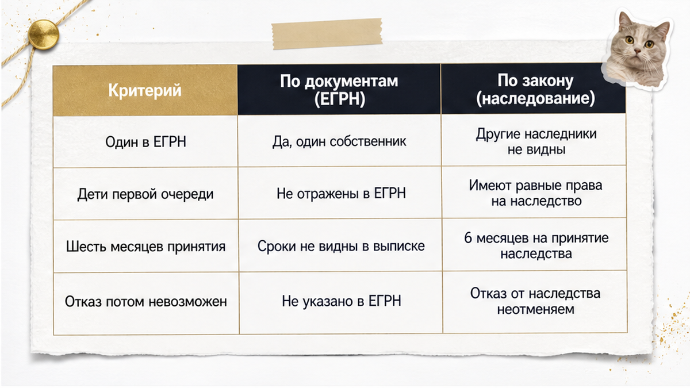
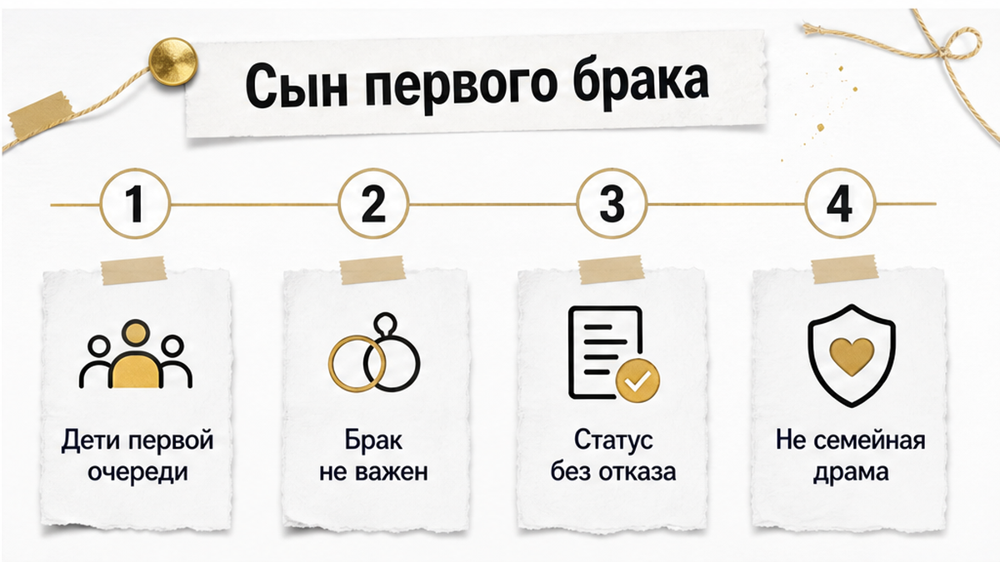

# Sol inputs — B07 — 2026-08-21

## ROLE
Sol: перепиши **целиком** смысл из `drafts/writer.html` в слог тенанта (SOUL + good-outputs).  
Выход: **только сырой HTML-фрагмент** тела статьи — без markdown fences, без ```html, без пояснений до/после.

## H1 (НЕ включать в article.html — только контекст)
Квартиру унаследовал один. Сын от первого брака отказ не писал

## HARD constraints

- **2000–2600 слов** русского текста (не сжимать ниже 2000).
- **Не выдумывать** факты, цифры, URL — только из Writer/research ниже.
- **HTML whitelist:** h2, h3, p, b, i, a, ul, ol, li, table, tr, th, td, figure, img, div — **b не strong, i не em**.
- **Без h1** в теле. **Без** research-даты, Wordstat, эмодзи, мата.
- **Не называть** Клышина, «юридический отдел», «команда менеджеров» — кейс как «пример из практики», не как чужой автор.
- **Klyshin rhythm, Shakin facts:** короткие абзацы, диалоги в «кавычках», контраст «обычный видит / риэлтор спрашивает».
- **7 figure placeholders** — сразу после открытия каждого из **первых 7 H2** (8-й H2 «Главный чеклист» — **без** figure, inline_8 не использовать):

```html
<figure class="inline-quad" data-slot="inline_N">
  
</figure>
```
(N = 1…7, zero-padded: inline-01.png … inline-07.png)

- **Interlink (HARD):** сохранить **все 3** sibling URL из Writer (можно переформулировать якорь, URL не менять):
  - /blog/vtorichka-i-riski/doverennost-ne-bronya-prodavec-priletel-odin-a-kvartiru-prodavali-chetvero/
  - /blog/vtorichka-i-riski/raspisku-na-kvartiru-napisali-deneg-na-schete-net/
  - /blog/vtorichka-i-riski/pochti-vnesli-zadatok-za-48-chasov-do-torgov-kvartiru-podarili-docheri/

- **Телефон в теле один раз:** `<a href="tel:+79220016505">+7&nbsp;922&nbsp;001&nbsp;65&nbsp;05</a>` — только в **excalibur-cta-end**, не дублировать в середине текста.

## CTA zones (quality-bar-9) — вставить по смыслу шаблонов

### Early — сразу после hook + TL;DR (после первого H2 «Коротко…»):

```html
<div class="excalibur-cta-early">
<p><b>Я — Святослав Шакин, The Риэлтор в Тюмени.</b> Лично веду сделку от звонка до регистрации.</p>
<p>Полный разбор наследственных кейсов и как я это ловлю до аванса — в <a href="https://t.me/Tyumen_Rieltor">Telegram</a> и <a href="https://max.ru/id561413315447_biz">MAX</a>. Напишите — подключусь.</p>
<p><a href="https://t.me/Tyumen_Rieltor">Telegram</a> · <a href="https://max.ru/id561413315447_biz">MAX</a></p>
</div>
```

### Mid — сразу после H2 «Главный чеклист…» и его содержимого (ol + закрывающий p):

```html
<div class="excalibur-cta-mid">
<p>Разборы похожих наследственных историй — в <a href="https://t.me/Tyumen_Rieltor">Telegram</a> и <a href="https://max.ru/id561413315447_biz">MAX</a>. Напишите до аванса — разберём вашу ситуацию.</p>
</div>
```

### End — финал (dual CTA + полный набор):

```html
<h2>Напишите до аванса — или сразу к делу</h2>
<p>Разберём наследственную квартиру и круг наследников до перевода денег — или подключусь в сделку на вторичке в Тюмени.</p>
<div class="excalibur-cta-end excalibur-social-cta">
<p>Напишите на консультацию в <a href="https://t.me/Tyumen_Rieltor">Telegram</a> или <a href="https://max.ru/id561413315447_biz">MAX</a> — или позвоните <a href="tel:+79220016505">+7&nbsp;922&nbsp;001&nbsp;65&nbsp;05</a>. Или сразу к делу: подключусь до аванса.</p>
<ul>
<li><a href="https://t.me/Tyumen_Rieltor">Telegram — смотреть разборы</a></li>
<li><a href="https://max.ru/id561413315447_biz">MAX — напишите, подключусь</a></li>
<li><a href="/">Сайт tymenrieltor.ru</a></li>
<li><a href="/gajdy/">PDF-гайды</a></li>
<li><a href="https://dzen.ru/holyslav">Дзен — смотреть разборы</a></li>
<li><a href="https://vk.ru/tymenrieltor">VK</a></li>
<li><a href="/rieltor-tyumen/">Обо мне</a></li>
</ul>
</div>
<p>Материал проверен: Святослав Шакин, личный риэлтор в Тюмени. Ориентир для покупателя, не индивидуальная юридическая консультация.</p>
```

## Soul calibration (кратко)

- Лид: сцена «квартира чистая, один в ЕГРН» → «сын от первого брака, отказ не писал» → сделка перестаёт быть простой.
- TL;DR / «Коротко» — 3–6 пунктов, не копипаст лида.
- Диалог: «Ну там ещё сын есть… отказ не писал, но мы потом разберёмся».
- Контраст: обычный видит одного собственника / риэлтор спрашивает про всех наследников первой очереди.
- Не SEO-робот, не глоссарий в лиде, не имя Клышина.

## title-brief.json

```json
{
  "topic_id": "B07",
  "h1": "Квартиру унаследовал один. Сын от первого брака отказ не писал",
  "subject": "наследство на квартиру: скрытый наследник первой очереди (сын от первого брака) без нотариального отказа — риск при покупке до аванса",
  "angle": "в ЕГРН один собственник — а второй наследник первой очереди отказ не оформлял"
}
```

## Fact check (research — не копировать в лид)

- Ст. 1142 ГК РФ: дети первой очереди независимо от брака родителей.
- Ст. 1154: 6 месяцев — срок принятия, не «риск закончился».
- Ст. 1155: восстановление суда / согласие остальных наследников; нет предельного срока для согласия.
- Реестр ФНП notariat.ru — номер дела, нотариус; пустой результат ≠ нет наследников.
- 2 900 ₽ — цена из конкретного отчёта в сигнале, не рыночная ставка.
- 3 года — практический порог проверки, не норма ГК РФ.
- **Не** утверждать, что сын обязательно получит долю.

## H2 structure (сохранить все 8 тем Writer, можно переформулировать заголовки)

1. Коротко / TL;DR про наследство и «одного собственника»
2. Почему ЕГРН и свидетельство не отвечают на вопрос «все ли наследники учтены»
3. Сын от первого брака — первая очередь по закону
4. Шесть месяцев прошло — риск не исчезает сам
5. Реестр наследственных дел ФНП (+ таблица)
6. Кейс: два года, отказ не написан (+ таблица в Writer если есть)
7. Что собрать до аванса (+ таблица)
8. Главный чеклист (без figure)

## Writer sections for this chunk

<p>Ситуация, с которой я сталкиваюсь на предавансовой проверке чаще, чем хотелось бы. Квартира хорошая, цена адекватная, продавец один — и в выписке ЕГРН он тоже один. Основание права: свидетельство о праве на наследство. Отец умер около двух лет назад, наследство оформлено, всё «чисто».</p>

<p>А потом в разговоре, между делом, всплывает фраза: «Ну там ещё сын есть, от первого брака. Он далеко, служит, связи нет. Отказ не писал, но мы потом разберёмся».</p>

<p>Вот на этом месте сделка перестаёт быть простой. Не потому, что сын обязательно придёт и заберёт долю — он может вообще никогда не появиться. А потому что покупатель в этот момент собирается внести деньги за квартиру, круг наследников по которой никем не закрыт. И «разберёмся потом» — это не про продавца. Это про нового собственника.</p>

<p>Разберу, почему один человек в ЕГРН и одно свидетельство о праве на наследство не отвечают на вопрос «все ли наследники учтены», что можно проверить до аванса и где заканчиваются возможности проверки.</p>

<h2>Коротко: что нужно понять про наследство и «одного собственника»</h2>
<figure class="inline-quad" data-slot="inline_1"></figure>

<ul>
<li><b>Один собственник в ЕГРН — это не «нет других наследников».</b> Это запись о том, кому в итоге оформили право. Она не показывает, сколько человек имели на наследство право и что с ними произошло.</li>
<li><b>Свидетельство о праве на наследство — документ конкретного наследника.</b> Оно подтверждает, что этому человеку выдали его долю или всё имущество, но не является справкой «других претендентов нет и не будет».</li>
<li><b>Дети от первого брака — первая очередь наравне со всеми.</b> По статье 1142 ГК РФ наследники первой очереди — дети, супруг и родители. Дети наследуют независимо от того, состояли их родители в браке между собой или нет.</li>
<li><b>Шесть месяцев с даты смерти — срок принятия наследства, а не срок «риск закончился».</b> Статья 1155 ГК РФ допускает восстановление срока судом или принятие наследства без суда — при письменном согласии остальных наследников, которые наследство приняли.</li>
<li><b>«Отказ напишет потом» — конструкция, которой в таком виде не существует.</b> Нотариальный отказ имеет свой срок и свои последствия, и договорённость на словах его не заменяет.</li>
<li><b>Проверка — это снижение риска, а не гарантия.</b> Реестр наследственных дел, состав наследственного дела и семейные документы дают картину. Они не выдают справку о том, что наследников больше нет.</li>
</ul>

<p>Дальше — по порядку: почему стандартный пакет документов не отвечает на главный вопрос, что реально можно посмотреть до аванса и в какой момент я бы сказал покупателю: «Эту квартиру — нет».</p>

<h2>Почему выписка ЕГРН и свидетельство не отвечают на вопрос «все ли наследники учтены»</h2>
<figure class="inline-quad" data-slot="inline_2"></figure>

<p>Выписка из ЕГРН отвечает на вопрос «кто сейчас собственник и на каком основании». Это её работа, и делает она её хорошо. Проблема в том, что покупатель читает её как ответ на другой вопрос — «есть ли к этой квартире чужие права».</p>

<p>В выписке вы увидите: собственник один, основание — свидетельство о праве на наследство по закону, дата регистрации. Всё. Вы не увидите, сколько человек обращалось к нотариусу. Не увидите, подавал ли кто-то заявление о принятии наследства и потом передумал. Не увидите, был ли у наследодателя ребёнок от предыдущего брака, о котором нотариусу никто не сообщил.</p>

<p>Со свидетельством похожая история. Нотариус ведёт наследственное дело по тем сведениям и документам, которые ему предоставили заявители, и по тем, которые он может запросить. Он не располагает базой, из которой автоматически выпадают все дети наследодателя за всю его жизнь. Если наследник, пришедший к нотариусу, о брате не упомянул — в деле этого брата не появится.</p>

<p>Отсюда простое следствие, которое почему-то каждый раз звучит для покупателя неожиданно: <i>свидетельство о праве на наследство подтверждает право того, кому оно выдано, но не доказывает, что круг наследников первой очереди был проверен полностью и что от остальных получены отказы.</i></p>

<p>Логика здесь та же, что и в другой частой истории — когда на сделку приезжает один человек с бумагами, а за его спиной остаются люди, чьи права этими бумагами не закрыты. Я разбирал такой случай отдельно: <a href="/blog/vtorichka-i-riski/doverennost-ne-bronya-prodavec-priletel-odin-a-kvartiru-prodavali-chetvero/">продавец прилетел один, а квартиру продавали четверо</a>. Наследство устроено похоже: документ на руках у одного, а вопрос — про всех.</p>

<p>Поэтому первый шаг при наследственной квартире — не «посмотреть выписку», а перестроить вопрос. Не «что показывает документ», а «чего этот документ показать не может в принципе».</p>

<h2>Сын от первого брака: это не семейная драма, а первая очередь по закону</h2>
<figure class="inline-quad" data-slot="inline_3"></figure>

<p>Когда продавец рассказывает про сына от первого брака, он почти всегда рассказывает это как историю отношений. Отец с ним не общался. Мать увезла ребёнка много лет назад. Он ни разу не приезжал. Он вообще не в курсе, что квартира есть.</p>

<p>Всё это может быть правдой — и всё это не имеет отношения к наследственному праву. Статья 1142 ГК РФ относит к наследникам первой очереди детей, супруга и родителей наследодателя. Дети наследуют независимо от того, в каком браке они родились и состояли ли их родители в браке между собой вообще. Общался отец с сыном или нет, помогал или не помогал, знал сын о квартире или не знал — это не входит в условия.</p>

<p>То же касается объяснений вроде «он служит, он в другом регионе, с ним нет связи». Служба, переезд, отсутствие контакта — обстоятельства жизни, а не основания, по которым человек перестаёт быть наследником первой очереди. Они могут объяснять, почему он не пришёл к нотариусу в срок. Они его из очереди не убирают.</p>

<p>Здесь важно не свалиться в другую крайность. Я <b>не</b> утверждаю, что такой сын обязательно получит долю в квартире. Он может не иметь интереса к наследствu. Он может не обратиться никогда. Восстановление срока — не автоматическая процедура, и суд оценивает причины пропуска.</p>

<p>Но покупателю нужно принять исходную точку честно: пока сын от первого брака жив и не оформил нотариальный отказ, он остаётся наследником первой очереди — со всеми правами, которые из этого следуют. Дальше вопрос только в том, какие документы это подтверждают или опровергают и что произошло со сроками. К срокам и переходим.</p>

=== SOL CHUNK 1/3 ===
Напиши ТОЛЬКО HTML: открытие (hook 3-4 абзаца) + <p><b>Быстрый инсайт.</b> 2–3 строки сути</p> + excalibur-cta-early + H2 «Коротко…» с TL;DR ul + H2 «Почему ЕГРН…» + H2 «Сын от первого брака…».

КРИТИЧНО: excalibur-cta-early — **до первого H2** (после «Быстрый инсайт», не после H2). Brand beat + TG https://t.me/Tyumen_Rieltor + MAX https://max.ru/id561413315447_biz ONLY.

Figure inline_1 после H2 «Коротко», inline_2 после H2 «Почему ЕГРН», inline_3 после H2 «Сын».
Interlink doverennost sibling в H2 «Почему ЕГРН».
Не называй Клышина. **650–750 слов максимум.** Без h1. Чистый HTML. b не strong, i не em.
