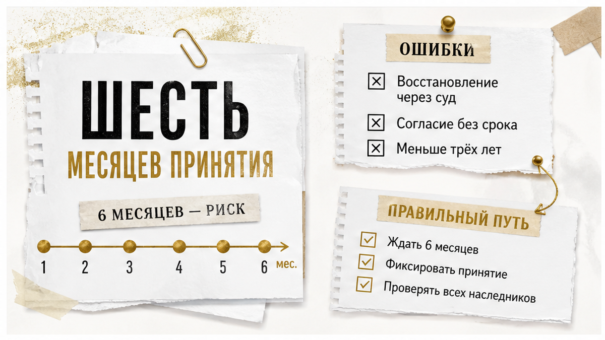
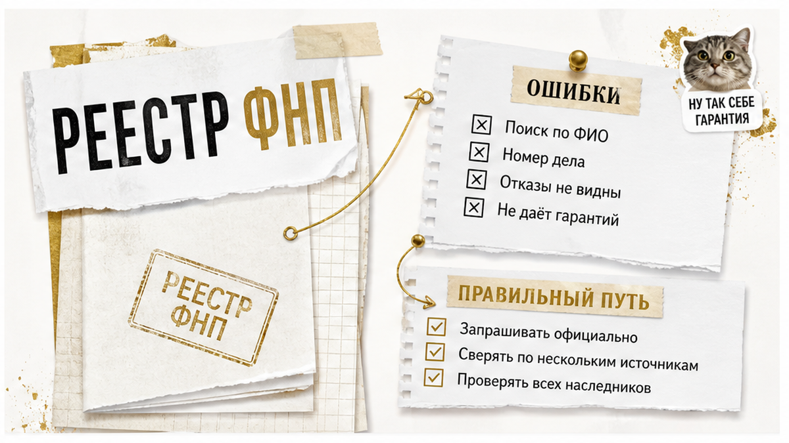
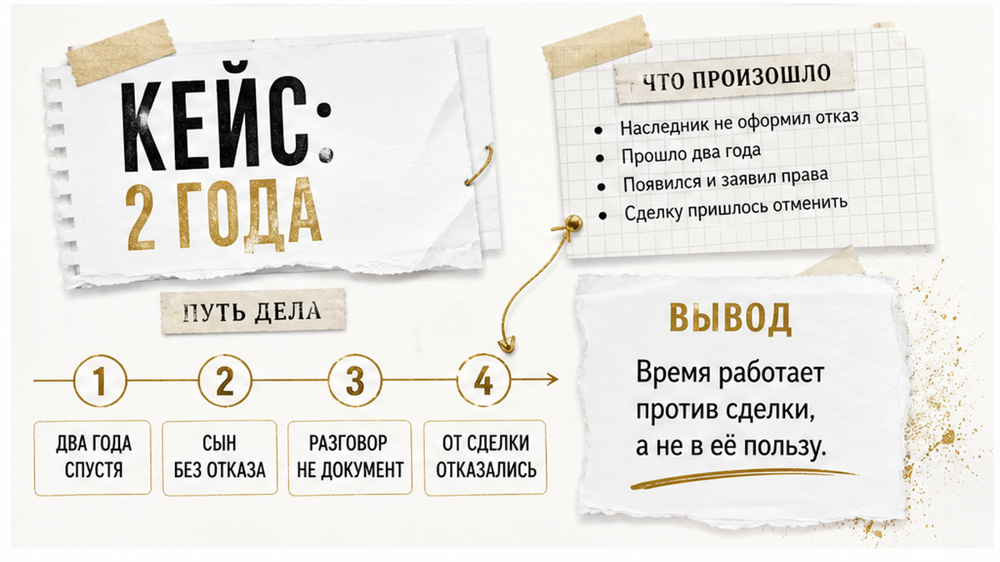

# Sol inputs — B07 — 2026-08-21

## ROLE
Sol: перепиши **целиком** смысл из `drafts/writer.html` в слог тенанта (SOUL + good-outputs).  
Выход: **только сырой HTML-фрагмент** тела статьи — без markdown fences, без ```html, без пояснений до/после.

## H1 (НЕ включать в article.html — только контекст)
Квартиру унаследовал один. Сын от первого брака отказ не писал

## HARD constraints

- **2000–2600 слов** русского текста (не сжимать ниже 2000).
- **Не выдумывать** факты, цифры, URL — только из Writer/research ниже.
- **HTML whitelist:** h2, h3, p, b, i, a, ul, ol, li, table, tr, th, td, figure, img, div — **b не strong, i не em**.
- **Без h1** в теле. **Без** research-даты, Wordstat, эмодзи, мата.
- **Не называть** Клышина, «юридический отдел», «команда менеджеров» — кейс как «пример из практики», не как чужой автор.
- **Klyshin rhythm, Shakin facts:** короткие абзацы, диалоги в «кавычках», контраст «обычный видит / риэлтор спрашивает».
- **7 figure placeholders** — сразу после открытия каждого из **первых 7 H2** (8-й H2 «Главный чеклист» — **без** figure, inline_8 не использовать):

```html
<figure class="inline-quad" data-slot="inline_N">
  
</figure>
```
(N = 1…7, zero-padded: inline-01.png … inline-07.png)

- **Interlink (HARD):** сохранить **все 3** sibling URL из Writer (можно переформулировать якорь, URL не менять):
  - /blog/vtorichka-i-riski/doverennost-ne-bronya-prodavec-priletel-odin-a-kvartiru-prodavali-chetvero/
  - /blog/vtorichka-i-riski/raspisku-na-kvartiru-napisali-deneg-na-schete-net/
  - /blog/vtorichka-i-riski/pochti-vnesli-zadatok-za-48-chasov-do-torgov-kvartiru-podarili-docheri/

- **Телефон в теле один раз:** `<a href="tel:+79220016505">+7&nbsp;922&nbsp;001&nbsp;65&nbsp;05</a>` — только в **excalibur-cta-end**, не дублировать в середине текста.

## CTA zones (quality-bar-9) — вставить по смыслу шаблонов

### Early — сразу после hook + TL;DR (после первого H2 «Коротко…»):

```html
<div class="excalibur-cta-early">
<p><b>Я — Святослав Шакин, The Риэлтор в Тюмени.</b> Лично веду сделку от звонка до регистрации.</p>
<p>Полный разбор наследственных кейсов и как я это ловлю до аванса — в <a href="https://t.me/Tyumen_Rieltor">Telegram</a> и <a href="https://max.ru/id561413315447_biz">MAX</a>. Напишите — подключусь.</p>
<p><a href="https://t.me/Tyumen_Rieltor">Telegram</a> · <a href="https://max.ru/id561413315447_biz">MAX</a></p>
</div>
```

### Mid — сразу после H2 «Главный чеклист…» и его содержимого (ol + закрывающий p):

```html
<div class="excalibur-cta-mid">
<p>Разборы похожих наследственных историй — в <a href="https://t.me/Tyumen_Rieltor">Telegram</a> и <a href="https://max.ru/id561413315447_biz">MAX</a>. Напишите до аванса — разберём вашу ситуацию.</p>
</div>
```

### End — финал (dual CTA + полный набор):

```html
<h2>Напишите до аванса — или сразу к делу</h2>
<p>Разберём наследственную квартиру и круг наследников до перевода денег — или подключусь в сделку на вторичке в Тюмени.</p>
<div class="excalibur-cta-end excalibur-social-cta">
<p>Напишите на консультацию в <a href="https://t.me/Tyumen_Rieltor">Telegram</a> или <a href="https://max.ru/id561413315447_biz">MAX</a> — или позвоните <a href="tel:+79220016505">+7&nbsp;922&nbsp;001&nbsp;65&nbsp;05</a>. Или сразу к делу: подключусь до аванса.</p>
<ul>
<li><a href="https://t.me/Tyumen_Rieltor">Telegram — смотреть разборы</a></li>
<li><a href="https://max.ru/id561413315447_biz">MAX — напишите, подключусь</a></li>
<li><a href="/">Сайт tymenrieltor.ru</a></li>
<li><a href="/gajdy/">PDF-гайды</a></li>
<li><a href="https://dzen.ru/holyslav">Дзен — смотреть разборы</a></li>
<li><a href="https://vk.ru/tymenrieltor">VK</a></li>
<li><a href="/rieltor-tyumen/">Обо мне</a></li>
</ul>
</div>
<p>Материал проверен: Святослав Шакин, личный риэлтор в Тюмени. Ориентир для покупателя, не индивидуальная юридическая консультация.</p>
```

## Soul calibration (кратко)

- Лид: сцена «квартира чистая, один в ЕГРН» → «сын от первого брака, отказ не писал» → сделка перестаёт быть простой.
- TL;DR / «Коротко» — 3–6 пунктов, не копипаст лида.
- Диалог: «Ну там ещё сын есть… отказ не писал, но мы потом разберёмся».
- Контраст: обычный видит одного собственника / риэлтор спрашивает про всех наследников первой очереди.
- Не SEO-робот, не глоссарий в лиде, не имя Клышина.

## title-brief.json

```json
{
  "topic_id": "B07",
  "h1": "Квартиру унаследовал один. Сын от первого брака отказ не писал",
  "subject": "наследство на квартиру: скрытый наследник первой очереди (сын от первого брака) без нотариального отказа — риск при покупке до аванса",
  "angle": "в ЕГРН один собственник — а второй наследник первой очереди отказ не оформлял"
}
```

## Fact check (research — не копировать в лид)

- Ст. 1142 ГК РФ: дети первой очереди независимо от брака родителей.
- Ст. 1154: 6 месяцев — срок принятия, не «риск закончился».
- Ст. 1155: восстановление суда / согласие остальных наследников; нет предельного срока для согласия.
- Реестр ФНП notariat.ru — номер дела, нотариус; пустой результат ≠ нет наследников.
- 2 900 ₽ — цена из конкретного отчёта в сигнале, не рыночная ставка.
- 3 года — практический порог проверки, не норма ГК РФ.
- **Не** утверждать, что сын обязательно получит долю.

## H2 structure (сохранить все 8 тем Writer, можно переформулировать заголовки)

1. Коротко / TL;DR про наследство и «одного собственника»
2. Почему ЕГРН и свидетельство не отвечают на вопрос «все ли наследники учтены»
3. Сын от первого брака — первая очередь по закону
4. Шесть месяцев прошло — риск не исчезает сам
5. Реестр наследственных дел ФНП (+ таблица)
6. Кейс: два года, отказ не написан (+ таблица в Writer если есть)
7. Что собрать до аванса (+ таблица)
8. Главный чеклист (без figure)

## Writer sections for this chunk

<h2>Шесть месяцев прошло — риск наследства не исчезает сам</h2>
<figure class="inline-quad" data-slot="inline_4"></figure>

<p>Самый частый аргумент продавца звучит убедительно: «Прошло два года, срок давно вышел, все сроки закрыты». Срок действительно есть. Он просто не работает так, как в этой фразе.</p>

<p>Статья 1154 ГК РФ: наследство принимают в течение шести месяцев со дня открытия наследства, а день открытия — это день смерти. Шесть месяцев — срок для <i>принятия</i>. Не срок, после которого наследник перестаёт быть наследником.</p>

<p>Дальше вступает <a href="https://www.consultant.ru/document/cons_doc_LAW_34154/e88ff3327fb40e20306d67842dcfafbe22e5de9c/" rel="nofollow">статья 1155</a>. Пропустивший срок может пойти двумя путями. Первый — суд: срок восстанавливают, если причины пропуска признают уважительными и человек обратился в течение шести месяцев после того, как эти причины отпали. Второй путь мимо суда: остальные наследники, которые наследство уже приняли, дают письменное согласие. Специального предельного срока для такого согласия закон не устанавливает.</p>

<p>Отсюда простое следствие для покупателя. Календарь сам по себе ничего не гарантирует. Гарантирует не время, а закрытый круг наследников с оформленными отказами.</p>

<p>Что происходит, если наследник появляется позже: прежнее свидетельство о праве на наследство может быть аннулировано, выдаётся новое, меняются доли, и вслед за этим меняются записи в ЕГРН. То есть меняется то самое основание, на которое покупатель смотрел как на надёжный документ.</p>

<p>В практике проверки есть рабочий ориентир: если право перешло к продавцу по наследству меньше трёх лет назад — это зона повышенного внимания. Подчеркну честно: <b>три года — не норма ГК РФ и не срок исковой давности по наследственным спорам</b>. Это внутренний практический порог, при котором смотрят внимательнее и просят больше документов. Не более и не менее.</p>

<p>И отдельно про частый сюжет: наследник служит, живёт в другом регионе, связь потеряна. Всё это может объяснять, почему человек не приходил к нотариусу. Но объяснение и утрата статуса — разные вещи. Наследственный статус не отменяется отсутствием контакта. Из этого не следует, что такой наследник обязательно получит долю в вашей квартире — следует только то, что вопрос открыт, а не закрыт.</p>

<p>По той же логике опасно платить «пока разбираются». Деньги уходят быстрее, чем закрываются документы — об этом отдельная история про <a href="/blog/vtorichka-i-riski/raspisku-na-kvartiru-napisali-deneg-na-schete-net/">расписку, которую написали, а денег на счёте не оказалось</a>.</p>

<h2>Реестр наследственных дел ФНП: что даёт поиск и где его границы</h2>
<figure class="inline-quad" data-slot="inline_5"></figure>

<p>Публичный сервис Федеральной нотариальной палаты на <a href="https://notariat.ru/" rel="nofollow">notariat.ru</a> — первое, что стоит открыть, когда в основании права стоит свидетельство о праве на наследство.</p>

<p>Поиск работает по точному ФИО наследодателя. Даты рождения и смерти сужают выборку. На выходе — номер наследственного дела и нотариус, который его ведёт.</p>

<p>Это много. Вы перестаёте верить на слово: дело существует, у него есть номер и конкретный нотариус. Дальше понятно, куда идти за составом дела.</p>

<p>И это мало. Реестр не показывает, кто именно из наследников заявился, кто отказался и сколько всего детей было у наследодателя. <b>Отсутствие записи в реестре не доказывает, что наследников нет.</b> Это единственный вывод, который из пустого результата делать нельзя.</p>

<table>
<tr><th>Шаг проверки</th><th>Что вы узнаёте точно</th><th>Что остаётся за кадром</th></tr>
<tr><td>Поиск в реестре ФНП по ФИО наследодателя</td><td>Есть ли дело, его номер, какой нотариус ведёт</td><td>Состав наследников, заявления, отказы</td></tr>
<tr><td>Выписка ЕГРН на квартиру</td><td>Кто собственник сегодня, каким документом оформлено право</td><td>Полнота круга наследников первой очереди</td></tr>
<tr><td>Свидетельство о праве на наследство</td><td>Кому и на какую долю выдано</td><td>Были ли ещё дети, писали ли они отказ</td></tr>
<tr><td>Состав наследственного дела у нотариуса</td><td>Кто обращался, какие отказы приняты</td><td>Наследник, который вообще не обращался</td></tr>
</table>

<p>Последняя строка — главная. Даже полный набор документов не выявляет того, кто ни к нотариусу, ни в суд пока не приходил. Проверка снижает риск и делает его видимым. Гарантией она не становится — и продавать её как гарантию нечестно.</p>

<p>Похожая ловушка описана в истории про <a href="/blog/vtorichka-i-riski/doverennost-ne-bronya-prodavec-priletel-odin-a-kvartiru-prodavali-chetvero/">доверенность, с которой продавец приехал один, а квартиру продавали четверо</a>: документ на руках был, круг лиц он не закрывал.</p>

<h2>Кейс: два года после смерти, отказ не написан, «с отказом потом разберёмся»</h2>
<figure class="inline-quad" data-slot="inline_6"></figure>

<p>Ситуация из практики, которую разбирал коллега Дмитрий Клышин, — привожу как пример, не как статистику.</p>

<p>Предавансовая проверка. Отец умер примерно два года назад. В ЕГРН — один собственник, основание — свидетельство о праве на наследство. Документы на первый взгляд ровные.</p>

<p>При разборе состава семьи выясняется: у наследодателя есть сын от первого брака. Нотариального отказа от него нет. Он к нотариусу не приходил.</p>

<p>Реакция продавцов дословно та, из-за которой такие сделки и разваливаются: «Покупайте так, с отказом потом разберёмся». Стоимость отчёта по этой проверке была 2 900 ₽ — цифра из публикации автора, а не рыночная ставка.</p>

<p>Что здесь важно понять. «Потом» — это не документ. Отказ оформляется нотариально и в свой срок, задним числом его к сделке не приложить. Покупатель, который согласился на «потом», покупает не квартиру с недостатком, а спор с открытым финалом.</p>

<p>В том случае покупатель от сделки отказался. Не потому, что сын гарантированно получил бы долю — этого никто не обещал. А потому, что <b>обязанность закрыть круг наследников лежит на продавце, а не на покупателе</b>.</p>

<p>Ровно та же механика — в истории про то, как <a href="/blog/vtorichka-i-riski/pochti-vnesli-zadatok-za-48-chasov-do-torgov-kvartiru-podarili-docheri/">задаток почти внесли за 48 часов до торгов</a>: чем сильнее давят «решайте сегодня», тем дороже стоит спокойная проверка.</p>

=== SOL CHUNK 2/3 ===
Напиши ТОЛЬКО HTML: H2 «Шесть месяцев…» + H2 «Реестр ФНП…» (таблица) + H2 «Кейс: два года…».
Figure inline_4, inline_5, inline_6 после соответствующих H2.
Interlink raspisku в H2 1; doverennost в H2 2; pochti-vnesli-zadatok в H2 3.
Кейс — «пример из практики», без имени Клышина. **650–750 слов максимум.** Без открытия, без CTA. Чистый HTML.
