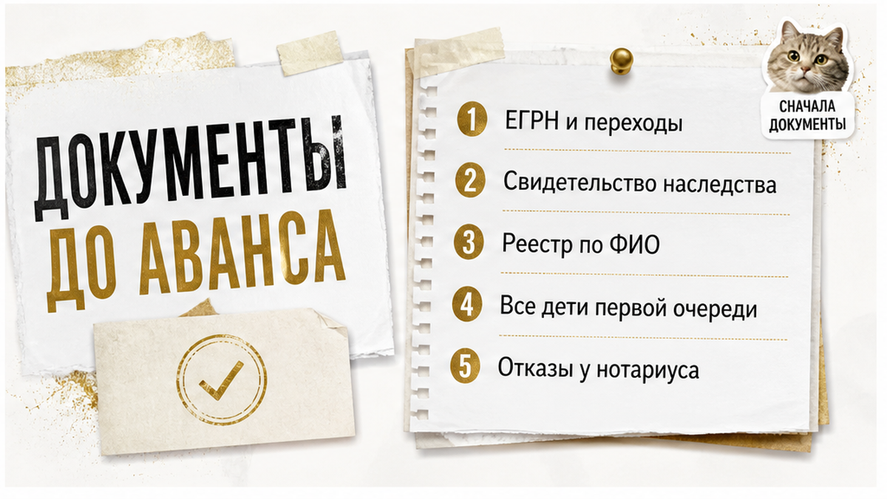

# Sol inputs — B07 — 2026-08-21

## ROLE
Sol: перепиши **целиком** смысл из `drafts/writer.html` в слог тенанта (SOUL + good-outputs).  
Выход: **только сырой HTML-фрагмент** тела статьи — без markdown fences, без ```html, без пояснений до/после.

## H1 (НЕ включать в article.html — только контекст)
Квартиру унаследовал один. Сын от первого брака отказ не писал

## HARD constraints

- **2000–2600 слов** русского текста (не сжимать ниже 2000).
- **Не выдумывать** факты, цифры, URL — только из Writer/research ниже.
- **HTML whitelist:** h2, h3, p, b, i, a, ul, ol, li, table, tr, th, td, figure, img, div — **b не strong, i не em**.
- **Без h1** в теле. **Без** research-даты, Wordstat, эмодзи, мата.
- **Не называть** Клышина, «юридический отдел», «команда менеджеров» — кейс как «пример из практики», не как чужой автор.
- **Klyshin rhythm, Shakin facts:** короткие абзацы, диалоги в «кавычках», контраст «обычный видит / риэлтор спрашивает».
- **7 figure placeholders** — сразу после открытия каждого из **первых 7 H2** (8-й H2 «Главный чеклист» — **без** figure, inline_8 не использовать):

```html
<figure class="inline-quad" data-slot="inline_N">
  
</figure>
```
(N = 1…7, zero-padded: inline-01.png … inline-07.png)

- **Interlink (HARD):** сохранить **все 3** sibling URL из Writer (можно переформулировать якорь, URL не менять):
  - /blog/vtorichka-i-riski/doverennost-ne-bronya-prodavec-priletel-odin-a-kvartiru-prodavali-chetvero/
  - /blog/vtorichka-i-riski/raspisku-na-kvartiru-napisali-deneg-na-schete-net/
  - /blog/vtorichka-i-riski/pochti-vnesli-zadatok-za-48-chasov-do-torgov-kvartiru-podarili-docheri/

- **Телефон в теле один раз:** `<a href="tel:+79220016505">+7&nbsp;922&nbsp;001&nbsp;65&nbsp;05</a>` — только в **excalibur-cta-end**, не дублировать в середине текста.

## CTA zones (quality-bar-9) — вставить по смыслу шаблонов

### Early — сразу после hook + TL;DR (после первого H2 «Коротко…»):

```html
<div class="excalibur-cta-early">
<p><b>Я — Святослав Шакин, The Риэлтор в Тюмени.</b> Лично веду сделку от звонка до регистрации.</p>
<p>Полный разбор наследственных кейсов и как я это ловлю до аванса — в <a href="https://t.me/Tyumen_Rieltor">Telegram</a> и <a href="https://max.ru/id561413315447_biz">MAX</a>. Напишите — подключусь.</p>
<p><a href="https://t.me/Tyumen_Rieltor">Telegram</a> · <a href="https://max.ru/id561413315447_biz">MAX</a></p>
</div>
```

### Mid — сразу после H2 «Главный чеклист…» и его содержимого (ol + закрывающий p):

```html
<div class="excalibur-cta-mid">
<p>Разборы похожих наследственных историй — в <a href="https://t.me/Tyumen_Rieltor">Telegram</a> и <a href="https://max.ru/id561413315447_biz">MAX</a>. Напишите до аванса — разберём вашу ситуацию.</p>
</div>
```

### End — финал (dual CTA + полный набор):

```html
<h2>Напишите до аванса — или сразу к делу</h2>
<p>Разберём наследственную квартиру и круг наследников до перевода денег — или подключусь в сделку на вторичке в Тюмени.</p>
<div class="excalibur-cta-end excalibur-social-cta">
<p>Напишите на консультацию в <a href="https://t.me/Tyumen_Rieltor">Telegram</a> или <a href="https://max.ru/id561413315447_biz">MAX</a> — или позвоните <a href="tel:+79220016505">+7&nbsp;922&nbsp;001&nbsp;65&nbsp;05</a>. Или сразу к делу: подключусь до аванса.</p>
<ul>
<li><a href="https://t.me/Tyumen_Rieltor">Telegram — смотреть разборы</a></li>
<li><a href="https://max.ru/id561413315447_biz">MAX — напишите, подключусь</a></li>
<li><a href="/">Сайт tymenrieltor.ru</a></li>
<li><a href="/gajdy/">PDF-гайды</a></li>
<li><a href="https://dzen.ru/holyslav">Дзен — смотреть разборы</a></li>
<li><a href="https://vk.ru/tymenrieltor">VK</a></li>
<li><a href="/rieltor-tyumen/">Обо мне</a></li>
</ul>
</div>
<p>Материал проверен: Святослав Шакин, личный риэлтор в Тюмени. Ориентир для покупателя, не индивидуальная юридическая консультация.</p>
```

## Soul calibration (кратко)

- Лид: сцена «квартира чистая, один в ЕГРН» → «сын от первого брака, отказ не писал» → сделка перестаёт быть простой.
- TL;DR / «Коротко» — 3–6 пунктов, не копипаст лида.
- Диалог: «Ну там ещё сын есть… отказ не писал, но мы потом разберёмся».
- Контраст: обычный видит одного собственника / риэлтор спрашивает про всех наследников первой очереди.
- Не SEO-робот, не глоссарий в лиде, не имя Клышина.

## title-brief.json

```json
{
  "topic_id": "B07",
  "h1": "Квартиру унаследовал один. Сын от первого брака отказ не писал",
  "subject": "наследство на квартиру: скрытый наследник первой очереди (сын от первого брака) без нотариального отказа — риск при покупке до аванса",
  "angle": "в ЕГРН один собственник — а второй наследник первой очереди отказ не оформлял"
}
```

## Fact check (research — не копировать в лид)

- Ст. 1142 ГК РФ: дети первой очереди независимо от брака родителей.
- Ст. 1154: 6 месяцев — срок принятия, не «риск закончился».
- Ст. 1155: восстановление суда / согласие остальных наследников; нет предельного срока для согласия.
- Реестр ФНП notariat.ru — номер дела, нотариус; пустой результат ≠ нет наследников.
- 2 900 ₽ — цена из конкретного отчёта в сигнале, не рыночная ставка.
- 3 года — практический порог проверки, не норма ГК РФ.
- **Не** утверждать, что сын обязательно получит долю.

## H2 structure (сохранить все 8 тем Writer, можно переформулировать заголовки)

1. Коротко / TL;DR про наследство и «одного собственника»
2. Почему ЕГРН и свидетельство не отвечают на вопрос «все ли наследники учтены»
3. Сын от первого брака — первая очередь по закону
4. Шесть месяцев прошло — риск не исчезает сам
5. Реестр наследственных дел ФНП (+ таблица)
6. Кейс: два года, отказ не написан (+ таблица в Writer если есть)
7. Что собрать до аванса (+ таблица)
8. Главный чеклист (без figure)

## Writer sections for this chunk

<h2>Что собрать и сопоставить до аванса</h2>
<figure class="inline-quad" data-slot="inline_7"></figure>

<p>Наследственная квартира проверяется не одним документом, а сопоставлением нескольких. Смысл простой: каждая бумага отвечает на свой узкий вопрос, и по отдельности любая из них выглядит успокаивающе. Круг лиц закрывается только там, где документы начинают подтверждать друг друга.</p>

<p>Вот что имеет смысл запросить и собрать до того, как деньги ушли:</p>

<ul>
<li><b>Выписка ЕГРН</b> — актуальная, плюс сведения о переходе прав: когда и на каком основании собственник стал собственником.</li>
<li><b>Свидетельство о праве на наследство</b> — основание регистрации. В нём видно нотариуса, дату и то, на какую долю оно выдано.</li>
<li><b>Данные наследственного дела</b> — номер и нотариус. Поиск в реестре наследственных дел ФНП даёт эти сведения по ФИО наследодателя, дата рождения и дата смерти сужают выборку.</li>
<li><b>Документы о браках наследодателя</b> — все, а не только последний. Первый брак — это ровно то место, где чаще всего появляется наследник, о котором продавец говорит вскользь.</li>
<li><b>Сведения о детях и родителях наследодателя</b> — первая очередь по статье 1142 ГК РФ. Дети наследуют независимо от того, был ли брак родителей зарегистрирован и сколько их было.</li>
<li><b>Нотариальные отказы</b> — если продавец говорит, что кто-то «не претендовал», это должно быть подтверждено документом, а не пересказом.</li>
</ul>

<p>Дальше документы нужно не просто сложить в папку, а сверить между собой. Ниже — что каждый из них реально закрывает.</p>

<table>
<tr><th>Документ</th><th>Что подтверждает</th><th>Чего не подтверждает</th></tr>
<tr><td>Выписка ЕГРН</td><td>Кто собственник сегодня и на каком основании зарегистрировано право</td><td>Что все наследники первой очереди были выявлены и учтены</td></tr>
<tr><td>Свидетельство о праве на наследство</td><td>Что нотариус оформил права конкретного наследника на конкретную долю</td><td>Что других наследников той же очереди не существует</td></tr>
<tr><td>Реестр наследственных дел ФНП</td><td>Что дело открывалось, его номер и кто нотариус</td><td>Состав наследников; отсутствие записи не означает отсутствие наследников</td></tr>
<tr><td>Документы о браках</td><td>Семейную хронологию наследодателя</td><td>Наличие или отсутствие детей от каждого брака</td></tr>
<tr><td>Нотариальный отказ</td><td>Что конкретное лицо отказалось от наследства в срок</td><td>Позицию тех, чей отказ не оформлен</td></tr>
</table>

<p>Отдельно про сроки. Шесть месяцев со дня смерти — срок принятия наследства по статье 1154 ГК РФ, а не срок, после которого тема закрывается сама. Статья 1155 ГК РФ допускает и восстановление срока судом при уважительных причинах, и принятие наследства без суда — при письменном согласии остальных наследников, уже принявших наследство. Специального предельного срока для такого согласия закон не устанавливает. Практика перепроверять переходы права моложе трёх лет — это рабочая осторожность рынка, а не норма кодекса и не срок исковой давности.</p>

<p>Если последующее принятие всё же состоялось, это не остаётся внутри нотариальной конторы: прежнее свидетельство может быть аннулировано, выдано новое, а изменения дойдут до ЕГРН. Именно поэтому «отказ потом» — это не отложенная формальность, а отложенный сюжет с вашей квартирой внутри.</p>

<p>Практическая последовательность у меня всегда одна: сначала пакет документов, потом деньги. Разбор до аванса стоит дешевле любого разбора после него — про историю с <a href="/blog/vtorichka-i-riski/raspisku-na-kvartiru-napisali-deneg-na-schete-net/">распиской, по которой денег на счёте не оказалось</a>, я уже писал отдельно.</p>

<h2>Главный чеклист: когда наследство выглядит чистым, а не является</h2>

<p>Короткий список, по которому я прохожу наследственные квартиры. Каждый пункт — не приговор сделке, а повод не платить, пока не получен ответ.</p>

<ol>
<li>В выписке ЕГРН один собственник, основание — свидетельство о праве на наследство. Это описание регистрации, а не вывод о круге наследников.</li>
<li>Известны все браки наследодателя, а не только последний.</li>
<li>По каждому браку понятно, были ли дети. Дети первой очереди наследуют независимо от того, в каком браке родились.</li>
<li>По каждому наследнику первой очереди есть либо доля в свидетельстве, либо нотариальный отказ. Слова «он не претендует» в этот список не входят.</li>
<li>Наследственное дело найдено, номер и нотариус известны, состав дела понятен.</li>
<li>С даты смерти прошло меньше трёх лет — значит, документы смотрим особенно внимательно, а не расслабляемся из-за истёкших шести месяцев.</li>
<li>Продавец объясняет отсутствие отказа обстоятельствами: служба, другой регион, потеря связи. Это возможное объяснение, но наследственный статус оно не отменяет.</li>
<li>Вам предлагают формулу «покупайте, с отказом потом разберёмся». Это перенос нерешённого вопроса на нового собственника.</li>
<li>Темп сделки задают вам, а не документы: <a href="/blog/vtorichka-i-riski/pochti-vnesli-zadatok-za-48-chasov-do-torgov-kvartiru-podarili-docheri/">«вносите сегодня, иначе уйдёт»</a> — это не про рынок, это про то, что проверять некогда.</li>
</ol>

<p>Сразу про границы. Ни один из этих пунктов не говорит, что сын от первого брака обязательно получит долю: он может не заявлять права никогда. Проверка не даёт гарантии — она даёт понимание, какой именно риск вы покупаете и за какие деньги. Реестр наследственных дел не выявляет всех наследников, а нотариус работает с теми, кто к нему обратился, и со сведениями, которые ему представили.</p>

<p>Что реально меняется после проверки: вы перестаёте платить за версию продавца. Один собственник в ЕГРН — это не «нет претензий», а «сегодня зарегистрирован один». Свидетельство — не справка о том, что всех посчитали. Шесть месяцев — не забор, за которым безопасно.</p>

<p>Покупатель из моего примера в итоге отказался от сделки. Не потому, что нашёл судебное решение или чьи-то претензии — их не было. Потому что на вопрос «где отказ второго наследника первой очереди» ответа не появилось ни у продавца, ни в документах. Для покупки жилья на свои деньги этого достаточно, чтобы сказать «нет» и посмотреть следующий вариант.</p>

=== SOL CHUNK 3/3 ===
Напиши ТОЛЬКО HTML: H2 «Что собрать…» (ul + таблица) + H2 «Главный чеклист…» (ol) + closing paragraphs + excalibur-cta-mid + H2 «Напишите до аванса — или сразу к делу» + excalibur-cta-end + дисклеймер.

Figure inline_7 только после H2 «Что собрать…». H2 чеклист — без figure.
Interlink raspisku в H2 «Что собрать»; pochti-vnesli в чеклисте.

После чеклиста и closing p:
<div class="excalibur-cta-mid">
<p>Разборы похожих наследственных историй — в <a href="https://t.me/Tyumen_Rieltor">Telegram</a> и <a href="https://max.ru/id561413315447_biz">MAX</a>. Напишите до аванса — разберём вашу ситуацию.</p>
</div>

End: dual CTA + tel:+79220016505 один раз + полный набор (TG, MAX, site, gajdy, dzen, vk, rieltor-tyumen).
**650–750 слов максимум.** Чистый HTML.
