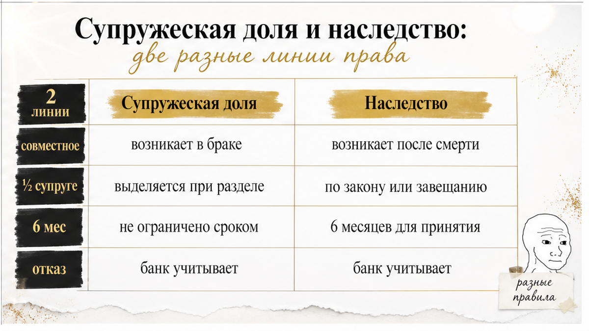

# Sol inputs — B08 — base

ROLE: Sol. Перепиши Writer в слог SOUL. Выход: только сырой HTML без markdown fences.

H1 (не в теле): Справка ЗАГС была чистой — банк отказал из-за доли умершей жены

HARD: **2000–2600 слов суммарно** по всем чанкам (Writer ~3243 — СЖАТЬ). b не strong, i не em. Без h1. Без выдуманных фактов. Без research-даты/Wordstat. Без мата.

News-casus: лид = сцена; **финал** (банк отказал, выход до аванса) — явный H2 **до** практики «что проверить».

Interlink (все 4 URL сохранить где уместно):
- /blog/vtorichka-i-riski/doverennost-ne-bronya-prodavec-priletel-odin-a-kvartiru-prodavali-chetvero/
- /blog/vtorichka-i-riski/nasledstvo-kvartiry-syn-ot-pervogo-braka-ne-otkazalsya/
- /blog/vtorichka-i-riski/pochti-vnesli-zadatok-za-48-chasov-do-torgov-kvartiru-podarili-docheri/
- /blog/vtorichka-i-riski/raspisku-na-kvartiru-napisali-deneg-na-schete-net/

Figure после каждого H2 в этом чанке:
```html
<figure class="inline-quad" data-slot="inline_N">
  

Writer part 3 current output (переписать короче):
<h2>Супружеская доля и наследство: две разные линии права</h2>

<figure class="inline-quad" data-slot="inline_7">
  
</figure>

<p>Продавцы говорили: «квартира наша, мы её купили». И формально были правы.</p>

<p>Только за словом «наша» в такой цепочке стоят две разные линии права. Их путают почти всегда.</p>

<p><b>Линия первая — супружеская.</b> Имущество, приобретённое в браке, по общему правилу является совместной собственностью супругов (ст. 34 СК РФ). Здесь важны не фамилии в выписке, а <b>дата и основание приобретения</b> плюс наличие брачного договора. Квартира куплена по ДКП в 1998 году, один из покупателей на тот момент был в браке — вопрос о совместной собственности возникает сам, без чьего-либо желания.</p>

<p><b>Линия вторая — наследственная.</b> Она включается позже, когда супруг умирает. И вот тут происходит подмена: людям кажется, что «умерла — значит, всё осталось мужу». На практике половина совместно нажитого — это супружеская доля пережившего супруга, и в наследственную массу она не входит. А вторая половина входит и делится между наследниками. Какие конкретно доли получатся — зависит от состава наследников, режима имущества и того, что делали с оформлением. Универсальной формулы «у умершего супруга ровно половина квартиры» нет, и выводить её я не стану ни для этого кейса, ни для вашего.</p>

<p>Дальше самый неудобный узел. Наследство можно принять <b>фактическими действиями</b> (ст. 1153 ГК РФ): жить, платить, содержать. При этом само наличие совместного права ещё не означает фактического принятия — это разные вещи, они разбираются по обстоятельствам. Срок принятия — шесть месяцев (ст. 1154 ГК РФ), но у того, кто принял фактически, срок обращения за свидетельством законом не ограничен. Человек может «ничего не оформлять» двадцать лет — и права от этого не исчезают.</p>

<p>И штрих, который закрыл дорогу к быстрой сделке. Федеральная нотариальная палата исходит из того, что после фактического принятия наследства нельзя оформить отказ <i>задним числом</i> во внесудебном порядке. То есть «наследники подпишут отказы, и через неделю выходим на сделку» — не работает. Это не вопрос доброй воли сторон, это вопрос порядка.</p>

<p>Плюс один из наследников умер. Цепочка от этого не рассасывается — она удлиняется.</p>

<h2>Таблица: что успокаивает на словах — и что реально закрывает риск</h2>

<figure class="inline-quad" data-slot="inline_8">
  
</figure>

<p>Собрал фразы, которые слышал в этой сделке и слышу в каждой второй. Слева — что говорят. Дальше — что фраза правда подтверждает, чего не закрывает и куда смотреть вместо неё.</p>

<table>
<thead>
<tr>
<th>Фраза на просмотре</th>
<th>Что она реально подтверждает</th>
<th>Какой риск остаётся открытым</th>
<th>Куда смотреть вместо неё</th>
</tr>
</thead>
<tbody>
<tr>
<td>«В браке не состояли, вот справка ЗАГС»</td>
<td>Что справка выдана и период в ней указан</td>
<td>Семейное положение на дату приобретения, если период начинается позже</td>
<td>Первая строка периода в справке против года покупки в правоустанавливающем документе</td>
</tr>
<tr>
<td>«Архив только такую справку и даёт»</td>
<td>Ограничения конкретного запроса и формата</td>
<td>Незакрытый интервал между покупкой и началом периода</td>
<td>Уточнение запроса под нужный период; ЕГР ЗАГС ведётся с 01.10.2018, более ранние сведения — архивные</td>
</tr>
<tr>
<td>«В ЕГРН чисто, ни арестов, ни обременений»</td>
<td>Отсутствие зарегистрированных ограничений на дату выписки</td>
<td>Невыделенная супружеская доля и права наследников, не попавшие в реестр</td>
<td>История основания права: чем и когда приобретено, кто был в браке, что было потом</td>
</tr>
<tr>
<td>«Супруга умерла давно, всё уже неактуально»</td>
<td>Факт смерти и давность события</td>
<td>Фактическое принятие наследства без регистрации доли (ст. 1153 ГК РФ)</td>
<td>Наследственная линия: кто наследники, что происходило с имуществом после смерти</td>
</tr>
<tr>
<td>«Наследники подпишут отказ, если надо»</td>
<td>Готовность договариваться на словах</td>
<td>Невозможность внесудебного отказа после фактического принятия</td>
<td>Позиция нотариуса по конкретной ситуации, а не обещание продавца</td>
</tr>
<tr>
<td>«Форма №15 у нас есть, этого достаточно»</td>
<td>Отсутствие регистрации брака на момент выдачи документа</td>
<td>Прошлые периоды, включая дату сделки многолетней давности</td>
<td>Совпадение периода документа с юридически значимой датой</td>
</tr>
</tbody>
</table>

<p>Обратите внимание: ни одна строка не говорит «продавец врёт». Проблема тоньше. Документ бывает подлинным, действующим — и не отвечающим на тот вопрос, ради которого его показывают.</p>

<div class="excalibur-cta-mid">
<p><b>Проверяю период справки ЗАГС против даты покупки — до аванса, не после.</b></p>
<p>Пишите в <a href="https://t.me/Tyumen_Rieltor">Telegram</a> или в <a href="https://max.ru/id561413315447_biz">MAX</a>: скину список того, что смотрю в цепочке прав на вторичке в Тюмени.</p>
</div>

<h2>Если вы покупаете вторичку в Тюмени: когда остановиться и позвать проверку</h2>

<figure class="inline-quad" data-slot="inline_9">
  
</figure>

<p>Я не про тревожность на пустом месте. Большинство сделок со вторичкой проходят нормально. И отказ банка в этой истории — факт конкретного кейса, а не правило: внутренних критериев того банка я не знаю и логику ему не приписываю.</p>

<p>Но есть сигналы, после которых я не двигаюсь дальше без разбора цепочки прав.</p>

<ol>
<li><b>Правоустанавливающий документ старше 15–20 лет.</b> Чем дальше дата, тем больше событий между ней и сегодняшней выпиской.</li>
<li><b>Период в справке ЗАГС начинается позже даты покупки.</b> Это не формальность. Это дыра ровно там, где нужен ответ.</li>
<li><b>В истории есть умерший супруг или умерший наследник.</b> Каждая смерть — отдельный вопрос: кто принял наследство и как оформил.</li>
<li><b>Продавцов несколько, а объяснение одно на всех.</b> Семейное положение проверяется по каждому собственнику и на нужную дату.</li>
<li><b>«Зачем оформлять, вы и так купите».</b> Отказ приводить документы в порядок — сам по себе информация.</li>
<li><b>Вас торопят внести деньги.</b> Спешка почти всегда работает против покупателя.</li>
</ol>

<p>Где останавливаться? <b>До аванса и до подачи в банк.</b> Это единственная точка, где выход стоит времени и нервов, но не денег. В нашей истории покупатель успел. У меня был кейс с остановкой <a href="/blog/vtorichka-i-riski/pochti-vnesli-zadatok-za-48-chasov-do-torgov-kvartiru-podarili-docheri/">за 48 часов до внесения задатка</a> — и другой, <a href="/blog/vtorichka-i-riski/raspisku-na-kvartiru-napisali-deneg-na-schete-net/">с уже написанной распиской</a>, где выйти удалось только потому, что деньги физически не ушли со счёта.</p>

<p>И про документы продавца отдельно. Справка, доверенность, выписка — не броня. Это ответы на конкретные вопросы в конкретных границах. В <a href="/blog/vtorichka-i-riski/doverennost-ne-bronya-prodavec-priletel-odin-a-kvartiru-prodavali-chetvero/">истории с доверенностью</a> бумага была настоящей, а состав собственников — совсем другим. Здесь то же самое: справка чистая, сделка — нет.</p>

<p>Нашли разрыв — не додумывайте за нотариуса и не считайте доли на калькуляторе. Порядок такой: зафиксировать непокрытый период, выяснить, кто из наследников и как принимал наследство, получить позицию нотариуса по ситуации — и только потом решать, есть ли путь к сделке. Иногда путь есть. Иногда продавцы просто не хотят этим заниматься, и честный ответ — уходить.</p>

<p>Если у вас в правоустанавливающем документе стоят девяностые или начало двухтысячных — покажите бумаги до того, как понесёте аванс. Разбор занимает несколько дней и стоит несопоставимо меньше, чем возврат денег через суд.</p>

<div class="excalibur-cta-end">
<p><b>Святослав Шакин, The Риэлтор — Тюмень.</b> Лично веду сделку и проверяю историю права на вторичке до аванса: период справок ЗАГС против даты приобретения, супружеские и наследственные линии, реальная конфигурация собственников. Звоните: <a href="tel:+79220016505">+7 922 001 65 05</a>.</p>
<ul>
<li>Написать в <a href="https://t.me/Tyumen_Rieltor">Telegram</a> — быстрее всего</li>
<li>Написать в <a href="https://max.ru/id561413315447_biz">MAX</a></li>
<li><a href="{{SITE_BASE}}/gajdy/">Гайды по покупке и проверке квартиры</a></li>
<li><a href="{{SITE_BASE}}/rieltor-tyumen/">Обо мне и о том, как я работаю</a></li>
<li><a href="{{SITE_BASE}}/kontakty/">Контакты</a> и <a href="{{SITE_BASE}}/">главная страница</a></li>
<li>Разборы сделок: <a href="https://dzen.ru/holyslav">Дзен</a> и <a href="https://vk.ru/tymenrieltor">ВКонтакте</a></li>
</ul>
<p>Одна проверка периода в справке дешевле любого суда о доле, про которую вы узнали после регистрации.</p>
<p><i>Материал носит информационный характер и не заменяет индивидуальную юридическую консультацию по вашей сделке.</i></p>
</div>

=== SOL CHUNK 3/3 RETRY — СЖАТЬ ===
Напиши ТОЛЬКО HTML-фрагмент финала статьи. **500–650 слов** (сжать на 30% vs черновик выше).

Секции:
- H2 «Супружеская доля и наследство: две разные линии права» + **только** figure inline_7 (inline_8 и inline_9 НЕ вставлять)
- H2 «Таблица: что успокаивает на словах — и что реально закрывает риск» — таблица 6 строк из Writer, **без figure**
- excalibur-cta-mid после таблицы (TG + MAX)
- H2 «Если вы покупаете вторичку в Тюмени: когда остановиться» — ol **4 пункта** (сжать), **без figure**
- excalibur-cta-end excalibur-social-cta — образец:
```html
<div class="excalibur-cta-end excalibur-social-cta">
<p>Напишите на консультацию в <a href="https://t.me/Tyumen_Rieltor">Telegram</a> или <a href="https://max.ru/id561413315447_biz">MAX</a> — или позвоните <a href="tel:+79220016505">+7 922 001 65 05</a>. Или сразу к делу: подключусь до аванса.</p>
<ul>
<li><a href="https://t.me/Tyumen_Rieltor">Telegram — смотреть разборы</a></li>
<li><a href="https://max.ru/id561413315447_biz">MAX — напишите, подключусь</a></li>
<li><a href="/">Сайт tymenrieltor.ru</a></li>
<li><a href="/gajdy/">PDF-гайды</a></li>
<li><a href="https://dzen.ru/holyslav">Дзен — смотреть разборы</a></li>
<li><a href="https://vk.ru/tymenrieltor">VK</a></li>
<li><a href="/rieltor-tyumen/">Обо мне</a></li>
</ul>
</div>
<p>Материал проверен: Святослав Шакин, личный риэлтор в Тюмени. Ориентир для покупателя, не индивидуальная юридическая консультация.</p>
```
**НЕ** использовать {{SITE_BASE}} — только href="/gajdy/", href="/", href="/rieltor-tyumen/".

Interlink: doverennost + zadatok + raspiska в тексте Tyumen-секции.
Без h1. Чистый HTML.
