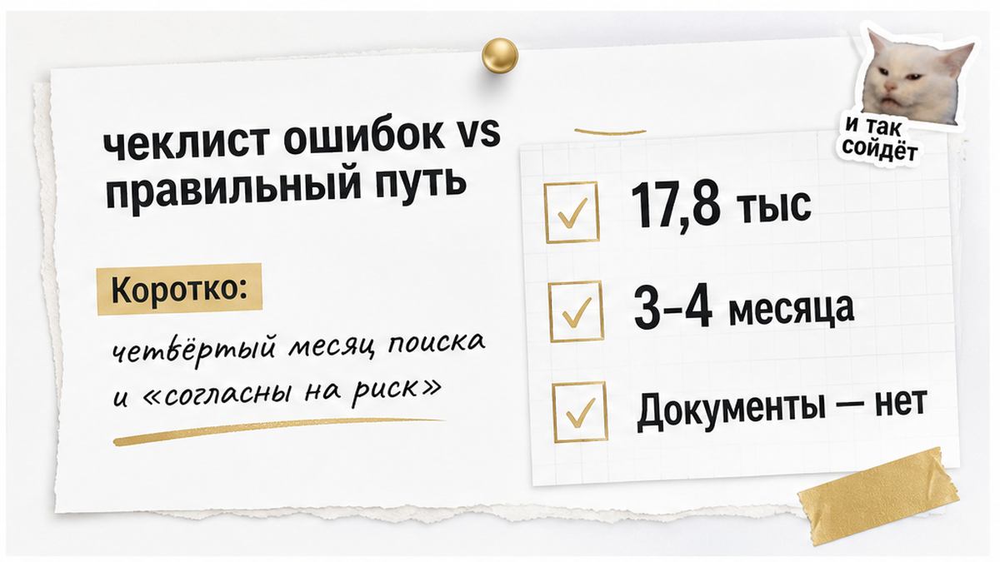
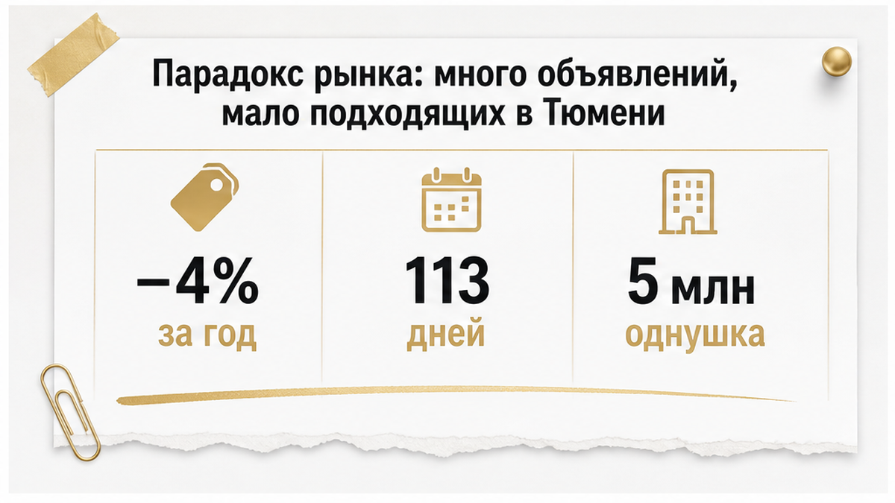
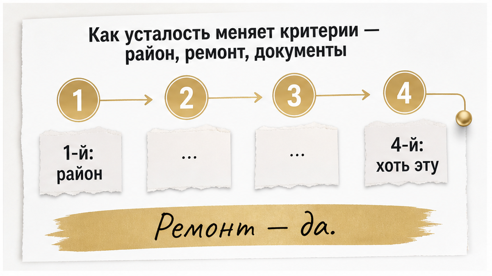

# Sol TRIM pass — B08

ROLE: Sol trim only. Input article below is ~3050 words. Output **2000–2600 words** Russian text.
Cut ~450–900 words by removing repetition, tightening tables, shorter paragraphs — **preserve all facts, 4 interlinks, 3 CTA zones, 7 inline figures, phone once in end CTA**.

Output: raw HTML only, no fences.

H1 context (not in body): Квартиру в Тюмени ищут четвёртый месяц. Уже согласны на риск

## Current article.html

«Святослав, мы четвёртый месяц смотрим. Устали. Согласны на риск — только помогите сделать безопасно».

Звучит спокойно. По смыслу — сдача позиций. Дальше идёт описание квартиры, и в описании уже видно, где будет больно: право перешло к продавцу пару месяцев назад, продают «по доверенности», история собственников читается с трудом. А вопрос ставится не «стоит ли это брать». Вопрос ставится так: «как сделать, чтобы всё было в порядке».

В одной фразе — два взаимоисключающих запроса. «Согласны на риск» значит: мы готовы принять вероятность потерь. «Сделайте безопасно» значит: уберите вероятность потерь. Проверка не превращает рискованный объект в безопасный. Она превращает неизвестный риск в известный. Это разные вещи — и ровно на этой разнице ломаются сделки уставших покупателей.

Меня зовут Святослав Шакин, я риэлтор в Тюмени, работаю под именем The Риэлтор. Каждый месяц через меня проходят объекты, которые кто-то уже успел назвать «нормальной квартирой» — потому что смотрел её на четвёртом месяце поиска.

Разборы кейсов и то, как я вылавливаю риски до аванса, а не после, — здесь: <a href="https://t.me/Tyumen_Rieltor">Telegram</a> и <a href="https://max.ru/id561413315447_biz">MAX</a>.

<h2>Коротко: четвёртый месяц поиска и «согласны на риск»</h2>

Если времени мало — вот суть в семи пунктах.

<ul>
<li>Много объявлений — не значит много подходящих квартир. По данным 72.ru от 9 июля 2026 года, в Тюмени около 17,8 тыс. объявлений вторички. И при этом дефицит в самых ходовых бюджетах.</li>
<li>После трёх-четырёх месяцев поиска человек оценивает уже не квартиру. Он оценивает возможность прекратить поиск. Это нормальная реакция и главный источник плохих решений.</li>
<li>Снизить требования к району и ремонту — компромисс. Снизить требования к документам — не компромисс, а перенос денег в зону, где их можно потерять.</li>
<li>«Безопасная сделка» и «осознанный риск» — не синонимы. Проверка не обнуляет риск, она делает его видимым до аванса.</li>
<li>Всё ключевое решается на этапе ЕГРН и выяснений: кто собственник, есть ли обременения, как выглядит история переходов, что происходит у продавца.</li>
<li>Расчёты «на доверии» — отдельный слой риска. Он снимается не уговорами, а аккредитивом.</li>
<li>Письменное заключение о рисках до аванса — минимальная страховка для уставшей семьи. Оно не запрещает покупать. Оно фиксирует, на что именно вы согласились.</li>
</ul>

<figure class="inline-quad" data-slot="inline_01"></figure>

<h2>Парадокс рынка: много объявлений, мало подходящих в Тюмени</h2>

<figure class="inline-quad" data-slot="inline_02"></figure>

«Там тысячи вариантов, а выбрать нечего». Это не искажение восприятия. Это точное описание рынка.

По июльской публикации Объектив.рф в Дзене Тюмень — лидер среди региональных столиц по объёму экспозиции вторички, около 509 тыс. м². Формально предложение огромное. Но экспозиция — это метры вообще, а покупатель ищет не метры вообще. Он ищет однушку с ремонтом за 4,5–5,5 млн или двушку около шести, в двух-трёх районах, с нормальными документами. В этом сегменте вариантов сильно меньше, чем обещает число объявлений.

Цифры 72.ru от 9 июля 2026 года объясняют, почему стало тяжелее. Объявлений около 17,8 тыс. — на 4% меньше, чем год назад. Средний срок продажи летом 113 дней против 150 в январе. Доля квартир, которые уходят в течение месяца, выросла вдвое. Дисконт сжался: 6% в июне против 6,8% годом ранее и 7,8% в январе. Продавец торгуется меньше, потому что видит очередь.

Цены за год сдвинулись ощутимо. Однушка — около 5 млн против 4,2 млн в июне 2025-го. Двушка — 6,28 против 5,58. Трёшка — 7,2 против 5,95. По данным ЦБ за первый квартал 2026 года новостройки в регионе стоят 138 334 ₽/м², вторичка — 128 812 ₽/м². Разрыв уже не тот, что был в разгар субсидированных ставок, и часть покупателей перетекла во вторичку. Спрос на ипотеку на вторичное жильё в июне 2026 года оказался выше июня 2025-го на 271% и выше января 2026-го на 84%, выдачи за год прибавили около 57% при среднем кредите примерно 3 млн ₽. URA.RU 11 августа 2026 года описывала то же самое проще: в июле вторичка шла вдвое активнее января.

Что это значит для семьи в поиске? Вы конкурируете не с пустым рынком. Вы конкурируете с людьми, которые тоже устали и тоже готовы решать быстро. Отсюда ощущение гонки — и именно оно ломает критерии. Кстати, поэтому же алгоритмы регулярно занижают адекватные объекты: они считают метры и аналоги, но не видят ни очереди на просмотр, ни дефицита подходящего. Механику я разбирал отдельно — <a href="/blog/vtorichka-i-riski/avtoocenka-kvartiry-na-dva-milliona-nizhe-rynka-circ-s-prosmotrami/">когда автооценка выдала цену на два миллиона ниже рынка, а квартиру смотрели в очередь</a>.

<h2>Как усталость меняет критерии — район, ремонт, документы</h2>

<figure class="inline-quad" data-slot="inline_03"></figure>

Длинный поиск работает как эрозия. Он не ломает решение одним ударом. Он снимает по слою за раз.

Первый месяц: «только этот район, только с ремонтом, только не первый этаж». Второй: «ладно, соседний район тоже посмотрим». Третий: «ремонт сделаем сами». Четвёртый: «ну ладно, хотя бы эту».

«Ну ладно, хотя бы эту» — у меня в работе маркер. Я слышу эту фразу в августе 2026 года чаще, чем год назад, и после неё почти всегда идёт объект, по которому я пишу негативное заключение. Доля таких заключений выросла примерно с 3–5% до порядка 10%. Оговорюсь честно: это моя личная статистика по моим клиентам, а не показатель тюменского рынка, переносить проценты на город нельзя. Но механику она показывает точно. Люди не стали покупать хуже. Люди стали быстрее соглашаться.

И здесь нужно развести два вида уступок, потому что их путают постоянно.

Уступки по потребительским качествам — ваше право и ваш выбор. Район дальше от работы, окна во двор вместо парка, ремонт «под себя», пятый этаж вместо второго. Это ухудшает комфорт, но не создаёт вероятность потерять квартиру. Дорога терпится, ремонт делается, квартира при необходимости продаётся.

Уступки по юридической части — другая категория. Здесь нет градации «чуть хуже». Здесь есть либо понятная история собственности, либо неизвестная. Покупатель, который только что легко отказался от готового ремонта, по инерции отказывается и от вопросов к документам — и думает, что сделал такой же безобидный шаг. Нет.

<table>
<thead>
<tr><th>Что покупатель снижает на 3–4-й месяц</th><th>Обратимо ли после сделки</th><th>Чем закрывается до аванса</th></tr>
</thead>
<tbody>
<tr><td>Район, удалённость от работы и школы</td><td>Да — можно привыкнуть, можно продать</td><td>Честным пересмотром бюджета и списка районов</td></tr>
<tr><td>Состояние ремонта, планировка, этаж</td><td>Да — деньги и время, но решаемо</td><td>Сметой на ремонт, а не надеждой «потом»</td></tr>
<tr><td>Скорость решения: «берём, пока не увели»</td><td>Частично — аванс можно потерять</td><td>Фиксацией условий и сроков на проверку</td></tr>
<tr><td>Внимание к истории переходов права</td><td>Нет — оспаривание бьёт по праву собственности</td><td>Выпиской ЕГРН и выяснением оснований</td></tr>
<tr><td>Вопросы к обстоятельствам продавца</td><td>Нет — банкротство и торги задним числом не отменишь</td><td>Проверкой до передачи любых денег</td></tr>
</tbody>
</table>

Отдельно про давление скоростью. Продавец или его агент видит уставшего покупателя за один разговор — и работает с этим: «есть ещё двое, аванс сегодня». Иногда сверху добавляют скидку, и тогда критичность отключается совсем. Как это выглядит вживую, я показывал в разборе про <a href="/blog/vtorichka-i-riski/skidku-dva-milliona-obeschali-a-v-kvartire-pryatali-risk/">обещанные два миллиона скидки, за которыми в квартире прятался риск</a>. Схема простая: скидка плюс срочный аванс плюс «а дальше как повезёт».

Моя задача в этот момент — не отговаривать вас от покупки. Моя задача — вернуть в решение то, что усталость выключает первым. Последовательность. Сначала выяснили, потом заплатили. Не наоборот.

<h2>«Безопасная сделка» и «осознанный риск» — не одно и то же</h2>

На четвёртом месяце поиска мне говорят почти дословно одну и ту же фразу: «Святослав, ну сделайте нам просто безопасно».

За ней стоит не запрос, а усталость. Человеку нужно, чтобы кто-то со стороны взял ответственность и произнёс два слова: «всё чисто». Тогда можно выдохнуть, подписать и перестать наконец смотреть квартиры по вечерам после работы.

И вот здесь я всегда отвечаю неудобно. Проверка не обнуляет риск. Проверка его <b>показывает</b>: называет источник, оценивает вероятность и говорит, что с этим можно сделать до того, как двинутся деньги.

Обычный покупатель слышит «проверено» и понимает: ничего не случится. Риэлтор произносит «проверено» и имеет в виду совсем другое: я знаю, что именно здесь может случиться, знаю цену вопроса и знаю, чем мы это закрываем.

Безопасная сделка в бытовом смысле — это обещание, что не случится никогда и ничего. Такого обещания в недвижимости не существует. Кто его даёт, продаёт вам спокойствие, а не работу.

Осознанный риск — это когда вы <i>знаете</i>, что в этой квартире не идеально, знаете, сколько это стоит, и решение принимаете вы. Не усталость за вас.

Поэтому у меня жёсткий порядок: риск обнаруживается <b>до аванса</b>, а не после. И оформляется письменно — заключением, где перечислено, что выявлено и что с этим делать.

Бумага дисциплинирует всех, включая меня. Устно на кухне легко сказать «да вроде нормально». На бумаге приходится формулировать точно. А клиент потом читает этот документ трезвой головой, а не в машине после четвёртого просмотра за день.

<table>
  <tr>
    <th>Что смотрим</th>
    <th>Что реально устраняется до сделки</th>
    <th>Что остаётся риском после всех действий</th>
    <th>Чем фиксируем решение</th>
  </tr>
  <tr>
    <td>Право собственности и обременения</td>
    <td>Снятие ипотеки, погашение записей, актуальная выписка</td>
    <td>Действия третьих лиц после сделки</td>
    <td>Пункт в заключении + условие в договоре</td>
  </tr>
  <tr>
    <td>История переходов права</td>
    <td>Запрос пояснений по каждой быстрой перепродаже</td>
    <td>Мотивы прошлых сделок, которые никто не подтвердит документом</td>
    <td>Письменная оценка вероятности</td>
  </tr>
  <tr>
    <td>Семейные обстоятельства продавца</td>
    <td>Нотариальное согласие супруга, участие всех собственников</td>
    <td>Неизвестные заранее претенденты на долю</td>
    <td>Заявления сторон + расширенный пакет</td>
  </tr>
  <tr>
    <td>Финансовое положение продавца</td>
    <td>Проверка банкротства, производств, торгов до аванса</td>
    <td>Процедуры, начатые после подписания</td>
    <td>Схема расчётов и сроки перехода денег</td>
  </tr>
</table>

Посмотрите на третью колонку. Она никогда не бывает пустой — и это нормально.

Ненормально другое: когда её вам вообще не показали.

<figure class="inline-quad" data-slot="inline_04"></figure>

<h2>Что проверяют в ЕГРН до аванса</h2>

Здесь порядок важнее содержания.

Выписка нужна <b>до аванса</b>. Не после подписания предварительного договора. Не «в день сделки, банк же всё равно проверит». Аванс — первый момент, когда ваши деньги перестают быть только вашими, и любой разговор о рисках после него вы ведёте с позиции слабого.

Что я смотрю первым делом:

<ul>
  <li><b>Собственник.</b> Кто именно указан в реестре, сколько собственников, есть ли доли. Продавец, который водит вас по квартире, и правообладатель в выписке — не всегда одно лицо.</li>
  <li><b>Обременения и ограничения.</b> Ипотека, аресты, запреты на регистрационные действия. Часть снимается штатно и спокойно, часть — сигнал остановиться прямо сейчас.</li>
  <li><b>История переходов права.</b> Как квартира попала к нынешнему владельцу и что было до него. Самый недооценённый пункт: люди смотрят на «сейчас», а вопросы почти всегда приходят из «раньше».</li>
</ul>

Отдельная тема — быстрые перепродажи. Если объект менял собственников через короткие промежутки, это не приговор. Это повод выяснять подробности: зачем, почему, по какой цене, чем закончилась предыдущая сделка.

Иногда объяснение бытовое и проверяемое. Иногда объяснения нет — и тогда я хочу, чтобы у клиента был выбор, а не сюрприз через полгода.

И правило, которое дороже всех остальных: деньги не двигаются раньше проверки. Я видел, чем заканчивается обратный порядок, и один такой сюжет разбирал подробно — <a href="/blog/vtorichka-i-riski/raspisku-na-kvartiru-napisali-deneg-na-schete-net/">расписку написали, а денег на счёте нет</a>. Там всё было по-человечески, на доверии. Именно поэтому разбирать пришлось долго.

<figure class="inline-quad" data-slot="inline_05"></figure>

<h2>Типовые юридические сигналы, на которые закрывают глаза</h2>

Закрывают глаза не по глупости.

Закрывают, когда эта квартира — единственная подходящая за три месяца, а рынок стоит над ухом. По данным 72.ru, средний срок продажи вторички в Тюмени летом сократился до 113 дней против 150 в январе, а средний дисконт в июне опустился до 6%. Продавцы стали увереннее и уступают меньше.

Покупатель чувствует это физически: начнёшь задавать вопросы — объект уйдёт.

Вот сигналы, мимо которых проходят чаще всего:

<ul>
  <li><b>Наследство, полученное меньше трёх лет назад.</b> Вопрос не в наследстве, а в том, все ли наследники учтены и как оформлен отказ. Отдельный разбор у меня есть — <a href="/blog/vtorichka-i-riski/nasledstvo-kvartiry-syn-ot-pervogo-braka-ne-otkazalsya/">про сына от первого брака, который не отказался</a>. Здесь это лишь один тип риска из списка.</li>
  <li><b>Дети от других браков.</b> Их наличие сделке не мешает. Мешает их неучтённость.</li>
  <li><b>Брак и режим имущества.</b> Квартира куплена в браке — значит, нужен режим и согласие супруга. «Мы давно развелись» документом не является.</li>
  <li><b>Банкротство, исполнительные производства, торги.</b> Проверяется до аванса и занимает считаные дни. Пропускают ровно потому, что этих дней жалко.</li>
</ul>

В моей практике этого года доля объектов с негативным заключением заметно выросла. Раньше это были единичные случаи на поток просмотров, теперь их ощутимо больше.

Это моя личная выборка, а не статистика по городу, и переносить её на всю Тюмень я не стану. Но тенденцию она показывает честно: чем сильнее устал покупатель, тем чаще он приносит на проверку объект, который месяц назад отверг бы сам, без меня.

<figure class="inline-quad" data-slot="inline_06"></figure>
<h2>Главный чеклист: риски до аванса</h2>

Этот чеклист я прохожу до того, как семья отдаёт первые деньги. Не после предварительного договора. Не «параллельно со сбором справок». <b>До аванса.</b>

Потому что аванс — это точка, после которой покупатель психологически уже купил квартиру. И любая найденная проблема начинает звучать мягче: «ну, наверное, решаемо».

Обычный человек в этот момент ищет причины согласиться. Риэлтор ищет причины остановиться. Разница в одну страницу текста.

<ol>
<li><b>Выписка из ЕГРН на актуальную дату.</b> Кто собственник по факту, а не по словам агента. Обременения, аресты, ипотека, запреты на регистрационные действия.</li>
<li><b>История переходов права.</b> Сколько раз квартира меняла владельца и как быстро. Две-три перепродажи за короткий срок — не приговор, но повод разобраться отдельно: зачем, кому, за сколько.</li>
<li><b>Наследство.</b> Если право получено по наследству и с момента открытия прошло меньше трёх лет — выясняю круг наследников. Не «спрашиваю продавца», а выясняю. Как это выглядит вживую, я разбирал в <a href="/blog/vtorichka-i-riski/nasledstvo-kvartiry-syn-ot-pervogo-braka-ne-otkazalsya/">кейсе с сыном от первого брака, который не отказался от доли</a>.</li>
<li><b>Дети продавца от других браков.</b> Отдельный пункт. Самый частый источник фразы «мы не знали».</li>
<li><b>Брак и режим имущества.</b> Когда куплено, в браке или нет, брачный договор, нужно ли согласие супруга или нотариальное заявление. Здесь ошибаются и добросовестные продавцы.</li>
<li><b>Банкротство, исполнительные производства, торги.</b> До аванса, а не «когда дойдём до сделки». Открытая процедура меняет всю логику расчётов.</li>
<li><b>Обстоятельства продажи.</b> Почему продают, куда переезжают, откуда срочность. Не из любопытства: срочность продавца часто объясняет и цену, и то, чего в документах не видно.</li>
</ol>

Итог этой работы — <b>письменное заключение о рисках до аванса</b>. Одна страница: что проверено, что подтверждено документами, что осталось непроверяемым и какой сценарий возможен в худшем случае.

Письменно — потому что устное «вроде всё нормально» через месяц каждый вспоминает по-своему.

И отдельный маркер. Если вам говорят «сначала аванс, потом документы, иначе уйдёт» — это не про дефицит. Это про давление. Механику, где скидка, аванс и «как повезёт» идут одним пакетом, я показывал в <a href="/blog/vtorichka-i-riski/skidku-dva-milliona-obeschali-a-v-kvartire-pryatali-risk/">разборе истории со скидкой в два миллиона</a>.

<figure class="inline-quad" data-slot="inline_07"></figure>

Если хотите видеть, как этот чеклист работает на живых объектах — я разбираю такие проверки по шагам в <a href="https://t.me/Tyumen_Rieltor">Telegram</a> и в <a href="https://max.ru/id561413315447_biz">MAX</a>. В MAX ещё и про то, как я автоматизирую рутину через нейросети, Make и Cursor AI, чтобы на анализ документов оставалось больше времени.

<h2>Деньги и расчёты: аккредитив вместо «на доверии»</h2>

Вторая половина рисков живёт не в документах, а в схеме передачи денег.

Усталость работает и здесь. После четвёртого месяца поиска покупателю кажется, что спорить ещё и про расчёты — значит окончательно всё сорвать. И он соглашается «как продавцу удобнее».

А удобнее продавцу почти всегда то, что хуже для покупателя.

<table>
<thead>
<tr><th>Схема расчёта</th><th>Кто контролирует деньги до регистрации</th><th>Что будет, если сделка не прошла</th><th>Когда соглашаюсь</th></tr>
</thead>
<tbody>
<tr><td>Наличные из рук в руки до регистрации</td><td>Продавец</td><td>Возврат — только добрая воля продавца или суд</td><td>Не соглашаюсь</td></tr>
<tr><td>Расписка «деньги получены», средств на счёте нет</td><td>Формально никто, фактически продавец</td><td>Спор о том, были ли деньги вообще</td><td>Не соглашаюсь</td></tr>
<tr><td>Аккредитив в банке</td><td>Банк, по условиям раскрытия</td><td>Регистрации нет — раскрытия нет, деньги возвращаются покупателю</td><td>Базовый вариант по умолчанию</td></tr>
</tbody>
</table>

Как выглядит расписка без денег на счёте, я показывал в <a href="/blog/vtorichka-i-riski/raspisku-na-kvartiru-napisali-deneg-na-schete-net/">отдельном разборе</a>. Коротко: доказывать потом придётся покупателю. И это долго.

Про цену вопроса. По тарифам Сбербанка (<i>sberbank.ru, раздел тарифов для физических лиц</i>) аккредитив для физлица по договору купли-продажи недвижимости стоит <b>3 400 ₽</b>. Иногда покупателю в переписке называют корпоративный тариф — 0,3% от суммы, минимум 15 000 ₽ — и после этого аккредитив выглядит дорогим. Это другой продукт, для бытовой сделки между физлицами он не нужен. Тарифы уточняйте на дату сделки, но порядок величин такой: безопасная схема расчётов — это тысячи рублей на сделке в пять-шесть миллионов.

Скажу прямо. Если объект вызывает вопросы, расчёты — последнее место, где стоит экономить. Наоборот: чем больше «осознанного риска» вы берёте по документам, тем жёстче должны быть условия раскрытия денег.

<h2>Что делать семье, которая уже «согласна на риск»</h2>

Если вы дочитали и узнали себя — четвёртый месяц, вариантов почти нет, а вот эта квартира с непонятной историей уже кажется приемлемой — вот порядок.

<b>Первое.</b> Пауза на сутки-двое. Выпишите на бумагу критерии, с которыми вы начинали поиск. Отдельно — пункты, по которым уже отступили. Разделите их на две колонки: где вы уступили в комфорте (район, этаж, ремонт, метраж), а где — в документах. Первая колонка — нормальный ход поиска. Вторая — то, что нужно возвращать обратно.

<b>Второе.</b> Проверка по чеклисту и письменное заключение до аванса. Если риск подтверждается — у вас появляется предмет разговора: торг, дополнительные документы, нотариальные заявления, другие условия расчётов. Не «беру как есть», а «беру, зная цену».

<b>Третье.</b> Заранее решите, при каком сценарии вы выходите. Один непроверяемый пункт — одно решение. Три сразу — совсем другое.

И да, иногда правильный ответ звучит скучно: продолжить поиск. По данным 72.ru за 9 июля 2026 года, средний срок продажи вторички в Тюмени летом составил 113 дней против 150 в январе, а доля объектов, уходящих в течение месяца, выросла вдвое. Рынок стал быстрее — значит, новые подходящие варианты появляются тоже быстрее, чем зимой. Ваш четвёртый месяц — не гарантия, что пятого не будет. Но и не приговор.

<b>Четвёртое.</b> Не переносите на себя чужую статистику. У коллег из других городов доля негативных заключений по проверенным объектам за год выросла с 3–5% примерно до 10% — это их практика, а не показатель по Тюмени. Полезен не процент, а механика: чем дольше человек ищет, тем чаще соглашается на объект, который в первый месяц отклонил бы за минуту. Отдельная ловушка — подозрительно низкая цена, которая собирает толпу просмотров; как это устроено, я разбирал в <a href="/blog/vtorichka-i-riski/avtoocenka-kvartiry-na-dva-milliona-nizhe-rynka-circ-s-prosmotrami/">кейсе с автооценкой на два миллиона ниже рынка</a>.

Если нужен человек, который пройдёт этот чеклист вместо вас и скажет прямо, где риск оценим, а где нет — напишите в <a href="https://t.me/Tyumen_Rieltor">Telegram</a> или <a href="https://max.ru/id561413315447_biz">MAX</a>. Иногда после проверки я говорю «покупайте, но на этих условиях». Иногда — «не эту». Оба ответа дешевле, чем аванс за квартиру, которую взяли от усталости.

Дальше — два варианта. Либо <b>напишите мне на консультацию</b> в <a href="https://t.me/Tyumen_Rieltor">Telegram</a> или <a href="https://max.ru/id561413315447_biz">MAX</a> — или позвоните <a href="tel:+79220016505">+7 922 001 65 05</a>. Либо <b>подключусь в сделку</b> целиком — от подбора и проверки до расчётов и регистрации.

Святослав Шакин, The Риэлтор, Тюмень:

<ul>
<li>Telegram — <a href="https://t.me/Tyumen_Rieltor">t.me/Tyumen_Rieltor</a></li>
<li>MAX — <a href="https://max.ru/id561413315447_biz">max.ru/id561413315447_biz</a></li>
<li>Сайт — <a href="/">tymenrieltor.ru</a></li>
<li>Дзен — <a href="https://dzen.ru/holyslav">dzen.ru/holyslav</a></li>
<li>VK — <a href="https://vk.ru/tymenrieltor">vk.ru/tymenrieltor</a></li>
<li>Гайды по сделкам — <a href="/gajdy/">tymenrieltor.ru/gajdy</a></li>
<li>Обо мне — <a href="/rieltor-tyumen/">tymenrieltor.ru/rieltor-tyumen</a></li>
<li>Контакты — <a href="/kontakty/">tymenrieltor.ru/kontakty</a></li>
</ul>

Материал проверен: Святослав Шакин, личный риэлтор в Тюмени. Ориентир для покупателя, не индивидуальная юридическая консультация.

