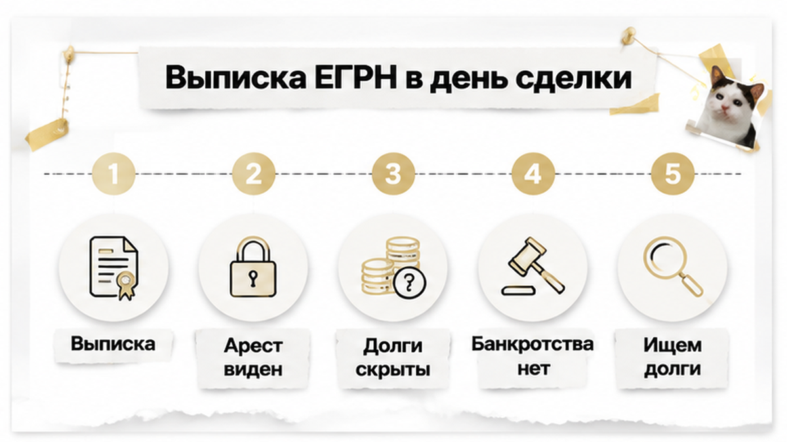
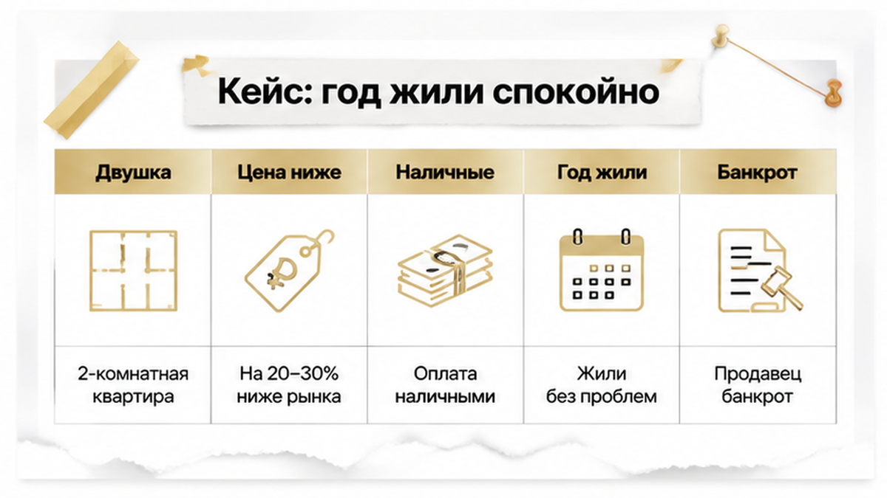
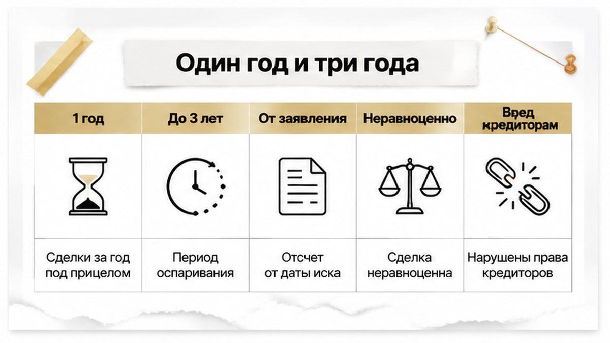
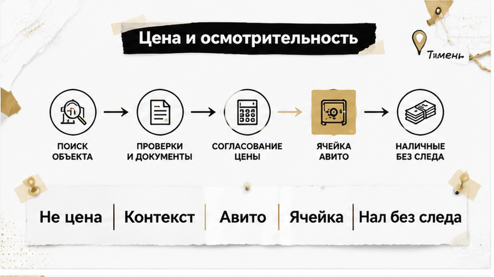
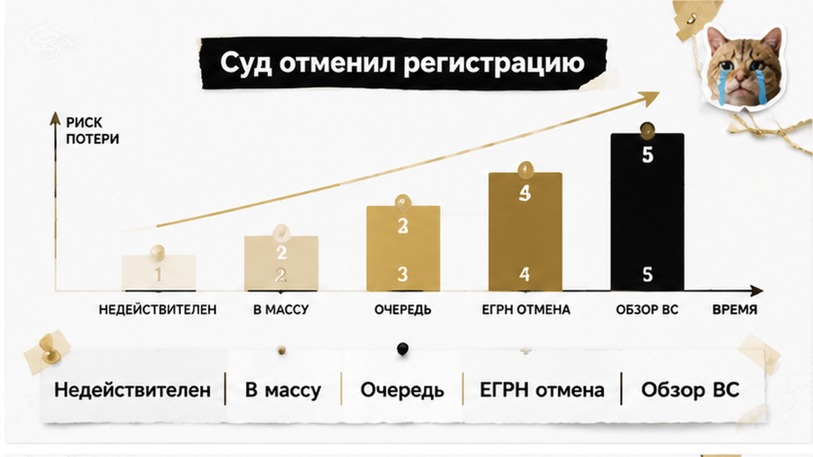
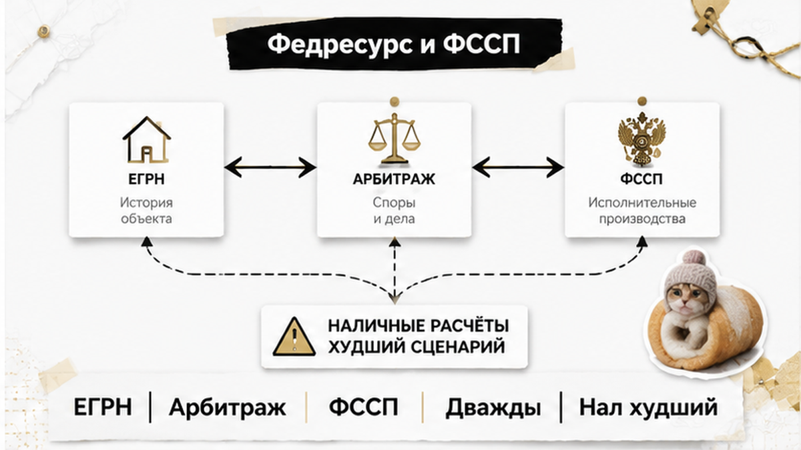

# Sol inputs — B10 — 2026-08-26

## ROLE
Sol: перепиши **целиком** смысл из `drafts/writer.html` в слог тенанта (SOUL + good-outputs).  
Выход: **только сырой HTML-фрагмент** тела статьи — без markdown fences, без ```html, без пояснений до/после.

## H1 (НЕ включать в article.html — только контекст)
Купил квартиру в Тюмени — через год суд вернул её банкроту

## HARD constraints

- **2000–2600 слов** русского текста (не сжимать ниже 2000).
- **Не выдумывать** факты, цифры, URL — только из Writer/research ниже.
- **HTML whitelist:** h2, h3, p, b, i, a, ul, ol, li, table, tr, th, td, figure, img, div — **b не strong, i не em**.
- **Без h1** в теле. **Без** research-даты, Wordstat, эмодзи, мата.
- **Klyshin rhythm, Shakin facts:** короткие абзацы, диалоги в «кавычках», контраст «обычный видит / риэлтор спрашивает».
- **Прозаический лид 4–6 предложений** (news-casus: сцена → напряжение → намёк на финал). **Запрещено** в первом экране: TL;DR, «Быстрый инсайт», bullet-списки до первого H2.
- **7 figure placeholders** — сразу после открытия каждого из **первых 7 H2**:

```html
<figure class="inline-quad" data-slot="inline_N">
  
</figure>
```
(N = 1…7, zero-padded: inline-01.png … inline-07.png)

- **Interlink (HARD):** сохранить **все 4** sibling URL из Writer (можно переформулировать якорь, URL не менять):
  - /blog/ipoteka/ipoteku-odobrili-a-registraciyu-otmenili-stroka-v-egrn/
  - /blog/vtorichka-i-riski/nasledstvo-kvartiry-syn-ot-pervogo-braka-ne-otkazalsya/
  - /blog/vtorichka-i-riski/skidku-dva-milliona-obeschali-a-v-kvartire-pryatali-risk/
  - /blog/vtorichka-i-riski/raspisku-na-kvartiru-napisali-deneg-na-schete-net/

- **Comment magnet (HARD):** один острый вопрос «…?» — после финала casus или перед mid CTA. Угол из title-brief: «Покупатель не знал о долгах продавца — он всё равно должен вернуть квартиру?»

- **Телефон в теле один раз:** `<a href="tel:+79220016505">+7&nbsp;922&nbsp;001&nbsp;65&nbsp;05</a>` — только в **excalibur-cta-end**, не дублировать.

## CTA zones (quality-bar-9) — вставить дословно по смыслу шаблонов

### Early — сразу после прозаического лида (4–6 предложений), ДО первого H2:

```html
<div class="excalibur-cta-early">
<p><b>Я — Святослав Шакин, The Риэлтор в Тюмени.</b> Лично веду сделку от звонка до регистрации.</p>
<p>Полный разбор кейсов и как я это ловлю до аванса — в <a href="https://t.me/Tyumen_Rieltor">Telegram</a> и <a href="https://max.ru/id561413315447_biz">MAX</a>. Напишите — подключусь.</p>
<p><a href="https://t.me/Tyumen_Rieltor">Telegram</a> · <a href="https://max.ru/id561413315447_biz">MAX</a></p>
</div>
```
Early CTA: **ТОЛЬКО** TG + MAX. Без других каналов.

### Mid — сразу после H2 «Что проверить до аванса…» и его содержимого (таблица + ol + закрывающий p):

```html
<div class="excalibur-cta-mid">
<p>Разборы похожих кейсов с банкротством продавца и оспариванием сделки — в <a href="https://t.me/Tyumen_Rieltor">Telegram</a> и <a href="https://max.ru/id561413315447_biz">MAX</a>. Напишите до аванса — разберём вашу ситуацию.</p>
</div>
```

### End — финал (dual CTA + полный набор):

```html
<h2>Напишите до аванса — или сразу к делу</h2>
<p>Разберём риски банкротства продавца и доказательную базу до перевода денег — или подключусь в сделку на вторичке в Тюмени.</p>
<div class="excalibur-cta-end excalibur-social-cta">
<p>Напишите на консультацию в <a href="https://t.me/Tyumen_Rieltor">Telegram</a> или <a href="https://max.ru/id561413315447_biz">MAX</a> — или позвоните <a href="tel:+79220016505">+7&nbsp;922&nbsp;001&nbsp;65&nbsp;05</a>. Или сразу к делу: подключусь до аванса.</p>
<ul>
<li><a href="https://t.me/Tyumen_Rieltor">Telegram — смотреть разборы</a></li>
<li><a href="https://max.ru/id561413315447_biz">MAX — напишите, подключусь</a></li>
<li><a href="/">Сайт tymenrieltor.ru</a></li>
<li><a href="/gajdy/">PDF-гайды</a></li>
<li><a href="https://dzen.ru/holyslav">Дзен — смотреть разборы</a></li>
<li><a href="https://vk.ru/tymenrieltor">VK</a></li>
<li><a href="/rieltor-tyumen/">Обо мне</a></li>
</ul>
</div>
<p>Материал проверен: Святослав Шакин, личный риэлтор в Тюмени. Ориентир для покупателя, не индивидуальная юридическая консультация.</p>
```

## Soul calibration (кратко)

- Лид: квартира куплена, право зарегистрировано, год спокойной жизни → повестка в арбитраж → финуправляющий оспаривает сделку.
- Диалог: «Сделка закрыта, запись внесена, спорить не о чем» — затем разбор.
- Контраст: обычный человек видит чистую выписку / риэлтор спрашивает про долги продавца и расчёт.
- Финал casus (H2 «Финал: суд отменил регистрацию…») — **до** практики «что проверить».
- Не SEO-робот, не глоссарий в лиде. Имя Клышина можно упомянуть как внешний сигнал (Writer), не как автор текста.

## title-brief.json

```json
{
  "topic_id": "B10",
  "h1": "Купил квартиру в Тюмени — через год суд вернул её банкроту",
  "subject": "Покупка квартиры в Тюмени и банкротство продавца",
  "angle": "Покупатель зарегистрировал право и въехал в квартиру, но через год финансовый управляющий оспорил сделку, а суд обязал вернуть жильё в конкурсную массу.",
  "comment_magnet_angle": "Покупатель не знал о долгах продавца — он всё равно должен вернуть квартиру?"
}
```

## Fact check (research — не копировать дату/Wordstat в лид)

- Сигнал Клышина 16.08.2026: банкротство продавца — первая из пяти схем законной потери квартиры.
- Обзор ВС РФ № 12/2026 от 01.07.2026: цена не изолированно; п.16 — реституция → отмена записи ЕГРН.
- Определение ВС от 17.04.2026 № 307-ЭС25-13338, дело А56-96799/2023 — отказ в иске финуправляющему.
- ст. 61.2 п.1 — 1 год до принятия заявления; п.2 — 3 года, цель вреда + знание.
- ст. 213.25 п.5 — после признания банкротом распоряжается только финуправляющий.
- **Фабула — обобщённая**, не конкретное тюменское дело с реквизитами. Честно оговаривать.
- **Не** обещать гарантию от титульного страхования / ячейки / выписки.
- **Не** советовать кредитную историю продавца без согласия.

## H2 structure (сохранить все темы Writer, можно переформулировать заголовки в слоге)

1. Чистая выписка ЕГРН в день сделки — что она реально показывает
2. Кейс в Тюмени: зарегистрировали право, въехали — и год жили спокойно
3. Почему финуправляющий смотрит сделки за один год и за три года
4. Что суд оценивает: цена, расчёт и осмотрительность покупателя
5. Финал: суд отменил регистрацию и вернул квартиру в конкурсную массу (+ comment magnet)
6. Что проверить до аванса на вторичке в Тюмени → **mid CTA после этого блока**
7. Федресурс, арбитраж и ФССП: где искать банкротство продавца
8. Если пришла повестка: первые шаги покупателя
9. Главный вывод: чистый ЕГРН не гарантирует, что сделку не оспорят → **end CTA**

## drafts/writer.html — ПЕРЕПИСАТЬ В СЛОГ (смысл сохранить)

<!-- WRITER DRAFT START -->
<p>Квартиру купили, право зарегистрировали, ключи забрали, обои переклеили — а через год пришла повестка в арбитражный суд. Продавец, который на сделке выглядел абсолютно нормальным человеком с чистой выпиской ЕГРН, спустя несколько месяцев после расчёта подал на собственное банкротство. Финансовый управляющий, как ему и положено, поднял все прежние сделки должника — и квартира, в которой уже год живёт другая семья, превратилась в «подозрительную сделку по выводу ликвидного актива». 16 августа 2026 года Клышин разбирал пять схем законной потери квартиры, и банкротство продавца стояло в этом списке под первым номером — не потому, что оно самое частое, а потому, что покупатель до последнего уверен: сделка закрыта, запись внесена, спорить не о чем. А в обзоре Верховного Суда № 12/2026 от 1 июля 2026 года прямо сказано: признание сделки недействительной и реституция — это основание отменить запись в ЕГРН. То есть запись, ради которой все и делалось, не финал, а всего лишь текущее состояние реестра.</p>

<p>Я Святослав Шакин, риэлтор из Тюмени. Ниже — разбор того, почему выписка «чистая на дату сделки» и «сделка не будет оспорена» — это два разных утверждения, и как выглядит их расхождение в живых деньгах.</p>

<h2>Чистая выписка ЕГРН в день сделки — что она реально показывает</h2>

<figure class="inline-quad" data-slot="inline_1"></figure>

<p>Выписка из ЕГРН отвечает ровно на один вопрос: кто и на каком основании владеет объектом и какие права и обременения зарегистрированы <i>на эту дату</i>. Арест — виден. Ипотека — видна. Запрет на регистрационные действия — виден. Судебный спор, если о нём внесена отметка, — виден.</p>

<p>Чего в выписке нет и не может быть: будущего заявления о банкротстве продавца, его долгов перед банками и физлицами, поручительств, неисполненных решений судов и намерения кредитора через месяц пойти в арбитраж. На дату сделки продавец может не быть банкротом — и никакой записи об этом в ЕГРН, разумеется, не будет. Процедура запускается позже, а вот смотреть назад она умеет.</p>

<p>Поэтому фраза «выписку взяли в день подписания, всё чисто» защищает от одного класса рисков — уже существующих обременений — и вообще не защищает от другого: оспаривания сделки по Закону о банкротстве. Это разные механики, и путать их дорого. Ровно так же покупатели путают одобренную ипотеку с гарантией регистрации — про это отдельный <a href="/blog/ipoteka/ipoteku-odobrili-a-registraciyu-otmenili-stroka-v-egrn/">случай, где ипотеку одобрили, а регистрацию отменили</a>. И примерно так же выписка молчит о людях, которые могут заявить права на объект — как в <a href="/blog/vtorichka-i-riski/nasledstvo-kvartiry-syn-ot-pervogo-braka-ne-otkazalsya/">истории с наследством, где сын от первого брака не отказался от доли</a>.</p>

<h2>Кейс в Тюмени: зарегистрировали право, въехали — и год жили спокойно</h2>

<figure class="inline-quad" data-slot="inline_2"></figure>

<p>Сразу оговорюсь честно: то, что я разбираю дальше, — обобщённая фабула, собранная из типовых дел, а не конкретное тюменское решение с номером и реквизитами. Выдавать её за установленный факт я не буду. Но каждый её элемент встречается в практике, и рассматривал бы такой спор Арбитражный суд Тюменской области — по общим федеральным правилам, тем же, что и в Петербурге или Екатеринбурге.</p>

<p>Фабула простая. Двушка на вторичке, продавец — собственник, документы в порядке, выписка свежая. Цена — ниже средней по дому, продавец объясняет спешкой: разъезд, переезд, «нужны деньги сейчас». Часть расчёта проходит наличными, без банковского следа, потому что «так быстрее». Договор подписан, право зарегистрировано, семья заезжает и год живёт, не вспоминая о продавце.</p>

<p>Через несколько месяцев после сделки продавец подаёт заявление о собственном банкротстве. Суд его принимает, назначает финансового управляющего — и тот начинает делать свою работу: собирать имущество должника в конкурсную массу и проверять, не ушло ли что-то из этого имущества незадолго до процедуры. Квартира, проданная дешевле рынка и частично за наличные, попадает в его список первой. Мотив покупателя тут вообще не обсуждается: управляющий смотрит не на людей, а на сделки.</p>

<p>Скидка, которую продавец объясняет спешкой, — почти всегда самая дорогая строка в договоре. Похожий сюжет я разбирал в <a href="/blog/vtorichka-i-riski/skidku-dva-milliona-obeschali-a-v-kvartire-pryatali-risk/">материале про обещанные два миллиона скидки, за которыми прятался риск</a>.</p>

<h2>Почему финуправляющий смотрит сделки за один год и за три года</h2>

<figure class="inline-quad" data-slot="inline_3"></figure>

<p>«Год» и «три года», которые все слышали, — это не сроки давности и не два срока для одного и того же. Это два разных основания в статье 61.2 Закона № 127-ФЗ, с разной глубиной ретроспективы и разным предметом доказывания.</p>

<p>Пункт 1 статьи 61.2 — неравноценное встречное исполнение. Сюда попадают сделки, совершённые в течение одного года до принятия заявления о банкротстве или после его принятия. Управляющему достаточно показать, что должник получил существенно меньше, чем отдал.</p>

<p>Пункт 2 статьи 61.2 — сделки в пределах трёх лет, совершённые с целью причинить вред имущественным правам кредиторов, при условии, что другая сторона знала или должна была знать об этой цели. Здесь планка доказывания выше, но и охват шире.</p>

<p>Критично важная деталь, на которой ошибаются чаще всего: и год, и три года считаются от даты <i>принятия заявления</i> о банкротстве, а не от даты решения о признании должника банкротом. Между этими датами могут пройти месяцы, и покупатель, который считает «от банкротства», регулярно ошибается в свою пользу.</p>

<table>
  <thead>
    <tr>
      <th>Основание</th>
      <th>Ретроспективный период</th>
      <th>Что доказывает финуправляющий</th>
      <th>Чем закрывается покупатель</th>
    </tr>
  </thead>
  <tbody>
    <tr>
      <td>п. 1 ст. 61.2</td>
      <td>1 год до принятия заявления и после</td>
      <td>Неравноценность встречного исполнения</td>
      <td>Рыночная логика цены, документальный расчёт</td>
    </tr>
    <tr>
      <td>п. 2 ст. 61.2</td>
      <td>До 3 лет до принятия заявления</td>
      <td>Цель причинить вред кредиторам плюс осведомлённость покупателя</td>
      <td>Отсутствие связи сторон, следы обычного поиска объекта, проверки на дату сделки</td>
    </tr>
  </tbody>
</table>

<p>Отсюда практический вывод, неприятный, но простой: сделка на вторичке живёт в зоне возможного оспаривания дольше, чем длится радость от переезда. И защищает в этой зоне не запись в ЕГРН, а то, что вы сможете предъявить суду о своём поведении на сделке.</p>

<h2>Что суд оценивает: цена, расчёт и осмотрительность покупателя</h2>

<figure class="inline-quad" data-slot="inline_4"></figure>

<p>Самое частое заблуждение покупателя звучит так: «Если я заплатил не слишком дешёво — сделку не тронут». Обзор Верховного суда № 12/2026 от 01.07.2026 читается ровно наоборот: цена не оценивается изолированно. Суд смотрит контекст сделки и осмотрительность приобретателя, а не только процент отклонения от рынка.</p>

<p>Формальное отклонение цены само по себе не делает договор недействительным. В определении от 17.04.2026 № 307-ЭС25-13338 по делу А56-96799/2023 Верховный суд отменил акты нижестоящих судов, которые построили выводы преимущественно на арифметике «дешевле рынка». В этом деле учли, что покупатель искал объект через Авито и Домклик, расчёт шёл через банковскую ячейку, а в договоре были заверения продавца об отсутствии признаков банкротства. В иске финансовому управляющему отказали.</p>

<p>Обратная сторона та же логика. Если цена занижена, расчёт был наличными без следа, часть суммы прошла «доплатой вне договора», стороны связаны, а право переходило быстро и по цепочке — совокупность обстоятельств начинает работать против покупателя. Отдельно суд смотрит, был ли у продавца ликвидный актив, который выводили перед банкротством, и были ли к моменту сделки долги.</p>

<p>Основания при этом разные, и путать их нельзя. Пункт 1 статьи 61.2 Закона № 127-ФЗ — это неравноценное встречное исполнение, и здесь достаточно одного года до принятия заявления о банкротстве или периода после него. Пункт 2 той же статьи — это трёхлетний период, но он требует цели причинить вред кредиторам и того, что другая сторона знала или должна была знать об этой цели. «Три года» — не универсальный срок для любой претензии, а конкретная конструкция с более тяжёлым доказыванием.</p>

<p>Именно поэтому дешёвая покупка с торгом «минус два миллиона» превращается в риск не сама по себе, а вместе со всем остальным — я разбирал такой сценарий в материале про <a href="/blog/vtorichka-i-riski/skidku-dva-milliona-obeschali-a-v-kvartire-pryatali-risk/">скидку, за которой прятался риск банкротства продавца</a>.</p>

<h2>Финал: суд отменил регистрацию и вернул квартиру в конкурсную массу</h2>

<figure class="inline-quad" data-slot="inline_5"></figure>

<p>Финал в такой фабуле выглядит буднично и от этого страшнее. Суд признаёт договор недействительным, применяет последствия — реституцию, и квартира возвращается в конкурсную массу должника. Требование покупателя о возврате денег при этом не исчезает, но встаёт в общую очередь кредиторов вместе с остальными.</p>

<p>Дальше срабатывает механика реестра. Согласно пункту 16 обзора № 12/2026, судебный акт о недействительности сделки и применении реституции является основанием для отмены записи в ЕГРН. То есть та самая «чистая» запись, которую покупатель считал финальной точкой, аннулируется на основании решения арбитражного суда — например, Арбитражного суда Тюменской области, если банкротство продавца рассматривается там.</p>

<p>И ещё одна деталь, которую редко замечают вовремя: после признания продавца банкротом распоряжаться имуществом конкурсной массы вправе только финансовый управляющий (пункт 5 статьи 213.25). Никакие последующие договорённости с бывшим собственником напрямую уже не работают.</p>

<p>Сразу оговорюсь честно: описанная история — обобщённая фабула, а не конкретное тюменское дело с реквизитами. Я не выдаю её за установленный судебный акт. Но правила, по которым она разворачивается, для тюменских продавцов ровно те же, что и для любых других — они федеральные.</p>

<p>И вот тут вопрос, на который у людей в комментариях всегда разные ответы. Покупатель не знал о долгах продавца — он всё равно должен вернуть квартиру? Формально «не знал» не является гарантией: суд оценивает совокупность обстоятельств, а не только субъективную уверенность приобретателя. Как вы считаете, это справедливо?</p>

<h2>Что проверить до аванса на вторичке в Тюмени</h2>

<figure class="inline-quad" data-slot="inline_6"></figure>

<p>Проверка делается до аванса, а не после подписания договора. Смысл не в том, чтобы получить гарантию — её не даёт никто. Смысл в том, чтобы собрать доказуемую картину: вы искали объект открыто, платили прозрачно, цену обосновали и проверили продавца по доступным источникам.</p>

<table>
<tr><td><b>Что проверяем</b></td><td><b>Где смотрим</b></td><td><b>Что настораживает</b></td></tr>
<tr><td>Признаки банкротства продавца</td><td>Федресурс, картотека арбитражных дел</td><td>Опубликованное сообщение, принятое заявление</td></tr>
<tr><td>Долги и взыскания</td><td>Банк данных исполнительных производств ФССП</td><td>Несколько производств, крупные суммы</td></tr>
<tr><td>Логика цены</td><td>Открытые объявления и аналоги по району</td><td>Скидка без объяснимой причины, торг «в моменте»</td></tr>
<tr><td>Расчёт</td><td>Банковские документы по всей сумме</td><td>Наличные без следа, доплата вне договора</td></tr>
<tr><td>История объекта</td><td>Выписка ЕГРН о переходах прав</td><td>Быстрые переходы, цепочка сделок</td></tr>
</table>

<p>Порядок действий я бы выстроил так.</p>

<ol>
<li>Проверить продавца по Федресурсу и картотеке арбитражных дел до передачи любых денег, включая аванс.</li>
<li>Посмотреть исполнительные производства в базе ФССП и зафиксировать результат скриншотом с датой.</li>
<li>Обосновать цену: сохранить объявления, переписку, историю торга — чтобы скидка имела объяснение, а не выглядела выводом актива.</li>
<li>Провести расчёт полностью документально, чтобы каждый рубль подтверждался банковской бумагой, а не расписками. Чем это заканчивается, я показывал в истории, где <a href="/blog/vtorichka-i-riski/raspisku-na-kvartiru-napisali-deneg-na-schete-net/">расписку написали, а денег на счёте не оказалось</a>.</li>
<li>Включить в договор заверения продавца об отсутствии признаков банкротства и неисполненных обязательств.</li>
<li>Сохранить весь комплект: выписки, скриншоты проверок, платёжные документы, переписку — это ваша будущая доказательная база осмотрительности.</li>
</ol>

<p>Про кредитную историю продавца отдельно: запрашивать её без его согласия нельзя, и обходных путей я не советую. Титульное страхование и юридическая экспертиза — рыночные услуги, они снижают ваши потери и повышают качество проверки, но не являются государственной гарантией и спор не исключают.</p>

<h2>Федресурс, арбитраж и ФССП: где искать банкротство продавца</h2>
<figure class="inline-quad" data-slot="inline_7"></figure>
<p>Выписка из ЕГРН показывает права и обременения на дату запроса — и всё. Она не отвечает на вопрос, есть ли у продавца просуженные долги, подано ли в отношении него заявление о банкротстве и не готовится ли оно прямо сейчас. Поэтому проверку приходится собирать из нескольких открытых источников, и ни один из них по отдельности картину не закрывает.</p>
<p>Базовый набор — три ресурса. Федресурс (Единый федеральный реестр сведений о банкротстве) публикует сообщения о введённых процедурах, назначенных финансовых управляющих, торгах. Картотека арбитражных дел показывает, принято ли заявление к производству, — а именно от даты принятия заявления отсчитываются ретроспективные периоды по статье 61.2 Закона № 127-ФЗ, один год и три года. Банк данных исполнительных производств ФССП даёт косвенный, но важный сигнал: массив взысканий у продавца — это будущие кредиторы, если процедура всё-таки начнётся. Для тюменских продавцов правила федеральные, а дело о банкротстве при прочих равных рассматривает Арбитражный суд Тюменской области.</p>
<table>
<tr><th>Источник</th><th>Что показывает</th><th>Чего не показывает</th></tr>
<tr><td>Федресурс (ЕФРСБ)</td><td>Введённые процедуры, финуправляющего, публикации по делу</td><td>Ситуацию до подачи заявления — за день до неё реестр пуст</td></tr>
<tr><td>Картотека арбитражных дел</td><td>Дату принятия заявления о банкротстве, движение дела</td><td>Планы кредиторов, которые ещё не пошли в суд</td></tr>
<tr><td>Банк данных ФССП</td><td>Возбуждённые исполнительные производства, суммы взысканий</td><td>Долги, по которым решение суда ещё не вынесено</td></tr>
<tr><td>Выписка ЕГРН</td><td>Права, обременения и аресты на дату запроса</td><td>Основания для оспаривания сделки по Закону о банкротстве</td></tr>
</table>
<p>Проверять имеет смысл дважды: перед авансом и повторно в день сделки. Между этими датами может измениться многое, и запись в картотеке, появившаяся за неделю до подписания договора, — это уже не «мелочь в биографии продавца», а прямое основание остановиться.</p>
<p>Отдельно про расчёт. Наличные без следа — худший вариант из возможных, потому что в обособленном споре покупателю приходится доказывать не только факт передачи денег, но и их источник. Как это выглядит, когда бумага есть, а движения средств нет, я разбирал в истории про <a href="/blog/vtorichka-i-riski/raspisku-na-kvartiru-napisali-deneg-na-schete-net/">расписку, за которой не оказалось денег на счёте</a>. Банковская ячейка, аккредитив, перевод — это не защита от оспаривания, но это документальный след, который суд видит.</p>

<h2>Если пришла повестка: первые шаги покупателя</h2>
<p>Повестка или определение арбитражного суда о привлечении вас к участию в обособленном споре — это не приговор и не повод замереть. Это процессуальный документ с датами, и главная ошибка на этом этапе — проигнорировать заседание, решив, что «я же добросовестный покупатель, суд разберётся». Суд разбирается по документам, которые ему принесли стороны.</p>
<ol>
<li>Посмотреть номер дела в картотеке арбитражных дел: кто заявитель, по какому основанию оспаривается сделка — пункт 1 статьи 61.2 (неравноценное встречное исполнение) или пункт 2 (цель причинить вред кредиторам). От этого зависит, что именно придётся доказывать.</li>
<li>Собрать пакет добросовестности: договор с заверениями продавца об отсутствии признаков банкротства, платёжные документы, договор аренды ячейки или аккредитива, выписки по счетам, справки об источнике средств.</li>
<li>Восстановить историю поиска квартиры: скриншоты объявления, переписка с агентом, распечатки с площадок. В деле А56-96799/2023 Верховный Суд учёл, что покупатель нашёл объект через Авито и Домклик, — это довод против версии о заранее спланированном выводе актива.</li>
<li>Собрать обоснование цены: аналоги на дату сделки, состояние квартиры, обременения и жильцы, если они влияли на торг. Формальный процент отклонения от рынка сам по себе не делает сделку недействительной — это прямо следует из обзора ВС РФ № 12/2026 и определения от 17.04.2026 № 307-ЭС25-13338.</li>
<li>Привлечь юриста, который ведёт банкротные обособленные споры. Это не тот же профиль, что сопровождение сделок купли-продажи.</li>
</ol>
<p>Что важно понимать заранее: если сделку всё-таки признают недействительной, применяется реституция — квартира возвращается в конкурсную массу, а требование покупателя о возврате денег включается в реестр требований кредиторов. Юридически стороны возвращаются в исходное положение. Фактически деньги приходят из конкурсной массы в порядке очерёдности и далеко не всегда в полном объёме. Именно поэтому проверка до аванса стоит дешевле любого спора после.</p>

<h2>Главный вывод: чистый ЕГРН не гарантирует, что сделку не оспорят</h2>
<p>Выписка без обременений на дату сделки — необходимое условие, но не достаточное. Она фиксирует состояние реестра на конкретный день и не говорит ничего о том, что произойдёт с продавцом через месяц. После принятия заявления о банкротстве финансовый управляющий разворачивается назад: смотрит сделки за год по пункту 1 статьи 61.2 и за три года по пункту 2, а после признания гражданина банкротом распоряжаться имуществом конкурсной массы вправе только он (пункт 5 статьи 213.25). Признание сделки недействительной с применением реституции становится основанием для отмены записи в ЕГРН — на это прямо указывает пункт 16 обзора ВС РФ № 12/2026.</p>
<p>Аргумент «я не знал о долгах продавца» работает не сам по себе, а вместе с доказательствами: рыночной логикой цены, документальным расчётом, следом поиска объекта, заверениями в договоре. Суд оценивает совокупность, а не одну удачную фразу. И это не единственный сценарий, где право зарегистрировано, а спор впереди: похожая механика — в истории про <a href="/blog/vtorichka-i-riski/nasledstvo-kvartiry-syn-ot-pervogo-braka-ne-otkazalsya/">наследственную квартиру, где объявился сын от первого брака</a>.</p>
<p>Титульное страхование и юридическая экспертиза — рыночные услуги, а не государственная гарантия: они снижают риск и компенсируют потери по условиям договора, но не запрещают финансовому управляющему подать заявление. Практический вывод простой: на вторичке в Тюмени проверять нужно не только квартиру, но и продавца — его долги, его суды, его финансовое положение. Квартира редко бывает проблемной сама по себе. Проблемным обычно бывает тот, кто её продаёт.</p>

<!-- WRITER DRAFT END -->
