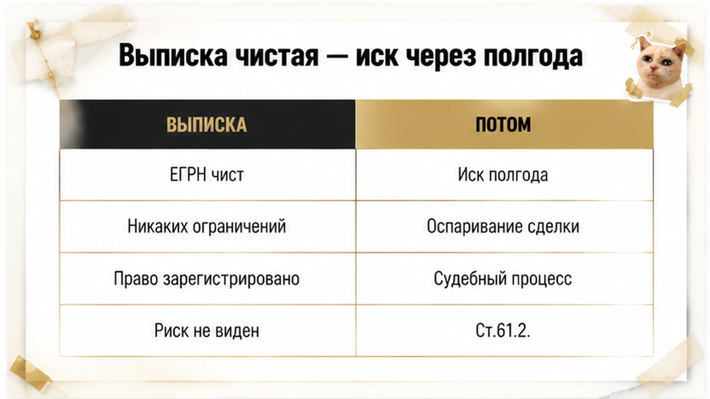
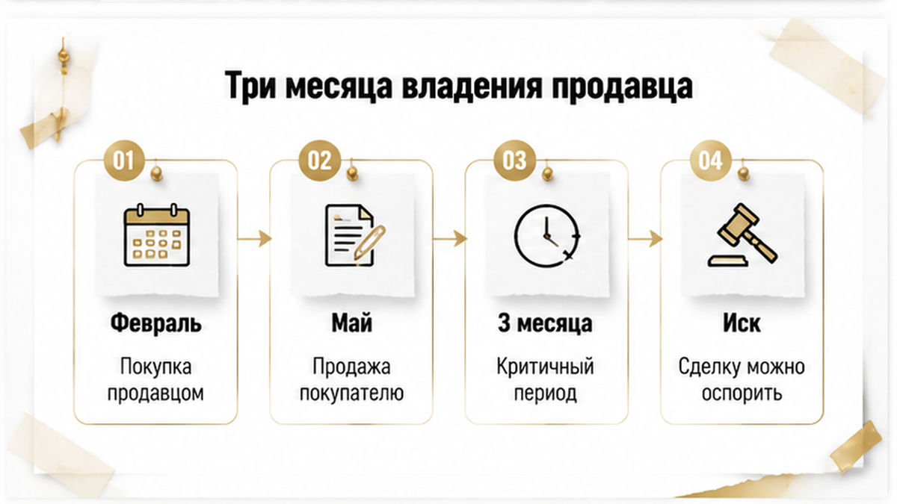
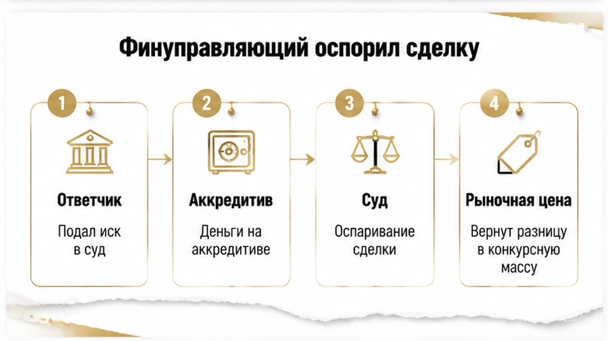
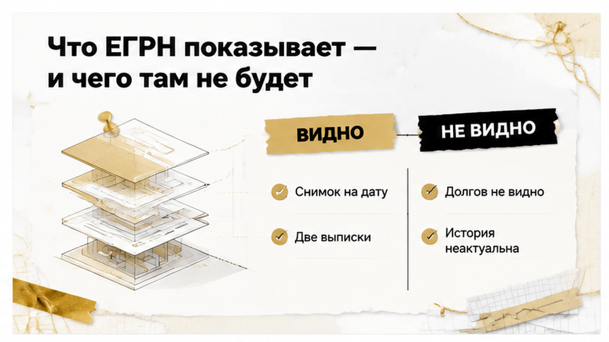
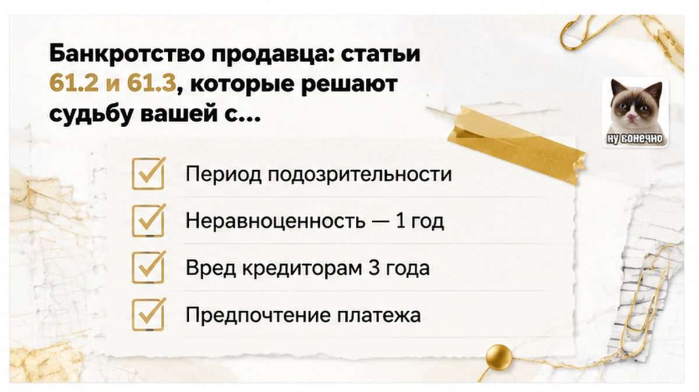
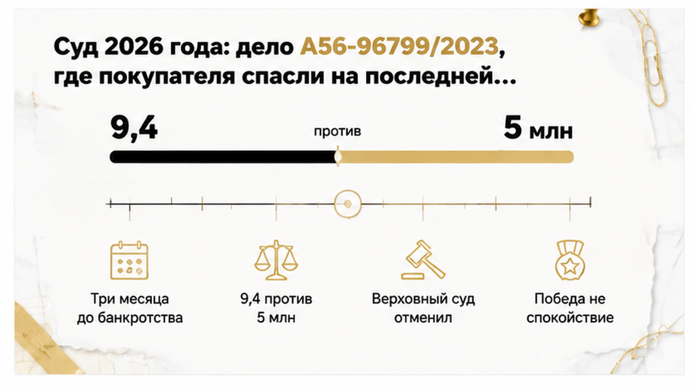
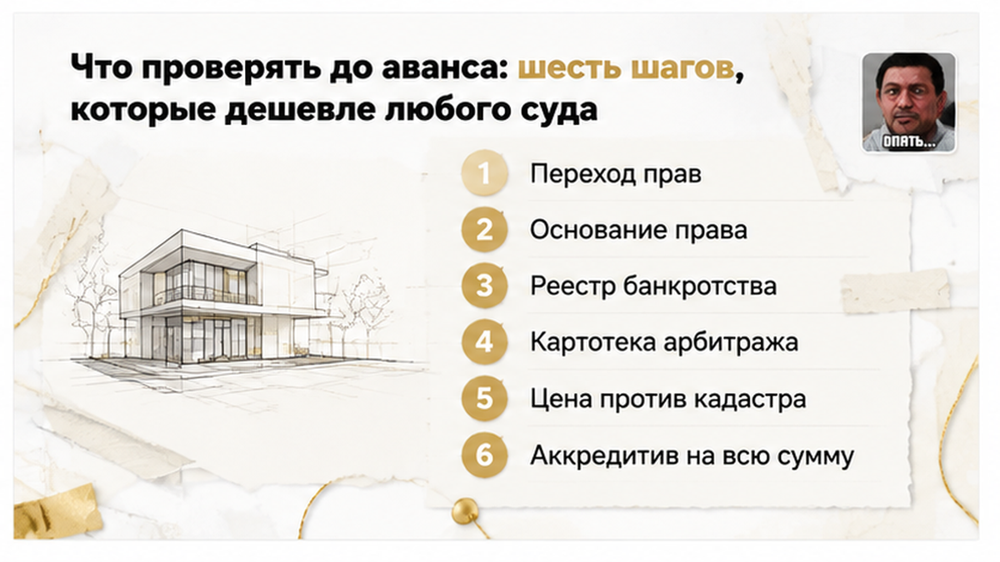

# Sol inputs — B10 — 2026-08-24

## ROLE
Sol: перепиши **целиком** смысл из `drafts/writer.html` в слог тенанта (SOUL + good-outputs).  
Выход: **только сырой HTML-фрагмент** тела статьи — без markdown fences, без ```html, без пояснений до/после.

## H1 (НЕ включать в article.html — только контекст)
Чистая выписка на квартиру — через полгода сделку оспорили

## HARD constraints

- **2000–2600 слов** русского текста. Writer ~2740 — **сжать** за счёт повторов и длинных абзацев, не выкидывая факты и финал casus.
- **Не выдумывать** факты, цифры, URL — только из Writer/research ниже.
- **HTML whitelist:** h2, h3, p, b, i, a, ul, ol, li, table, tr, th, td, figure, img, div — **b не strong, i не em**.
- **Без h1** в теле. **Без** research-даты, Wordstat, эмодзи, мата.
- **Klyshin rhythm, Shakin facts:** короткие абзацы (часто одно предложение = один абзац), диалоги в «кавычках», контраст «обычный видит / риэлтор спрашивает».
- **Прозаический лид 4–6 предложений** — сцена casus, **без** TL;DR, **без** «Быстрый инсайт», **без** bullet/ul/ol до первого H2.
- **Ровно 7 figure** — сразу после открытия каждого из **первых 7 H2** (inline_8 из Writer убрать; блок «Типичные ошибки» влить в конец чеклиста или в финальный абзац перед end CTA **без** отдельного H2 с figure):

```html
<figure class="inline-quad" data-slot="inline_N">

</figure>
```
(N = 1…7, zero-padded: inline-01.png … inline-07.png)

- **Interlink (HARD):** сохранить **все 4** sibling URL из Writer (можно переформулировать якорь, URL не менять):
  - /blog/vtorichka-i-riski/raspisku-na-kvartiru-napisali-deneg-na-schete-net/
  - /blog/ipoteka/ipoteku-odobrili-a-registraciyu-otmenili-stroka-v-egrn/
  - /blog/vtorichka-i-riski/skidku-dva-milliona-obeschali-a-v-kvartire-pryatali-risk/
  - /blog/vtorichka-i-riski/nasledstvo-kvartiry-syn-ot-pervogo-braka-ne-otkazalsya/

- **Телефон в теле один раз:** `<a href="tel:+79220016505">+7 922 001 65 05</a>` — только в **excalibur-cta-end**, не дублировать.

- **Comment magnet (HARD):** один острый вопрос с двумя полюсами — после финала casus или перед mid CTA. Угол из title-brief: «Три месяца владения продавца — для вас стоп-сигнал или «на рынке так принято»?»

- **News-casus arc:** лид → early CTA → история → **явный H2-финал** (суд/оспаривание/исход) → практика после → comment magnet → mid CTA → end CTA.

- Не писать имя Клышина как автора; допустимо «как формулируют в разборах 2026 года» без привязки к личности.

## CTA zones (quality-bar-9)

### Early — сразу после прозаического лида (4–6 предложений), **до** первого H2:

```html
<div class="excalibur-cta-early">
<p><b>Я — Святослав Шакин, The Риэлтор в Тюмени.</b> Лично веду сделку от звонка до регистрации.</p>
<p>Полный разбор кейсов и как я это ловлю до аванса — в <a href="https://t.me/Tyumen_Rieltor">Telegram</a> и <a href="https://max.ru/id561413315447_biz">MAX</a>.</p>
<p><a href="https://t.me/Tyumen_Rieltor">Telegram</a> · <a href="https://max.ru/id561413315447_biz">MAX</a></p>
</div>
```

### Mid — после H2 с чеклистом/таблицей «что проверять до аванса»:

```html
<div class="excalibur-cta-mid">
<p><b>Проверяю цепочку владения и банкротные реестры до аванса — по каждому участнику, а не только по продавцу.</b></p>
<p>Разборы сделок, красные флаги и живые кейсы Тюмени — в <a href="https://t.me/Tyumen_Rieltor">Telegram</a> и <a href="https://max.ru/id561413315447_biz">MAX</a>.</p>
</div>
```

### End — dual CTA + полный набор каналов:

```html
<div class="excalibur-cta-end">
<p><b>Я — Святослав Шакин, The Риэлтор в Тюмени.</b> Веду сделку лично: проверяю цепочку владения, банкротные реестры и расчёт до того, как вы внесли аванс.</p>
<p>Если продавец владеет квартирой недавно — покажите мне выписку до аванса, а не после регистрации: <a href="tel:+79220016505">+7 922 001 65 05</a>.</p>
<p><a href="https://t.me/Tyumen_Rieltor">Telegram</a> · <a href="https://max.ru/id561413315447_biz">MAX</a> · <a href="https://dzen.ru/holyslav">Дзен</a> · <a href="https://vk.ru/tymenrieltor">VK</a></p>
<p><a href="{{SITE_BASE}}/gajdy/">Гайды по сделкам</a> · <a href="{{SITE_BASE}}/rieltor-tyumen/">Обо мне</a> · <a href="{{SITE_BASE}}/kontakty/">Контакты</a></p>
</div>
```

Закрывающий дисклеймер после end CTA:
`<p>Материал проверен: Святослав Шакин, личный риэлтор в Тюмени. Ориентир для покупателя, не индивидуальная юридическая консультация.</p>`

## Soul calibration (кратко)

- Лид: покупатель въехал, полгода спокойствия → конверт из арбитража → выписка была честной, но неполной.
- Диалог: «Наверное, планы поменялись» — про три месяца владения.
- Контраст: обычный видит чистую выписку / риэлтор видит короткий срок в цепочке.
- Финал casus обязателен: финуправляющий → суд → квартиру сохранил, но год нервов и юрист.
- Практика (чеклист, таблицы) — **после** финала, не вместо истории.

## title-brief.json

```json
{
  "topic_id": "B10",
  "h1": "Чистая выписка на квартиру — через полгода сделку оспорили",
  "comment_magnet_angle": "Три месяца владения продавца — для вас стоп-сигнал или «на рынке так принято»?"
}
```

## Fact check (research — не копировать в лид)

- Composite casus Тюмень: выписка чистая, продавец владел ~3 мес., аккредитив, через ~6 мес. иск финуправляющего. **Не выдумывать** ФИО и номер дела.
- Дело А56-96799/2023 (Право.ру 16.04.2026): продажа авг. 2023, банкротство +3 мес.; экспертиза 9,4 vs 5 млн; ВС отменил — добросовестный покупатель, цена выше кадастровой.
- КС Определение №765-О от 31.03.2026: ДКП более чем за 3 года до банкротства — отказ в оспаривании.
- ст. 61.2, 61.3, 61.9, 213.32 — 127-ФЗ.
- Короткий срок владения ≠ недействительность; это индикатор для проверки.
- fedresurs.ru, kad.arbitr.ru — банкротство не в ЕГРН.

## H2 structure (7 H2 с figure + практика; ошибки покупателя — ul без отдельного H2)

1. Выписка была чистой — а через полгода пришёл иск (inline_1)
2. Три месяца владения: что видно в переходе прав (inline_2)
3. Финал: финуправляющий оспорил сделку — и что из этого вышло (inline_3) — **обязательный casus-финал**
4. Что ЕГРН показывает — и чего там не будет (inline_4)
5. Банкротство продавца: ст. 61.2 и 61.3 (inline_5) + таблица из Writer
6. Суд 2026: дело А56-96799/2023 (inline_6)
7. Что проверять до аванса (inline_7) + ol + таблица + типичные ошибки (ul, без 8-го H2)

## drafts/writer.html — ПЕРЕПИСАТЬ В СЛОГ (смысл сохранить)

<!-- WRITER DRAFT START -->

<p><b>Полгода после регистрации — это ещё не финиш.</b> Летом покупатель в Тюмени взял вторичку с идеальными документами: актуальная выписка ЕГРН без арестов, без обременений, без судебных отметок, собственник один, расчёт через банк. Он спокойно заехал, поменял входную дверь, оформил лицевые счета и через месяц перестал вообще думать о сделке. А ещё через пять месяцев в почтовом ящике оказался конверт из арбитражного суда: финансовый управляющий продавца требовал признать договор купли-продажи недействительным и вернуть квартиру в конкурсную массу. Продавец, у которого при подписании не было ни одной отметки в реестре, к этому моменту уже банкротился. Самое неприятное в этой истории — в выписке всё было честно: реестр показал ровно то, что в нём было на дату запроса, и ни строчкой больше.</p>

<p>Я разбираю такие сценарии не для того, чтобы напугать вторичкой — а чтобы объяснить, где в этой сделке заранее горела лампочка. Она горела, и покупатель её видел: продавец владел квартирой три месяца.</p>

<h2>Выписка была чистой — а через полгода пришёл иск из арбитража</h2>

<figure class="inline-quad" data-slot="inline_1">

</figure>

<p>Сделка выглядела образцово. Квартира в обжитом районе, один собственник, свежая выписка из ЕГРН, заказанная за несколько дней до аванса. В разделе про обременения — прочерк. Аресты — нет. Судебные споры, о которых реестр знает и вносит отметку, — нет. Продавец на связи, документы отдаёт без нытья, торг умеренный. Покупатель сделал ровно то, что советуют в любой статье: заказал выписку, сверил паспорт, проверил, что человек единственный правообладатель.</p>

<p>Расчёт тоже был правильный. Не наличные в машине, не «расписку напишем, а деньги завтра», а банковский аккредитив: деньги раскрываются продавцу только после регистрации перехода права. Кто хоть раз читал историю про то, как <a href="/blog/vtorichka-i-riski/raspisku-na-kvartiru-napisali-deneg-na-schete-net/">расписку на квартиру написали, а денег на счёте нет</a>, тот к банковской схеме относится с уважением. Регистрация прошла штатно, выписка о правах пришла уже на нового собственника, ключи, ремонт, обычная жизнь.</p>

<p>Извещение из арбитражного суда пришло на шестом месяце. Смысл документа: в отношении продавца ведётся процедура банкротства, финансовый управляющий проанализировал сделки должника и считает договор купли-продажи квартиры подлежащим оспариванию. Основание — нормы Закона о банкротстве о сделках, причиняющих вред кредиторам. Ответчик — покупатель. Предмет спора — та самая квартира, где уже стоит новая дверь.</p>

<p>И вот здесь важно сказать честно: <b>выписка ЕГРН не соврала.</b> Она сделала то, что умеет — показала состояние реестра на дату запроса. Она не умеет показывать заявление о банкротстве, которое ещё не подано, долги продавца перед банками и физлицами, требования, которые всплывут в реестре кредиторов, и намерения будущего финансового управляющего. Ровно как в другом моём разборе, где <a href="/blog/ipoteka/ipoteku-odobrili-a-registraciyu-otmenili-stroka-v-egrn/">ипотеку одобрили, а регистрацию отменили из-за строки в ЕГРН</a>: реестр — это инструмент с чётко очерченными возможностями, а не оракул.</p>

<h2>Три месяца владения: что покупатель увидел в переходе прав</h2>

<figure class="inline-quad" data-slot="inline_2">

</figure>

<p>Самое обидное: сигнал у покупателя на руках был. Он заказывал не только актуальную выписку о правах, но и <b>выписку о переходе прав</b> — тот документ, где перечислены все регистрации по объекту: даты, номера, основания. И в этой выписке было видно, что продавец стал собственником всего за три месяца до нашей сделки. Купил в феврале — продал в мае. Документ-основание — договор купли-продажи, то есть человек не наследовал, не получал в дар, не выкупал долю у родственников. Просто купил и почти сразу перепродал.</p>

<p>Покупатель посмотрел на эту строку и мысленно объяснил её себе сам: наверное, не сошлось по работе, наверное, планы поменялись, бывает. Такое действительно бывает — и здесь надо оговорить сразу, чтобы не плодить панику: <b>короткий срок владения сам по себе ничего не нарушает.</b> В законе нет нормы «если владел меньше года — сделка недействительна». Человек имеет право купить квартиру и продать её через неделю. Это не состав, это не презумпция, это не приговор.</p>

<p>Но это индикатор. В риелторской практике связка «недавно купил — быстро продаёт» означает одно из двух. Либо перед вами флип: объект взяли дешевле, освежили, продают дороже — тогда логика в цене и сроках просматривается, а продавец охотно рассказывает, что и за сколько делал. Либо от объекта или от долгов избавляются — и тогда квартира едет к вам вместе с чужой проблемой. Разница между этими двумя вариантами не в ЕГРН. Она в человеке: его долгах, его судах, его связях с предыдущим собственником.</p>

<p>Когда я вижу два-три перехода права по одному объекту за последние год-два, я перестаю читать реестр и начинаю читать людей — каждое звено цепочки отдельно. Именно так вылезают истории вроде той, где <a href="/blog/vtorichka-i-riski/skidku-dva-milliona-obeschali-a-v-kvartire-pryatali-risk/">скидку два миллиона обещали, а в квартире прятали риск</a>: скидка была настоящей, риск тоже.</p>

<h2>Финал: финуправляющий оспорил сделку — и что из этого вышло</h2>

<figure class="inline-quad" data-slot="inline_3">

</figure>

<p>Дальше — то, за чем обычно и приходят читатели: чем всё закончилось. Финансовый управляющий заявил обособленный спор в рамках дела о банкротстве продавца. Логика заявления стандартная для таких процессов: должник за короткое время до банкротства вывел ликвидный актив, кредиторы получили вред, значит договор надо признать недействительным, а квартиру — вернуть в конкурсную массу и продать с торгов в пользу кредиторов.</p>

<p>Покупатель оказался в положении, которое я никому не пожелаю. Он не должник. Он не участник схемы. Он заплатил рыночные деньги через банк. Но ответчиком по спору стал именно он, и защищаться пришлось ему — за свой счёт, со своим юристом, в арбитраже, где он до этого не был ни разу. Аргументов у него, к счастью, оказалось достаточно: аккредитив с прозрачным движением денег, цена в договоре без «занижения для налога», выписки, заказанные до аванса, отсутствие любых связей с продавцом — не родственник, не коллега, вышел на квартиру по объявлению, риелтор не общий.</p>

<p>Сделку он в итоге сохранил: суд не нашёл ни неравноценности встречного исполнения, ни признаков того, что покупатель знал или должен был знать о неплатёжеспособности продавца. Квартира осталась за ним. Цена сохранения — больше года в процессах, расходы на юриста, замороженные планы (о продаже или залоге объекта, пока идёт спор, речи не было) и очень нервное лето.</p>

<p>А теперь неприятная часть. Такой финал — не автоматический. Если бы расчёт шёл наличными без следов, если бы в договоре стояла сумма ниже фактической, если бы покупатель оказался хоть немного «своим» продавцу — разговор в суде был бы совсем другим, и с квартирой пришлось бы попрощаться, встав в очередь кредиторов за деньгами, которых у банкрота нет. Именно поэтому я не считаю чистую выписку ЕГРН финишем проверки. Это первый экран, а не отчёт.</p>

<h2>Что ЕГРН показывает на дату выписки — и чего там никогда не будет</h2>

<figure class="inline-quad" data-slot="inline_4"></figure>

<p>Разберу спокойно, что вообще делает выписка. Актуальная выписка о правах на объект отвечает на четыре вопроса: кто сейчас собственник, есть ли зарегистрированные обременения, есть ли аресты и запреты, внесена ли отметка о судебном споре. Всё. Это снимок реестра на конкретную дату и час.</p>

<p>Теперь то, чего в ней не будет никогда. В выписке нет будущего банкротства продавца. Нет его скрытых долгов — расписок, займов, поручительств, налоговой задолженности. Нет намерения финансового управляющего через год поднять сделку и подать заявление в арбитраж. Реестр не прогнозирует, он фиксирует.</p>

<p>Поэтому фраза «выписка чистая» описывает состояние объекта, а не состояние человека, который его продаёт. Квартира может быть безупречной, а продавец — на пороге процедуры. И вторая выписка, которую заказывают реже, чем стоило бы, — <b>выписка о переходе прав</b>. Она показывает все регистрации по объекту: даты, основания, кто и когда становился собственником.</p>

<p>Именно там видно то самое: продавец получил право три месяца назад. Там же видно поле «документ-основание» — как он получил квартиру. Купля-продажа, наследство, дарение, раздел имущества, решение суда. Каждое основание тянет свой набор вопросов: по <a href="/blog/vtorichka-i-riski/nasledstvo-kvartiry-syn-ot-pervogo-braka-ne-otkazalsya/">наследству</a> — круг наследников и отказы, по дарению — родство и возмездность, по решению суда — не обжаловано ли оно.</p>

<p>Заказать обе можно на Госуслугах, через сайт Росреестра или в МФЦ. Электронная выписка с усиленной квалифицированной подписью имеет ту же силу, что бумажная, — вопрос только в удобстве. Отдельно напомню: строка в реестре умеет отменять сделку и без всякого банкротства — про такой случай я уже писал в разборе, где <a href="/blog/ipoteka/ipoteku-odobrili-a-registraciyu-otmenili-stroka-v-egrn/">ипотеку одобрили, а регистрацию отменили</a>. «Чистая» и «полная» — разные слова.</p>

<h2>Банкротство продавца: статьи 61.2 и 61.3 и окно в три года</h2>

<figure class="inline-quad" data-slot="inline_5"></figure>

<p>Дальше начинается та часть, которую покупатель обычно узнаёт уже из конверта арбитражного суда. Когда гражданина признают банкротом, финансовый управляющий получает право оспаривать его прошлые сделки. Механизм для физлиц включается через статью 213.32 закона № 127-ФЗ, а сами основания лежат в статьях 61.2 и 61.3.</p>

<p>Пункт 1 статьи 61.2 — про неравноценное встречное исполнение. Проще: продали заметно дешевле, чем стоило. Окно — один год до принятия заявления о банкротстве и после него.</p>

<p>Пункт 2 статьи 61.2 — про сделку с целью причинить вред кредиторам. Здесь окно уже три года. И здесь работают презумпции: если на момент сделки должник был неплатёжеспособен, если сделка безвозмездная, если покупатель — заинтересованное лицо, суд предполагает вред, пока не доказано обратное.</p>

<p>Статья 61.3 — про предпочтение: когда один кредитор получил больше, чем получил бы в общей очереди. В покупке квартиры она всплывает реже, чем 61.2, — обычно если объект уходил в счёт долга, а не за живые деньги.</p>

<p>Сроки давности отдельная тема. По статье 61.9 управляющий имеет год с момента, когда он узнал или должен был узнать об основаниях оспаривания. Но для пункта 2 статьи 61.2 существует внешний предел — три года с даты самой сделки. Как формулируют в разборах 2026 года: управляющий «поднимает сделки за три года». Это и есть тот горизонт, внутри которого покупатель считается уязвимым.</p>

<table>
<tr><th>Основание</th><th>Временно́е окно</th><th>Что доказывает управляющий</th><th>Что работает на покупателя</th></tr>
<tr><td>п. 1 ст. 61.2</td><td>1 год до и после заявления</td><td>Цена явно неравноценна встречному исполнению</td><td>Оценка, сопоставимые предложения, цена не ниже кадастровой</td></tr>
<tr><td>п. 2 ст. 61.2</td><td>3 года до и после заявления</td><td>Цель причинить вред кредиторам; неплатёжеспособность, безвозмездность, заинтересованность</td><td>Отсутствие родства и связей, прозрачный расчёт, реальные деньги</td></tr>
<tr><td>ст. 61.3</td><td>Сделки с предпочтением одному кредитору</td><td>Один кредитор получил больше остальных</td><td>Возмездность: платили деньгами, а не «закрывали долг»</td></tr>
<tr><td>ст. 61.9</td><td>1 год с момента, когда управляющий узнал; предел — 3 года с даты сделки</td><td>Момент, когда стало известно об основаниях</td><td>Дата регистрации перехода права, выход за трёхлетний предел</td></tr>
</table>

<p>Есть и обратная граница. Конституционный суд в определении № 765-О от 31 марта 2026 года рассматривал ситуацию, где договор купли-продажи был заключён более чем за три года до банкротства, — суды в оспаривании отказали. То есть предел не декоративный, он работает.</p>

<h2>Суд 2026: когда «цена ниже рынка» не отменяет сделку (дело А56-96799/2023)</h2>

<figure class="inline-quad" data-slot="inline_6"></figure>

<p>Теперь самое неожиданное — и это единственная хорошая новость в статье. Дело А56-96799/2023, о нём писали на Право.ру 16 апреля 2026 года.</p>

<p>Квартиру продали в августе 2023 года. Через три месяца продавец ушёл в банкротство — почти зеркальная ситуация к нашему тюменскому казусу, только с обратной стороны. Управляющий оспорил сделку. Судебная экспертиза оценила квартиру в 9,4 млн рублей, а продана она была за 5 млн — отклонение сильно больше двадцати процентов. Нижестоящие суды признали сделку недействительной: разрыв в цене выглядел приговором.</p>

<p>Верховный суд отменил эти акты. Аргументы: покупатель добросовестный, цена сделки была выше кадастровой стоимости, квартира для покупателя — единственное жильё.</p>

<p>Логика ВС в обзоре практики звучит так: отклонение от рыночной цены само по себе не делает сделку недействительной. Суды смотрят совокупность. Через что шли деньги — банковская ячейка, аккредитив, безналичный расчёт. Насколько цена ушла вниз относительно кадастровой, а не только относительно оценочной. Врал ли продавец о своих долгах. Мог ли покупатель при обычной осмотрительности заподозрить неладное.</p>

<p>Отсюда практический вывод, который я повторяю клиентам на каждом просмотре. Скидка — не улика, но и не подарок. Она становится уликой, когда её нечем объяснить: нет ремонта, нет спешки с переездом, нет наследственной доли, нет ничего, кроме «хозяин торопится». Про то, как «скидка два миллиона» оказывается упаковкой для риска, у меня есть <a href="/blog/vtorichka-i-riski/skidku-dva-milliona-obeschali-a-v-kvartire-pryatali-risk/">отдельный разбор</a>.</p>

<p>И главное: короткий срок владения продавца — это <b>не нарушение закона</b>. В законе нет нормы «владел меньше года — сделка порочна». Флип как бизнес-модель существует и работает легально. Проблема в другом: короткая цепочка резко повышает цену вашей невнимательности, потому что за три месяца человек не успевает обрасти историей, которую можно проверить.</p>

<p><b>Три месяца владения продавца — для вас стоп-сигнал или «на рынке так принято»?</b> Напишите в комментариях, как поступили бы вы: развернулись бы на просмотре или пошли бы дальше проверять — и что именно проверять стали бы первым.</p>

<h2>Что проверять до аванса, если продавец владел квартирой недавно</h2>

<figure class="inline-quad" data-slot="inline_7"></figure>

<p>Короткий срок владения сам по себе ничего не нарушает. В законе нет нормы «владел три месяца — сделка недействительна». Но это тот самый повод не ограничиваться актуальной выпиской и потратить один вечер на проверку людей, а не только реестра. В моей практике в Тюмени именно этот вечер отделяет спокойную сделку от переписки с арбитражным управляющим.</p>

<p>Вот что я делаю до того, как покупатель внёс хоть рубль аванса.</p>

<ol>
<li><b>Заказываю выписку о переходе прав за 3–5 лет.</b> Не актуальную, а именно историю: даты регистраций, основания, сколько раз объект менял собственника. Здесь видно и трёхмесячное владение, и цепочку из нескольких переходов подряд. Если переходов два и больше за год-два — проверяю каждое звено, а не только текущего продавца.</li>
<li><b>Смотрю поле «документ-основание».</b> Купля-продажа, наследство, дарение, решение суда — от этого зависит, где искать риск. Наследственная цепочка тянет за собой историю с наследниками, о которой я подробно писал в разборе <a href="/blog/vtorichka-i-riski/nasledstvo-kvartiry-syn-ot-pervogo-braka-ne-otkazalsya/">про сына от первого брака, который не отказался от наследства</a>. Купля-продажа тремя месяцами ранее — тянет за собой вопрос к предыдущему собственнику.</li>
<li><b>Проверяю банкротство продавца и предыдущих владельцев.</b> Федресурс (fedresurs.ru) и картотека арбитражных дел (kad.arbitr.ru) — по каждому человеку из цепочки за последние годы. ЕГРН про банкротство не расскажет: реестр фиксирует права, а не финансовое положение людей.</li>
<li><b>Сверяю цену с рынком и с кадастровой стоимостью.</b> Не «дёшево или дорого по ощущению», а конкретные цифры: сопоставимые предложения в том же доме и районе плюс кадастровая стоимость из той же выписки. Отклонение вниз — не приговор, но это то, о чём вас спросит суд, если дело дойдёт до оспаривания.</li>
<li><b>Собираю следы прозрачного расчёта.</b> Аккредитив или сервис безопасных расчётов, полная сумма в договоре, подтверждение происхождения денег у покупателя. Это не абсолютная броня, но это аргумент добросовестности. Что бывает, когда расчёт идёт мимо банка, я разбирал в истории <a href="/blog/vtorichka-i-riski/raspisku-na-kvartiru-napisali-deneg-na-schete-net/">про расписку, после которой денег на счёте не оказалось</a>.</li>
<li><b>Ищу аффилированность.</b> Родственные фамилии в цепочке, один и тот же представитель по доверенности, один риелтор на всех участников, продажа «своим». Заинтересованность — это прямая презумпция по пункту 2 статьи 61.2: доказывать вред кредиторам станет заметно проще.</li>
</ol>

<p>Чтобы не держать всё в голове, я свёл проверку в таблицу — по ней удобно идти перед авансом.</p>

<table>
<tr><th>Что проверяем</th><th>Где смотрим</th><th>Красный флаг</th><th>Действие покупателя</th></tr>
<tr><td>История владения</td><td>Выписка ЕГРН о переходе прав</td><td>2+ перехода за год-два, владение 3–6 месяцев</td><td>Проверять каждое звено цепочки, а не только продавца</td></tr>
<tr><td>Финансовое состояние продавца</td><td>fedresurs.ru, kad.arbitr.ru</td><td>Заявление о банкротстве, иски, исполнительные производства</td><td>Не вносить аванс до выяснения статуса дела</td></tr>
<tr><td>Предыдущие собственники</td><td>Те же реестры по данным из выписки</td><td>Банкротство прежнего владельца после продажи</td><td>Оценивать риск связанных сделок, обсуждать с юристом</td></tr>
<tr><td>Цена</td><td>Рынок района + кадастровая стоимость</td><td>Существенная скидка без объяснимой причины</td><td>Фиксировать обоснование цены (состояние, срочность, торг)</td></tr>
<tr><td>Расчёт</td><td>Аккредитив, СБР, банковские документы</td><td>Наличные, заниженная сумма в договоре</td><td>Только банковский расчёт, полная сумма в ДКП</td></tr>
<tr><td>Связи участников</td><td>Документы, доверенности, состав сторон</td><td>Родство, общий представитель, «продажа своим»</td><td>Повышенная осторожность: работают презумпции 61.2</td></tr>
</table>

<p>Отдельно напомню: «чистая» выписка о правах и запись об ограничении — разные вещи, и одна строка в реестре умеет останавливать сделку уже на регистрации. Как это выглядит на практике, я показывал в кейсе <a href="/blog/ipoteka/ipoteku-odobrili-a-registraciyu-otmenili-stroka-v-egrn/">про одобренную ипотеку и строку в ЕГРН</a>.</p>

<p>Ошибки повторяются из сделки в сделку, и почти все они — про избыточное доверие к одному документу.</p>

<ul>
<li><b>Считать актуальную выписку полной проверкой.</b> Она отвечает на вопрос «кто собственник и что записано сегодня». Не на вопрос «что будет с этим человеком через полгода».</li>
<li><b>Не заказывать выписку о переходе прав.</b> Именно там видно короткий срок владения, частые перепродажи и основания сделок. Без неё покупатель просто не знает историю объекта.</li>
<li><b>Проверять банкротство после аванса или вовсе не проверять.</b> После внесения денег переговорная позиция меняется: отказаться сложнее, а информация та же самая и была доступна бесплатно.</li>
<li><b>Радоваться скидке, не сверив её с кадастровой стоимостью.</b> Особенно при короткой цепочке владения.</li>
<li><b>Считать любую быструю перепродажу мошенничеством.</b> Флип — не преступление. Это сигнал проверить глубже, а не повод разворачиваться на пороге.</li>
<li><b>Экономить на прозрачном расчёте.</b> Наличные и заниженная сумма в договоре бьют по покупателю дважды: и по деньгам, и по аргументу добросовестности в суде.</li>
</ul>

<p>И честное ограничение, без которого разбор был бы рекламой. Ни одна проверка не даёт стопроцентной гарантии: чистая выписка не обещает, что квартира останется вашей, а три месяца владения продавца не означают недействительность сделки. Что действительно работает — это собранное досье: история переходов, отсутствие банкротных дел на дату сделки, рыночная цена, банковский расчёт и полная сумма в договоре. Именно этот набор документов делает вас тем самым добросовестным приобретателем, которого суд в 2026 году защитил даже при цене заметно ниже экспертной оценки.</p>

<!-- WRITER DRAFT END -->
