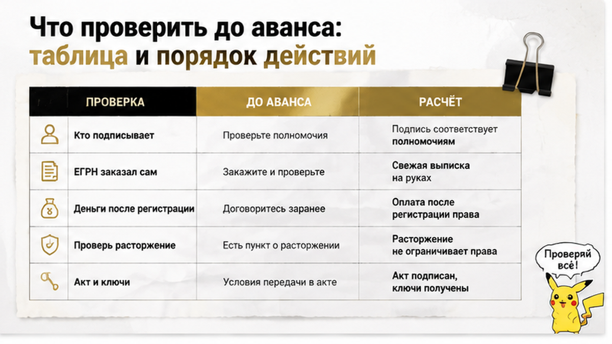

Sol TRIM chunk 3/3 only — B12
Урежь этот HTML-фрагмент на 15-25 слов: убери воду, сохрани все факты, 2 H2, table, ol (7 пунктов), comment magnet, mid+end CTA, interlinks.
Цель: весь article после merge ≤2595 слов.
Выход: только HTML фрагмент с <h2>Что проверить... до конца.

<h2>Что проверить до аванса: таблица и порядок действий</h2>

<figure class="inline-quad" data-slot="inline_7"></figure>

Дальше — часть, ради которой я вообще разбираю чужие истории. Ялуторовский случай не закончен: проверка идёт, суда нет, чем всё завершится — не знаю. Но точки, в которых сделку можно было притормозить, из публикации видны отчётливо.

Я не проверяю «квартиру» как абстракцию. Я проверяю четыре вещи: кто подписывает, что зарегистрировано, как двигаются деньги и что написано в договоре мелким шрифтом. Двойная продажа живёт не в стенах и не в подъезде — она живёт в этих четырёх местах одновременно.

<table>
<tr><th>Что я проверяю</th><th>Откуда беру информацию</th><th>Сигнал, после которого торможу аванс</th></tr>
<tr><td>Кто именно продаёт</td><td>Паспорт собственника, доверенность целиком, сверка ФИО с реестром</td><td>Собственника не видел ни разу, всё общение — через представителя</td></tr>
<tr><td>Актуальность права</td><td>Выписка ЕГРН, которую заказал я, а не принёс продавец</td><td>Документ приносят «уже готовым» и торопят подписать сегодня</td></tr>
<tr><td>Условия расчёта</td><td>Раздел договора об оплате, а не устные договорённости</td><td>Деньги уходят посреднику или продавцу до регистрации перехода права</td></tr>
<tr><td>Пункты о расторжении</td><td>Полный текст договора, включая приложения и «технические» абзацы</td><td>Формулировка, позволяющая продавцу выйти из сделки «без ущерба сторонам»</td></tr>
<tr><td>Фактическое владение</td><td>Осмотр, ключи, акт приёма-передачи, реальное освобождение</td><td>«Живут, освободят позже» — без срока и без документа</td></tr>
<tr><td>История объекта</td><td>Объявления, площадки, разговор с соседями и УК</td><td>Один посредник ведёт по объекту несколько параллельных переговоров</td></tr>
</table>

Порядок действий у меня простой и почти всегда одинаковый:

<ol>
<li>До любого аванса заказываю выписку ЕГРН сам. Она показывает зарегистрированное право на момент выдачи — не больше, но и не меньше. Почему одной строки в реестре мало, я разбирал в <a href="/blog/ipoteka/ipoteku-odobrili-a-registraciyu-otmenili-stroka-v-egrn/">истории с одобренной ипотекой и отменённой регистрацией</a>.</li>
<li>Если сделку ведёт представитель — читаю доверенность до последней строчки: кто выдал, какие полномочия, вправе ли получать деньги. В Ялуторовске, как следует из публикации URA.RU, квартиру продавала риелтор именно по доверенности. Отдельный разбор, где собственник появился один, а продавцов оказалось четверо, — <a href="/blog/vtorichka-i-riski/doverennost-ne-bronya-prodavec-priletel-odin-a-kvartiru-prodavali-chetvero/">здесь</a>.</li>
<li>Настаиваю на прямом разговоре с собственником — видео, встреча, что угодно, кроме пересказа посредника.</li>
<li>Прочитываю договор целиком и вслух проговариваю каждый пункт про расторжение и возврат денег. По версии Романа Матвеева, именно «хитроумный пункт» стал опорой для попытки развернуть первую сделку назад. Это позиция защиты, не вывод суда — но как повод перечитать договор годится.</li>
<li>Развожу во времени два момента: когда продавец получает деньги и когда я становлюсь собственником в реестре. Расписка этого не делает — про это была история, где <a href="/blog/vtorichka-i-riski/raspisku-na-kvartiru-napisali-deneg-na-schete-net/">расписку написали, а денег на счёте не оказалось</a>.</li>
<li>Фиксирую фактическую передачу: акт, ключи, показания счётчиков, дата въезда. В спорах о нескольких покупателях суды смотрят и на то, кому объект реально передан во владение.</li>
<li>Если что-то не сходится — жду. Один пропущенный «выгодный» вариант дешевле, чем год переписки с адвокатом.</li>
</ol>

Гарантии не даёт ни один пункт. Присутствие банка, нотариуса или агентства не означает, что кто-то проверил всю цепочку. Но каждый пункт отнимает у схемы одну степень свободы, а их у неё не бесконечно много.

И вопрос, на который у меня самого нет честного ответа. Кто прав: тот, кто первым заплатил и въехал в квартиру, или тот, кто позже заплатил продавцу больше? Напишите в комментариях — мне правда интересно, где для вас проходит граница между «формально по бумагам» и «по справедливости».

Разбираю такие сделки по документам, а не по объявлениям. Свежие кейсы по тюменской вторичке — в <a href="https://t.me/Tyumen_Rieltor">Telegram</a> и в <a href="https://max.ru/id561413315447_biz">MAX</a>: заглядывайте, если покупка у вас в планах на ближайшие месяцы.

<h2>Двойная продажа в регионе: когда история заканчивается приговором</h2>

Ялуторовский случай висит в неопределённости: доследственная проверка — это ещё не уголовное дело, а попытка выселить покупательницу — не состоявшееся выселение. Но у похожих сюжетов бывает и другой финал.

В Ставропольском крае 12 августа 2026 года вынесли приговор по делу о мошенничестве при продаже дома: продавец взял с покупательницы предоплату 500 тысяч рублей, продал объект другому человеку, а потом получил от первой покупательницы ещё 500 тысяч. Ущерб — миллион, наказание — год колонии. Это отдельная история, с Ялуторовском никак не связанная, и переносить её выводы на тюменский кейс нельзя: там суд разобрался, здесь суда ещё не было.

Фон при этом невесёлый. По данным тюменских правовых обозревателей, в 2024–2025 годах в области возбуждали девять уголовных дел по схемам с жильём. Матвеев утверждал, что тот же специалист по похожей схеме продал две квартиры в Тобольске в 2025 году, — это заявление представителя стороны, а не судебный акт, и проверять его будут следователи, не я.

Практический вывод короткий. Привлекательная цена, гладкая сделка и вежливый посредник — не подтверждение чистоты, а иногда та самая приманка, о которой я писал в разборе, где <a href="/blog/vtorichka-i-riski/skidku-dva-milliona-obeschali-a-v-kvartire-pryatali-risk/">скидку в два миллиона обещали, а в квартире прятали риск</a>. Год спокойной жизни в квартире тоже ничего не закрывает: в Ялуторовске о втором покупателе узнали как раз спустя год.

Я не призываю бояться вторички. Я призываю потратить два-три дня на документы до аванса, а не два года на суды после. Разница в цене этих вариантов обычно равна всей сумме сделки.

Если вы сейчас смотрите квартиру в Тюмени, Ялуторовске или Тобольске и что-то в сделке кажется слишком гладким — покажите мне документы до того, как отдадите аванс. Разберём доверенность, договор и порядок расчёта: это дешевле любого адвоката потом.

Святослав Шакин, The Риэлтор, Тюмень. Написать: <a href="https://t.me/Tyumen_Rieltor">Telegram</a> или <a href="https://max.ru/id561413315447_biz">MAX</a>. Позвонить: <a href="tel:+79220016505">+7 922 001 65 05</a>.

Больше разборов: <a href="https://dzen.ru/holyslav">Дзен</a>, <a href="https://vk.ru/tymenrieltor">ВКонтакте</a>, <a href="/">главная</a>, <a href="/gajdy/">гайды по сделкам</a> и <a href="/rieltor-tyumen/">сопровождение покупки в Тюмени</a>.

