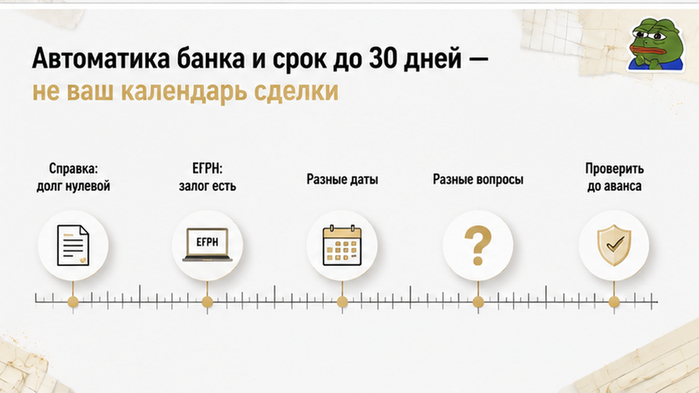

ROLE: Sol. Сожми HTML ниже на ~50 слов (убери повторы, не трогай таблицу, interlink, CTA ul, href="/"). Выход: ПОЛНЫЙ HTML фрагмент от <h2>Что сопоставить до 
 конца excalibur-cta-end.
<h2>Что сопоставить до аванса: таблица двух документов</h2>

<figure class="inline-quad" data-slot="inline_7"></figure>

Сведём всё к двум бумагам — тем самым, что лежали на столе у той семьи.

Справка банка закрывает вопрос денег: обязательство исполнено, долга нет. Выписка ЕГРН закрывает вопрос реестра: висит ли на квартире запись об ипотеке прямо сейчас. Первую выдаёт кредитор, и говорит она про кредитный договор. Вторую выдаёт орган регистрации прав, и говорит она про объект. В спокойной сделке эти документы совпадают, и никто не смотрит на них по отдельности. В тюменском казусе они разошлись — ровно в те сутки, когда деньги уже собирались передавать.

<table>
<tr><th>Вопрос покупателя</th><th>Справка банка о закрытии кредита</th><th>Выписка ЕГРН на дату аванса</th></tr>
<tr><td>Что подтверждает по существу</td><td>Прекращение задолженности продавца перед банком</td><td>Наличие или отсутствие записи об ипотеке на объекте</td></tr>
<tr><td>Кто выдаёт</td><td>Кредитор — сторона кредитного договора</td><td>Орган регистрации прав по объекту недвижимости</td></tr>
<tr><td>На какую дату работает</td><td>На дату выдачи справки продавцу</td><td>На дату формирования выписки покупателем</td></tr>
<tr><td>Где смотреть результат</td><td>Формулировка о нулевом остатке или отсутствии долга</td><td>Раздел об ограничениях прав и обременениях объекта</td></tr>
<tr><td>Что делать при расхождении</td><td>Уточнить у банка статус документов и согласие на сделку</td><td>Дождаться погашения записи или согласовать схему продажи заложенного объекта</td></tr>
</table>

Практика из казуса собирается в четыре действия. Все — до денег, ни одного после.

<ol>
<li>Выписку ЕГРН заказывает покупатель и сам — за сутки-двое до аванса. Не месяц назад, «когда смотрели квартиру», и не с чужого экрана.</li>
<li>Раздел об ограничениях и обременениях читается построчно. Пустая графа — это результат. Слова продавца — это план.</li>
<li>Если запись на месте, у банка спрашивают не «когда снимете», а что уже сделано: подано ли заявление в Росреестр и есть ли письменное согласие на отчуждение, если кредит закрыт не полностью.</li>
<li>Расхождение справки и выписки — не повод обвинять человека, а повод передвинуть дату. Справка не фальшивая, она просто про другое.</li>
</ol>

Та же механика выручала и на других сюжетах: <a href="/blog/vtorichka-i-riski/skazali-v-brake-ne-byl-a-v-tyumeni-pered-avansom-vsplyla-umershaya-zhena-i-neofo/">в Тюмени перед авансом всплывали обстоятельства, о которых продавец искренне не помнил</a>. Документ, заказанный покупателем прямо перед сделкой, всегда сильнее любого пересказа.

Достаточно ли вам справки банка о закрытии кредита — или вы бы ждали свежую выписку ЕГРН без обременения? Напишите в комментариях, как поступили бы на месте той семьи.

Не понимаете, что именно смотреть в выписке перед авансом, — спросите до того, как назначена дата. Я на связи в <a href="https://t.me/Tyumen_Rieltor">Telegram</a> и в <a href="https://max.ru/id561413315447_biz">MAX</a>.

<h2>Аванс, задаток и обещание продавца: почему текст договора решает</h2>

Осталось то, что проскакивают быстрее всего, — бумага, которую подписывают перед деньгами.

«Снимем обременение в день сделки» звучит как обязательство. Силы у этой фразы ровно столько, сколько её попало в текст соглашения. Нет условия о состоянии реестра к конкретной дате — спорить потом не о чем. Продавец скажет: кредит закрыл, справку показал, сроки регистрации от меня не зависят. И формально будет недалёк от истины: запись погашается в течение трёх рабочих дней с момента поступления заявления, а момент подачи он контролирует не полностью.

Поэтому условие пишут как результат, а не как намерение. К согласованной дате продавец предоставляет выписку ЕГРН без записи об ипотеке — и до этой выписки деньги не двигаются. Там же оговариваются последствия, если результата к сроку нет. Автоматического возврата аванса в природе не существует: всё решает текст и то, задаток это или аванс по правовой природе. «В крайнем случае просто заберу свои деньги обратно» — самая дорогая иллюзия вторички, и <a href="/blog/vtorichka-i-riski/raspisku-na-kvartiru-napisali-deneg-na-schete-net/">истории про красиво написанные расписки</a> заканчиваются именно этой фразой.

Отдельно про расчёты. Передать деньги, пока статус залога непонятен, — это не «ускорить сделку», а взять на себя чужой процесс. Кредит закрыт не полностью и объект в залоге — согласие банка и схема расчётов делаются до аванса, а не параллельно ему. Кредит закрыт, но запись висит — дешевле сдвинуть дату на две-четыре недели, чем подписывать под честное слово.

Семья из казуса не выиграла суд и не возвращала деньги. Возвращать было нечего: они успели остановиться. Выписка за сутки до аванса сработала как ручка, за которую можно ухватиться и притормозить.

И главное. Вторичку с бывшей ипотекой в Тюмени покупают спокойно и постоянно — большинство таких сделок проходит ровно, потому что залог снимают заранее и к авансу приходят с чистой выпиской. Работает не подозрительность, а порядок: сначала реестр, потом деньги. Соблюли порядок — и снятое обременение вообще не становится историей.

Смотрите квартиру с бывшей или действующей ипотекой продавца в Тюмени — разберём документы до аванса, а не после. Пишите, звоните, приходите с выпиской:

<ul>
<li>Telegram — <a href="https://t.me/Tyumen_Rieltor">@Tyumen_Rieltor</a></li>
<li>MAX — <a href="https://max.ru/id561413315447_biz">написать в MAX</a></li>
<li><a href="/">Сайт</a></li>
<li><a href="/gajdy/">PDF-гайды</a> по покупке квартиры</li>
<li>Дзен — <a href="https://dzen.ru/holyslav">разборы сделок</a></li>
<li>ВКонтакте — <a href="https://vk.ru/tymenrieltor">сообщество</a></li>
<li>Телефон — <a href="tel:+79220016505">+7 922 001 65 05</a></li>
<li><a href="{{SITE_BASE}}/rieltor-tyumen/">Услуги риэлтора в Тюмени</a></li>
</ul>

Святослав Шакин, The Риэлтор, Тюмень.

