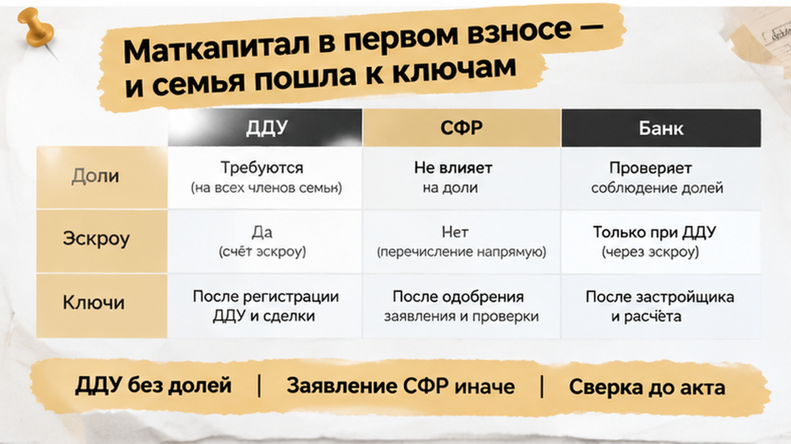

# Targeted Sol fix ONLY — B24 quality-score repair (NOT full rewrite)

ROLE: Sol targeted patch. Output **полный** article.html (HTML only, no fences, no h1).

## FIX ONLY these FAILs (quality-score-notes.md)

### 1. LEAD — first 1-2 sentences MUST contain:
- **Digit** deadline: use `3 недели` or `21 день` (gate needs `\d`, not «три»)
- **Consequence beat** in first 1-2 sentences: verb like «остановил», «отложил», «задержал» + stakes
Keep lead 4–6 sentences total. Do NOT add TL;DR/bullets.

### 2. FINALE zone (last 2 H2: «Ключи перенесли…» + «Что сверить…»)
Remove **third retell** of phrase cluster «собственность владельца сертификата супруга» — rephrase in H2 «Ключи перенесли» para about юрист/допсоглашение AND table cell if needed (e.g. «общую собственность родителей и детей», «доли детям по 256-ФЗ») WITHOUT repeating middle verbatim.
**KEEP:** comment magnet, agency ending before end CTA, all CTAs unchanged, table structure (5 rows), all H2 titles verbatim.

### 3. HARD constraints
- Word count **1400–1600** (currently ~1562 gate / ~1636 raw — trim ~20–40 words if needed, NO padding)
- **Do NOT** change facts, URLs, H2 titles, inline figures, CTA blocks
- **Do NOT** rewrite middle H2s (only lead + finale-zone paragraphs)
- HTML: `<b>` not `<strong>`, `<i>` not `<em>`

## quality-score-notes.md
# Quality score notes (для Sol, один проход)

H1: В Тюмени ДДУ с маткапиталом остановили — доли детям не оформили

Исправь **только** структуру/тон по FAIL ниже. Факты из drafts/writer.html не менять.
Без self-score loop. Без padding до 1800+. Target 1400–1600 слов.

## LEAD FAIL
- lead-hit: first 1-2 sentences missing number/deadline

## FINALE FAIL
- finale-third-retell: middle scene repeated in closing: «собственность владельца сертификата супруга»

## Current article.html — patch and return full HTML

В Тюмени семья с двумя детьми уже видела финиш: дом сдан, ДДУ зарегистрирован, маткапитал перечислен на эскроу, до акта и ключей оставалось около трёх недель. В первоначальный взнос вошли деньги сертификата и собственные накопления — сделка казалась почти закрытой. Перед регистрацией квартиры банк остановил сопровождение: в ДДУ, заявлении для СФР и кредитных документах по-разному описали будущие доли детей. Ключи пришлось отложить, пока все бумаги не выстроили в одну понятную цепочку.

Я, Святослав Шакин, The Риэлтор из Тюмени. В Telegram и MAX разбираю места, где новостройка спотыкается уже перед финишем — дом сдан, а документы внезапно требуют ещё одного круга.

<a href="https://t.me/Tyumen_Rieltor">Telegram The Риэлтор</a> · <a href="https://max.ru/id561413315447_biz">MAX</a>

<h2>Маткапитал в первом взносе — и семья пошла к ключам</h2>

<figure class="inline-quad" data-slot="inline_01"></figure>

Квартиру в тюменской новостройке семья покупала по семейной ипотеке. В первоначальный взнос направили маткапитал и собственные накопления. Заявление о распоряжении средствами подали через банк, после чего деньги перечислили на эскроу. ДДУ зарегистрировали — для покупателя это выглядит как финальная отметка: договор есть, деньги внесены, дом скоро передадут.

На деле зарегистрированный ДДУ подтверждает право требовать от застройщика будущую квартиру — не право собственности на неё. Собственность появляется позже: после ввода дома, передачи объекта, оформления квартиры на себя. Когда дом ввели и застройщик начал приглашать покупателей за актами, до ключей оставалось примерно три недели. Банк повторно проверил пакет — в формулировках об общей собственности родителей и детей обнаружилось расхождение.

Маткапитал не означает, что доли детей уже должны существовать в момент подписания ДДУ. Жильё, купленное с его использованием, в итоге нужно оформить в общую собственность владельца сертификата, супруга и всех детей — с определением долей соглашением.

<h2>В ДДУ одно, в заявлении для СФР — другое</h2>

<figure class="inline-quad" data-slot="inline_02"></figure>

В ДДУ и приложениях не было точной формулировки, связывающей обязанность семьи с последующим оформлением квартиры на родителей и детей. В заявлении для СФР эту обязанность описали иначе, в кредитном пакете банка появилась ещё одна редакция. По отдельности документы казались рабочими — вместе они не отвечали на простой вопрос: кто, когда и на каком основании оформляет доли после регистрации права.

Зарегистрированный ДДУ и перечисленный маткапитал закрывают отдельные этапы сделки — они не заменяют проверку будущей общей собственности. Это не то же самое, что ситуация, когда <a href="/blog/ipoteka/semejnuyu-ipoteku-na-novostrojku-odobrili-eskrou-ne-otkryli/">семейную ипотеку одобрили, а эскроу с маткапиталом не открылся</a>. Здесь деньги дошли до эскроу, дом сдали, документы разошлись перед переходом к собственности.

Маткапитал можно направить на первоначальный взнос по ипотеке, не дожидаясь трёх лет ребёнка. После передачи квартиры и регистрации права обязанность оформить жильё в общую собственность сохраняется. Обычно ориентируются на письменное обязательство сделать это в течение шести месяцев после передаточного акта, при ипотеке — после акта и снятия залога.

С марта 2020 года отдельное нотариальное обязательство для подачи в СФР обычно не требуется — отмена документа не отменила саму обязанность выделить доли детям. Банк не расторгал ДДУ, покупку не отменял. Он приостановил внутреннее сопровождение оформления квартиры, пока пакет не приведут к единой формулировке. СФР тоже не запускал автоматический возврат денег: фонд задал вопросы по распоряжению маткапиталом.

Поэтому фраза «ДДУ уже зарегистрирован» не должна заканчивать проверку. В сделке с ипотекой и маткапиталом нужно сопоставить ДДУ, заявление в СФР и кредитные документы до подписания акта.

<h2>За три недели до акта банк приостановил регистрацию</h2>

<figure class="inline-quad" data-slot="inline_03"></figure>

Дом уже ввели, ДДУ зарегистрировали, первоначальный взнос внесли, деньги семьи и материнского капитала лежали на эскроу. До подписания акта и получения ключей оставалось около трёх недель — именно тогда банк остановил подготовку оформления квартиры.

Договор не расторгали, квартиру у семьи не забирали: документы попросили привести к одной понятной схеме. В ДДУ и приложениях по-разному описывалась будущая доля детей. Для покупателя это выглядело технической разницей — банку требовалось однозначно понимать, кто станет собственником, когда и на каком основании.

Зарегистрированный ДДУ подтверждает право требовать от застройщика будущую квартиру, ещё не является правом собственности. Оно появляется после передачи объекта и оформления квартиры — перед финишем банк снова проверяет пакет. Такая точка риска возникает, когда в одной сделке соединены <a href="/blog/ipoteka/semejnuyu-ipoteku-na-novostrojku-odobrili-eskrou-ne-otkryli/">семейная ипотека, маткапитал и эскроу</a>: каждый документ по отдельности выглядит рабочим, вместе даёт расхождение.

По части 4 статьи 10 закона № 256-ФЗ жильё, купленное с использованием материнского капитала, должно перейти в общую собственность владельца сертификата, супруга и всех детей — доли определяют соглашением. Детские доли не обязаны быть вписаны в ДДУ до передачи дома, будущую обязанность оформить общую собственность нужно одинаково отразить в связанных документах.

Вопросы возникли и у Социального фонда России. Это не означало автоматический возврат маткапитала или отказ от сделки — противоречие требовалось исправить письменно. При ипотеке в цепочке есть залог банка, поэтому устного обещания «после ключей всё оформим» недостаточно. Акт и выдачу ключей отложили: сначала нужно было определить, какой документ исправлять и в каком виде банк и СФР примут обновлённый пакет.

<h2>Застройщик не переподписал ДДУ — пошли через юриста</h2>

<figure class="inline-quad" data-slot="inline_04"></figure>

Сначала семья попросила застройщика бесплатно переподписать ДДУ. Договор уже прошёл государственную регистрацию, был связан с ипотекой, эскроу, заявлением на распоряжение маткапиталом и обязательствами перед банком. Простая правка текста проблему не закрывала.

Юрист сверил зарегистрированный ДДУ и приложения, кредитные документы, заявление о распоряжении маткапиталом, переписку о подготовке акта. Если изменить только ДДУ, прежняя формулировка могла остаться в кредитном или социальном пакете.

После проверки подготовили <b>дополнительное соглашение к ДДУ</b> и отдельное соглашение о будущих долях. Важно было связать доли детей с режимом собственности супругов, условиями ипотеки, порядком оформления квартиры после передачи. Если меняется режим собственности супругов, может потребоваться нотариальное оформление.

Отдельное нотариальное обязательство для подачи в Социальный фонд с марта 2020 года обычно не требуется — обязанность выделить детям доли сохраняется. Фраза «потом оформите у нотариуса» не заменяет письменный порядок, одинаково отражённый в документах семьи, банка и СФР.

Застройщик оформил дополнение, юрист проверил формулировки, банк получил согласованный комплект — внутреннюю приостановку регистрации сняли. Прежний график вернуть не удалось: акт и выдачу ключей перенесли примерно на месяц.

Семья не стала подписывать документы в спешке, полагаться на устное обещание менеджера. Зарегистрированный ДДУ и открытый эскроу сами по себе не гарантируют беспроблемный переход к собственности — при ипотеке и маткапитале все документы должны одинаково описывать будущие доли.

Похожий риск разбирали в истории, где <a href="/blog/ipoteka/ipoteku-odobrili-a-registraciyu-otmenili-stroka-v-egrn/">ипотеку одобрили, но регистрацию права остановили</a>.

<h2>Ключи перенесли на месяц: как закрыли пакет</h2>

<figure class="inline-quad" data-slot="inline_05"></figure>

После отказа застройщика бесплатно переподписывать зарегистрированный ДДУ семье пришлось заново проверить договор, заявление в Социальный фонд России, кредитный пакет банка. По отдельности формулировки выглядели знакомо — вместе не объясняли, как квартира станет общей собственностью родителей и детей.

Юрист подготовил дополнительное соглашение к ДДУ и соглашение о будущих долях. В них закрепили обязанность оформить квартиру в общую собственность владельца сертификата, супруга и обоих детей после передачи объекта и регистрации права. Порядок согласовали с банком, включая снятие залога.

Отсутствие оформленных детских долей в ДДУ само по себе ещё не означает безусловную ошибку: до регистрации права семья имеет требование к застройщику, не собственность. Будущая обязанность должна быть описана одинаково в ДДУ, заявлении в СФР и банковских документах.

После согласования исправленный пакет снова направили на проверку. Банк возобновил подготовку регистрации — первоначальный график вернуть не удалось: подписание акта и выдачу ключей перенесли примерно на месяц.

Квартиру семья не потеряла, ДДУ не расторгали, автоматического возврата маткапитала не произошло. Ценой ошибки стало время: документы начали приводить в порядок, когда дом уже сдали, до ключей оставались считаные недели.

Доли детям нужно фиксировать прямо в ДДУ или отдельным соглашением до подписания: где бы вы поставили красную линию, если ключи уже на подходе?

<h2>Что сверить до акта приёма — таблица</h2>

<figure class="inline-quad" data-slot="inline_06"></figure>

Перед актом приёма-передачи стоит проверить не только квартиру, дату выдачи ключей. При маткапитале и ипотеке важна вся связка: ДДУ, заявление в СФР, кредитный договор, сведения об эскроу, будущая регистрация права.

<table>
<tr><th>Что проверить</th><th>С чем сравнить</th><th>На что обратить внимание</th></tr>
<tr><td>ДДУ и приложения</td><td>Заявление в СФР и кредитный пакет</td><td>Одинаково ли описана обязанность оформить жильё в общую собственность владельца сертификата, супруга и всех детей</td></tr>
<tr><td>Сумма и источник первоначального взноса</td><td>Кредитный договор, заявление о распоряжении маткапиталом, сведения об эскроу</td><td>Совпадают ли собственные средства, маткапитал, порядок перечисления денег</td></tr>
<tr><td>Условия банка</td><td>Проект регистрации права и будущие документы на квартиру</td><td>Какие бумаги потребуются до регистрации, после снятия залога</td></tr>
<tr><td>Акт приёма-передачи</td><td>Сроки регистрации и раскрытия эскроу</td><td>Не подписывается ли акт раньше, чем закрыты вопросы по документам</td></tr>
<tr><td>Будущее соглашение о долях</td><td>Режим собственности супругов и условия ипотеки</td><td>Достаточна ли простая письменная форма или понадобится нотариальное оформление</td></tr>
</table>

Запросите у банка срок исполнения обязанности по долям, перечень документов для регистрации. При ипотеке этот срок могут связывать с передачей квартиры, снятием залога — устного объяснения менеджера недостаточно.

С марта 2020 года отдельное нотариальное обязательство для подачи в СФР обычно не требуется. Обязанность выделить доли детям сохраняется — она не исчезает после регистрации ДДУ и перечисления маткапитала на эскроу.

Сопоставьте документы до подписания акта. Если формулировки расходятся, сначала установите, что исправлять, кто согласует изменения: застройщик не обязан бесплатно переподписывать зарегистрированный договор из-за несостыковки, найденной перед ключами.

Похожие сбои возникают и в других связках. Например, условия <a href="/blog/ipoteka/semejnuyu-ipoteku-na-novostrojku-odobrili-eskrou-ne-otkryli/">семейной ипотеки и эскроу с маткапиталом</a> могут не совпасть, банк — остановить сопровождение сделки перед финишем. При переносе ключей полезно заранее проверить <a href="/blog/vtorichka-i-riski/klyuchi-ot-novostrojki-v-tyumeni-perenesli-na-god-dengi-na-eskrou-zamorozili/">условия эскроу</a>.

Если банк не подтверждает готовность пакета, акт лучше не подписывать до получения понятного письменного ответа. Разумнее поставить паузу <i>до брони или до акта</i>, чем переносить проблему в оформление квартиры.

<figure class="inline-quad" data-slot="inline_07"></figure>

Я разбираю такие узкие места в сделках с новостройками Тюмени без общих страшилок, универсальных обещаний. Подписывайтесь на <a href="https://t.me/Tyumen_Rieltor">Telegram The Риэлтор</a>, добавляйтесь в <a href="https://max.ru/id561413315447_biz">MAX</a> — там можно посмотреть, что проверить до даты ключей, а не после остановки регистрации.

В этой истории семья дождалась ключей после исправления документов, повторной проверки. Сработала не надежда, что менеджер «сам всё оформит», а сверка цепочки: ДДУ ↔ СФР ↔ банк. Обязанность по долям закрепили письменно, пакет согласовали, регистрацию возобновили.

Если нужен спокойный разбор новостройки и ипотечного пакета в Тюмени, приходите в <a href="https://t.me/Tyumen_Rieltor">Telegram</a> или <a href="https://max.ru/id561413315447_biz">MAX</a>. Связаться со мной можно по телефону <a href="tel:+79220016505">+7 922 001 65 05</a>.

Ещё больше разборов — на <a href="https://dzen.ru/holyslav">Дзене</a> и в <a href="https://vk.ru/tymenrieltor">VK</a>. Полезные материалы собраны в <a href="{{SITE_BASE}}/gajdy/">гайдах</a>, информация о работе — на странице <a href="{{SITE_BASE}}/rieltor-tyumen/">риэлтора в Тюмени</a>.

