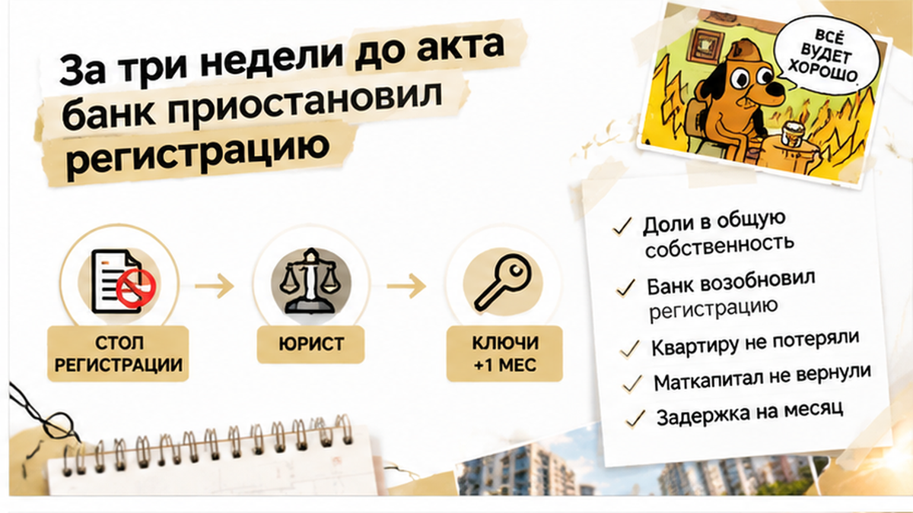
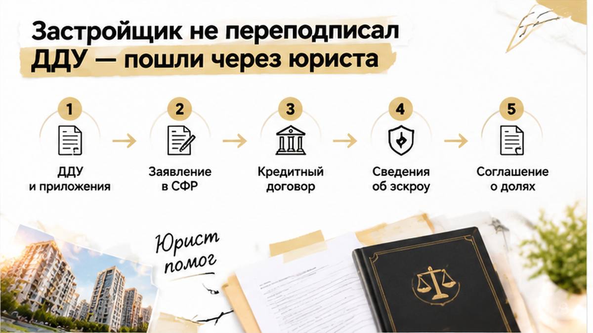

Assembled Sol TRIM — B24 — 2026-09-08

ROLE: Sol TRIM pass — сжать финальный article.html. НЕ переписывать с нуля.

Задача: убрать spine-once повторы («три недели до акта», «банк приостановил», «ДДУ и СФР не сходятся», «256-ФЗ / нотариальное обязательство с 2020» — не дублировать в соседних H2), сократить ul-список в H2 «юрист» до 3 пунктов, склеить однострочные абзацы.
ЦЕЛЬ: итог **1400–1600 слов** (сейчас ~2010). Убрать минимум 400 слов в этом проходе.

ДОБАВИТЬ если отсутствуют (после соответствующих H2):
<figure class="inline-quad" data-slot="inline_05"></figure>
<figure class="inline-quad" data-slot="inline_06"></figure>
<figure class="inline-quad" data-slot="inline_07"></figure>

СОХРАНИТЬ БЕЗ ИЗМЕНЕНИЙ URL/структуры:
- все 6 H2 дословно
- ровно 7 inline-quad (inline_01…inline_07)
- excalibur-cta-early, excalibur-cta-mid, excalibur-cta-end целиком (телефон 1×)
- comment magnet: «Доли детям нужно фиксировать прямо в ДДУ или отдельным соглашением до подписания: где бы вы поставили красную линию, если ключи уже на подходе?»
- interlink href только из writer (не менять URL):
  /blog/ipoteka/semejnuyu-ipoteku-na-novostrojku-odobrili-eskrou-ne-otkryli/
  /blog/ipoteka/v-tyumeni-nakanune-ddu-bank-podnyal-stavku-ipoteki-platezh-vyros-sdelku-ostanovi/
  /blog/vtorichka-i-riski/klyuchi-ot-novostrojki-v-tyumeni-perenesli-na-god-dengi-na-eskrou-zamorozili/
  /blog/ipoteka/ipoteku-odobrili-a-registraciyu-otmenili-stroka-v-egrn/
- таблицу целиком
- casus spine: лид 4–6 предложений, финал «ключи перенесли», agency ending

ЗАПРЕЩЕНО: новые факты, composite disclaimer, TL;DR, удаление H2/inline/CTA.
HTML: <b> не <strong>, <i> не <em>. Выход: только HTML фрагмент без fences.
