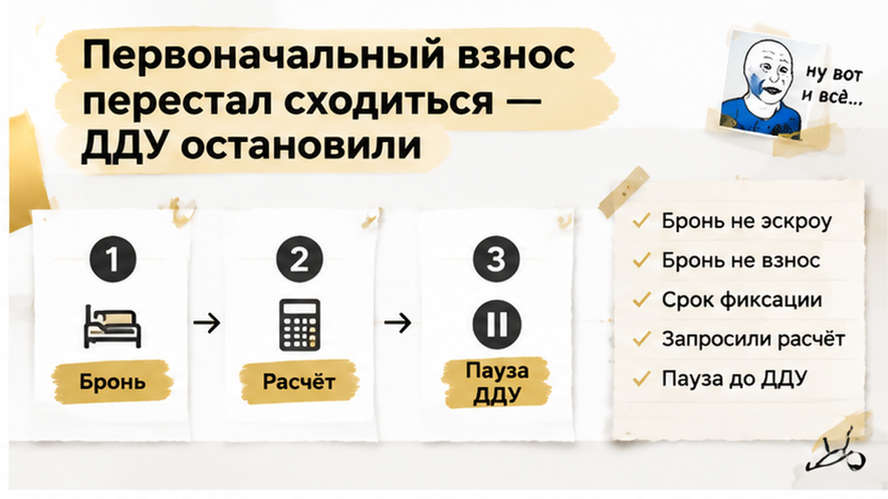

OUTPUT FORMAT: raw HTML fragment only. No markdown fences. No explanations. No refusals. Start with <h2>.

You are gpt-6-astra in Sol role. The Python conductor already called this API. Return the HTML body sections below rewritten in tenant voice (Святослав Шакин, The Риэлтор, Тюмень — простой язык, короткие абзацы).

After first H2 add:
<figure class="inline-quad" data-slot="inline_05"></figure>
After second H2 add inline_06 and inline_07 figures (same pattern, src cover/inline-06.png and cover/inline-07.png).

Include comment magnet question once (bipolar): Банк пересчитал лимит семейной ипотеки за три недели до ДДУ — вы бы подписали договор по старому расчёту менеджера или развернулись, даже если бронь сгорит?

Include excalibur-cta-mid (TG https://t.me/Tyumen_Rieltor + MAX https://max.ru/id561413315447_biz) after table.
Include excalibur-cta-end excalibur-social-cta with tel +79220016505 once, Дзен https://dzen.ru/holyslav, VK https://vk.ru/tymenrieltor, {{SITE_BASE}}/gajdy/, {{SITE_BASE}}/rieltor-tyumen/

Table with 6 rows (срок решения, сумма кредита и ПВ, структура комбо, платёж и ПДН, объект и застройщик, бронь ДДУ эскроу) — 4 columns as in writer.

Facts only from writer — no new URLs. Agency ending: семья остановилась до эскроу, запросить письменное подтверждение лимита до ДДУ.

<h2>Бронь тикает, деньги не на эскроу</h2>

После нового расчёта у семьи оставались выбранная квартира, прежняя цена и бронь, но кредит с первоначальным взносом уже не сходились. Плата за бронь не становится эскроу или первым взносом: до подписания ДДУ и кредитного договора деньги на счёт не уходят. Поэтому остановка была неприятной, но управляемой: семья могла потерять бронь, зато не запускала сделку с платежом, который перестал помещаться в бюджет.

Предварительное одобрение не гарантирует финальные параметры конкретной сделки: банк ещё проверяет сумму для выбранной квартиры, застройщика и сочетание льготной и рыночной частей кредита. В договоре бронирования нужно посмотреть срок фиксации квартиры, цену и последствия отказа банка или нехватки первоначального взноса.

Семья остановила сделку до прояснения цифр. Теперь можно запросить у банка письменный расчёт, сверить его с договором бронирования и решить, искать ли другой лот, увеличивать первоначальный взнос или выходить из сделки на условиях договора.

<h2>Что сверять до подписания ДДУ и открытия эскроу — таблица</h2>

Перед ДДУ нужен один актуальный сценарий от банка, договор бронирования и документы по квартире. Если хотя бы одна цифра осталась от старого расчёта, сделка снова может остановиться.

<!-- rewrite table + CTAs in Shakin voice -->
