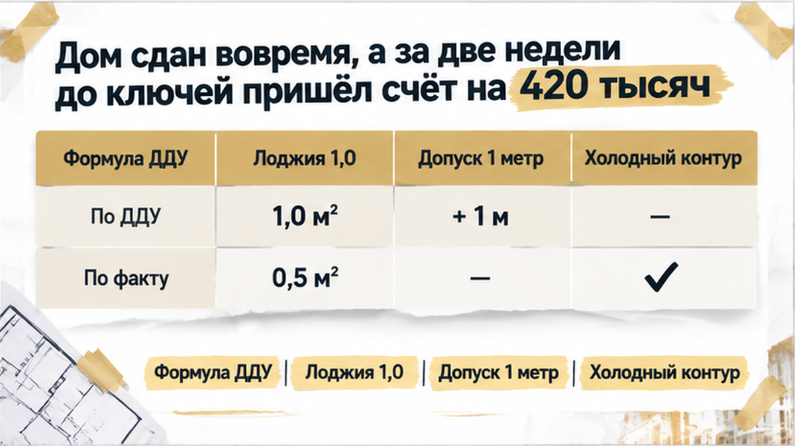
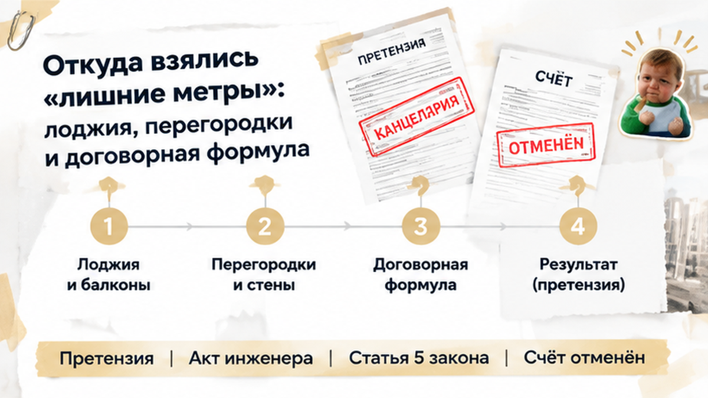
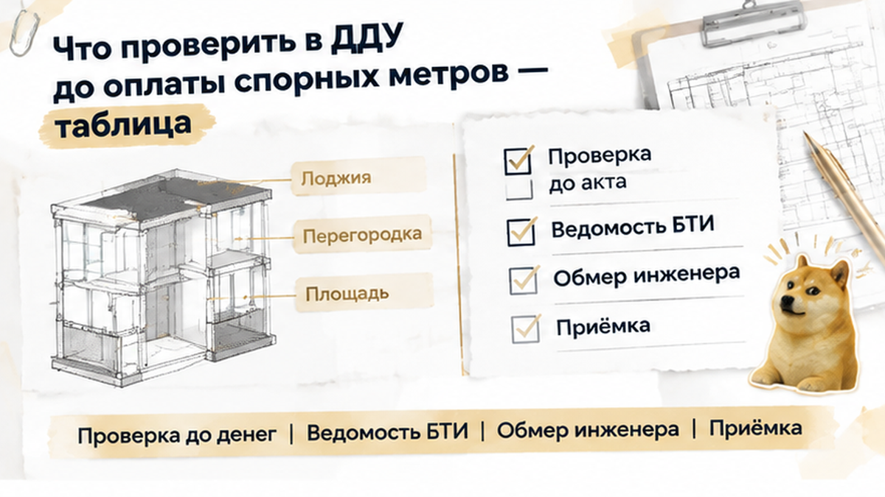

Assembled Sol inputs — B24 — 2026-09-12

ROLE: Sol — перепиши целиком смысл из drafts/writer.html в слог тенанта (SOUL + good-outputs).
Выход: только сырой HTML-фрагмент без markdown fences, без h1.

H1 context (НЕ в HTML): В Тюмени застройщик потребовал 420 тысяч за лишние метры — ключи не выдал

HARD:
- **1400–1600 слов** (hard max 1750; ужать без потери фактов: убрать повторы, recap, тройной пересказ одной сцены).
- Spine once: casus один проход — сцена в комнате, требование, блокировка ключей, независимый обмер, претензия и отмена счёта.
- Не выдумывать факты/URL. HTML: `<b>` не `<strong>`, `<i>` не `<em>`.
- Прозаический лид **4–6 предложений** до первого H2. Без TL;DR, без bullets до первого H2.
- **6 H2** из writer — каждый один раз. **7 figure.inline-quad** после H2 (распределить: 1–2 на бит, всего 7):
<figure class="inline-quad" data-slot="inline_N"></figure>
(N=1…7, zero-padded inline-01…inline-07; alt оставь пустым — caption builder позже)
- Interlink сохранить (URL не менять), **2–4 ссылки** суммарно:
  /blog/pokupka-kvartiry/v-tyumeni-zastrojschik-smenil-yurlico-dolschikam-prislali-novyj-ddu-eskrou-ne-ot/
  /blog/vtorichka-i-riski/klyuchi-ot-novostrojki-v-tyumeni-perenesli-na-god-dengi-na-eskrou-zamorozili/
  /blog/ipoteka/semejnuyu-ipoteku-na-novostrojku-odobrili-eskrou-ne-otkryli/
- Телефон один раз в excalibur-cta-end: <a href="tel:+79220016505">+7 922 001 65 05</a>
- **Comment magnet** (острый bipolar вопрос): «Застройщик требует 420 тысяч за лишние метры перед ключами — вы бы пошли на независимый обмер или взяли кредит, чтобы не срывать переезд?»
- **Ending landing:** agency, not panic — семья остановилась до подписания акта; проверила обмеры инженером; аннулировала счёт и забрала ключи; CTA «до внесения денег/подписания акта», не «бегите».
- **no composite disclaimer:** сцена = конкретный день; **ban** «случай собирательный», «без фамилий», «механика повторяется», «не репортаж».
- Короткие абзацы, диалоги в кавычках, контраст обычный/профи.

CTA early (после лида, до H2): excalibur-cta-early — только TG https://t.me/Tyumen_Rieltor + MAX https://max.ru/id561413315447_biz
CTA mid (после таблицы/практики): excalibur-cta-mid — TG + MAX
CTA end: excalibur-cta-end excalibur-social-cta — dual CTA + полный набор: TG, MAX, tel, Дзен https://dzen.ru/holyslav, VK https://vk.ru/tymenrieltor, {{SITE_BASE}}/gajdy/, {{SITE_BASE}}/rieltor-tyumen/

Soul: Klyshin rhythm, Shakin facts. «Расскажу изнутри», не агентство.

H2: Дом сдали вовремя, а за две недели до ключей пришёл счёт на 420 тысяч
H2: Откуда взялись «лишние метры»: лоджия, перегородки и договорная формула
H2: Застройщик заблокировал ключи: «сначала перечислите доплату, потом акт»
H2: Независимый обмер на объекте: что показал лазерный дальномер инженера
H2: Досудебная претензия и аннулирование счёта: ключи забрали без доплаты
H2: Что проверить в ДДУ до оплаты спорных метров — таблица

WRITER DRAFT:

В Тюмени семье с детьми выставили 420 тысяч рублей за «лишние метры» в новостройке и поставили выдачу ключей в зависимость от оплаты. Двухкомнатную квартиру покупали в ипотеку, дом уже ввели в эксплуатацию, а уведомление о доплате пришло за 10–14 дней до ожидаемой передачи. По расчёту застройщика, квартира выросла на 3,2 квадратного метра — и за эту прибавку предлагали отдельно перечислить деньги на расчётный счёт. Свободной суммы у семьи не было: оставшийся бюджет предназначался для чистовой отделки и мебели. Теперь рядом с ДДУ на кухне лежал счёт, из-за которого приходилось выбирать уже не обстановку будущей квартиры, а способ получить к ней доступ.

Я Святослав Шакин, The Риэлтор, Тюмень. Разбираю покупки новостроек через документы и деньги покупателя: что проверить до платежа и где не стоит полагаться на слова менеджера. Такие разборы публикую в <a href="https://t.me/Tyumen_Rieltor">Telegram</a> и <a href="https://max.ru/id561413315447_biz">MAX</a> — оставайтесь, если тоже готовитесь покупать или принимать квартиру.

<h2>Дом сдали вовремя, а за две недели до ключей пришёл счёт на 420 тысяч</h2>
<figure class="inline-quad" data-slot="inline_1"></figure>

На этом этапе покупка казалась завершённой: квартира выбрана, ипотека оформлена, дом сдан вовремя. Впереди оставались только приёмка, ключи и закупка материалов для ремонта. Но ввод дома в эксплуатацию и передача ключей конкретному дольщику — два совершенно разных юридических события. Разрешение на ввод подтверждает готовность здания в целом, но не означает, что семья может прямо завтра открыть дверь своим ключом. В этот зазор между вводом и передачей застройщик и прислал уведомление о перерасчёте.

Бумага выглядела солидно: фирменный бланк, ссылки на обмеры, точные цифры и реквизиты расчётного счёта. Большинство людей в такой ситуации теряются: застройщик ведь профессионал, у него целый штат инженеров и юристов, раз насчитали — значит, обязаны заплатить. Свободных 420 тысяч в семье не было, деньги отложили на бригаду и плитку в санузел. Но главный принцип защиты прост: <b>счёт показывает сумму претензии застройщика, но сам по себе не доказывает, что расчёт составлен по закону и договору</b>.

Подобные развилки в новостройках Тюмени случаются регулярно: например, когда <a href="/blog/ipoteka/semejnuyu-ipoteku-na-novostrojku-odobrili-eskrou-ne-otkryli/">семейную ипотеку одобрили, но цепочка до регистрации ДДУ не завершена</a>, покупатели тоже считают сделку закрытой раньше времени. Здесь семья не стала в панике искать кредит под драконовский процент, а села проверять текст ДДУ строчка за строчкой.

<h2>Откуда взялись «лишние метры»: лоджия, перегородки и договорная формула</h2>
<figure class="inline-quad" data-slot="inline_2"></figure>

Первое, что нашли в договоре, — пункт о допустимом строительном отклонении. В ДДУ прямо говорилось: если фактическая площадь квартиры по результатам обмеров отличается от проектной менее чем на 1 квадратный метр, стороны не производят никаких взаимных расчетов. Это критически важное условие, которое согласовали при покупке. Значит, спор шёл не о сантиметрах вообще, а о том, действительно ли квартира перешагнула этот порог в один метр.

Ключевая ошибка застройщика вскрылась в расчёте холодной застеклённой лоджии. В уведомлении её площадь посчитали с коэффициентом 1,0 — ровно так же, как жилую отапливаемую комнату или кухню. Наличие пластикового стеклопакета не делает холодную лоджию тёплым контуром квартиры. По закону лоджия считается с понижающим коэффициентом 0,5, то есть каждый квадратный метр должен учитываться наполовину.

Здесь важно помнить разницу между терминами. По статье 15 Жилищного кодекса РФ балконы и лоджии вообще исключены из общей площади жилого помещения. В расчётах по 214-ФЗ используется приведённая проектная площадь с понижающими коэффициентами. Застройщик же просто взял фактические габариты лоджии и прибавил их целиком, приписав семье сразу 1,8 лишних квадратных метра.

Второй блок приписок прятался в штукатурке и перегородках. Замеры в коридоре и санузле выполнили без учёта проектной толщины отделочных слоёв, что на бумаге раздуло квартиру ещё на 0,6 метра. Прежде чем перечислять сотни тысяч рублей на расчётный счёт застройщика, нужно точно знать, за что именно платите.

<h2>Застройщик заблокировал ключи: «сначала перечислите доплату, потом акт»</h2>
<figure class="inline-quad" data-slot="inline_3"></figure>

Разговор в офисе продаж сразу перешёл на язык ультиматумов. Менеджер заявил прямо: «Пока платёжка на 420 тысяч не ляжет в дело, на объект вас не пустят, передаточный акт никто не подпишет, а ключи останутся в сейфе». Более того, семье пригрозили: если не заплатите в течение двух месяцев, застройщик подпишет односторонний акт приёма-передачи, и квартира всё равно перейдёт к вам — вместе с долгом и судебными пенями.

Такое давление рассчитано на шок. Покупатель представляет, как срывается переезд, затягивается аренда съёмного жилья, а деньги тают на глазах. Но связывать передачу квартиры с уплатой спорной, неподтверждённой суммы — прямое нарушение баланса интересов. Закон № 214-ФЗ действительно позволяет составить односторонний акт, но только при немотивированном уклонении дольщика от приёмки. Мотивированный спор по площади и расчёту цены уклонением не является.

В Тюмени подобные ситуации требуют хладнокровия: мы уже подробно разбирали, как <a href="/blog/vtorichka-i-riski/klyuchi-ot-novostrojki-v-tyumeni-perenesli-na-god-dengi-na-eskrou-zamorozili/">срыв сроков передачи ключей и заморозка денег на эскроу</a> меняют позицию дольщика. Семья не стала кричать в офисе и не побежала в банк за кредитом. Вместо устных споров они наняли независимого специалиста.

<h2>Независимый обмер на объекте: что показал лазерный дальномер инженера</h2>
<figure class="inline-quad" data-slot="inline_4"></figure>

На контрольный осмотр пригласили аттестованного кадастрового инженера с поверенным лазерным дальномером. Специалист прошёл каждый угол двухкомнатной квартиры, зафиксировал геометрические параметры комнат, коридора, санузлов и составил детальный план фактических обмеров по точкам.

Результаты контрольного обмера расставили всё по местам. Застеклённая лоджия при расчёте с законным коэффициентом 0,5 дала ровно ту площадь, которая была заложена в проект, сняв 1,8 метра необоснованной прибавки. Точные замеры по внутренним граням перегородок убрали ещё 0,6 метра виртуального прироста. Итоговое реальное превышение площади квартиры составило всего 0,8 квадратного метра.

А теперь смотрим в договор: допустимое отклонение — 1 квадратный метр. Реальная разница в 0,8 метра полностью уложилась в пределы договорной погрешности. По условиям ДДУ при таком отклонении никакие доплаты с дольщика взиматься не могут. Застройщик не имел права требовать ни единого рубля.

<h2>Досудебная претензия и аннулирование счёта: ключи забрали без доплаты</h2>
<figure class="inline-quad" data-slot="inline_5"></figure>

С актом независимого кадастрового инженера позиция семьи стала железобетонной. Покупатели подготовили мотивированную досудебную претензию. В ней сослались на статью 5 закона № 214-ФЗ, пункт ДДУ о допустимой погрешности в 1 кв. м, правила расчёта площадей Приказа Росреестра № П/0393 и приложили официальный отчёт обмера с печатью инженера.

Требование сформулировали предельно жёстко: аннулировать необоснованный счёт на 420 000 рублей, согласовать дату приёмки и передать ключи по двустороннему передаточному акту в установленный договором срок. Претензию вручили под входящий штамп в канцелярии застройщика.

Юридический отдел застройщика изучил расчёты инженера и формулу ДДУ. Спорить в суде при таких доказательствах застройщику было невыгодно: помимо проигрыша по доплате ему грозил штраф по закону о защите прав потребителей и компенсация судебных расходов. Через четыре дня семья получила официальный ответ: счёт на 420 тысяч аннулирован в связи с технической корректировкой расчёта. Дольщики вышли на приёмку, подписали акт без замечаний по метражу и забрали заветные ключи.

<b>Застройщик требует 420 тысяч за лишние метры перед ключами — вы бы пошли на независимый обмер или взяли кредит, чтобы не срывать переезд?</b>

<h2>Что проверить в ДДУ до оплаты спорных метров — таблица</h2>
<figure class="inline-quad" data-slot="inline_6"></figure>
<figure class="inline-quad" data-slot="inline_7"></figure>

Когда застройщик присылает уведомление о доплате, первая реакция — паника. Но защитить деньги позволяет чёткий алгоритм действий по документам.

<table>
<tr><th>Что сопоставить</th><th>Где искать в документах</th><th>Что это даёт покупателю</th></tr>
<tr><td>Проектную и фактическую площадь</td><td>Текст ДДУ, приложение с планировкой, техплан</td><td>Показывает, какую именно величину сравнивает застройщик.</td></tr>
<tr><td>Пункт о перерасчёте цены</td><td>Раздел ДДУ «Цена договора и порядок расчётов»</td><td>Определяет, предусмотрена ли вообще доплата за превышение площади.</td></tr>
<tr><td>Порог допустимой погрешности</td><td>Условия договора о строительных допусках</td><td>Если отклонение меньше порога (например, 1 кв. м), доплата не взимается.</td></tr>
<tr><td>Коэффициенты лоджий и балконов</td><td>Экспликация к ДДУ, проектная декларация</td><td>Исключает оплату холодных помещений по тарифу жилых комнат.</td></tr>
<tr><td>Фактические размеры комнат</td><td>Акт контрольного обмера кадастрового инженера</td><td>Даёт официальный документ против абстрактного счёта застройщика.</td></tr>
</table>

Сохраните этот алгоритм до получения ключей. В <a href="https://t.me/Tyumen_Rieltor">Telegram</a> и <a href="https://max.ru/id561413315447_biz">MAX</a> я регулярно разбираю скрытые ловушки договоров долевого участия в Тюмени.

Если похожие расхождения возникли на этапе оформления, важно помнить: <a href="/blog/pokupka-kvartiry/v-tyumeni-zastrojschik-smenil-yurlico-dolschikam-prislali-novyj-ddu-eskrou-ne-ot/">любые изменения застройщика в ДДУ требуют проверки юристом до перевода денег</a>. Лучшая защита от внезапных счетов — внимательно читать договор ещё до открытия эскроу-счёта.

А если дом уже сдан и вам прислали требование о доплате — не торопитесь брать кредит. Запросите расчётную ведомость, наймите кадастрового инженера и сравните реальные метры с условиями вашего ДДУ. Покупать новостройки в Тюмени безопасно, если каждую цифру проверять фактами и законом.

Я Святослав Шакин, The Риэлтор, Тюмень. Помогаю выбирать и проверять новостройки от котлована до приёмки ключей. Если сомневаетесь в условиях договора или застройщик выставил спорный счёт — напишите мне в <a href="https://t.me/Tyumen_Rieltor">Telegram</a> или <a href="https://max.ru/id561413315447_biz">MAX</a>, либо звоните напрямую: <a href="tel:+79220016505">+7 922 001 65 05</a>. Актуальные разборы смотрите в моём <a href="https://dzen.ru/holyslav">Дзене</a> и сообществе <a href="https://vk.ru/tymenrieltor">ВКонтакте</a>, практические инструкции читайте в <a href="{{SITE_BASE}}/gajdy/">гайдах</a>, а условия работы — на странице <a href="{{SITE_BASE}}/rieltor-tyumen/">риэлтора в Тюмени</a>.

