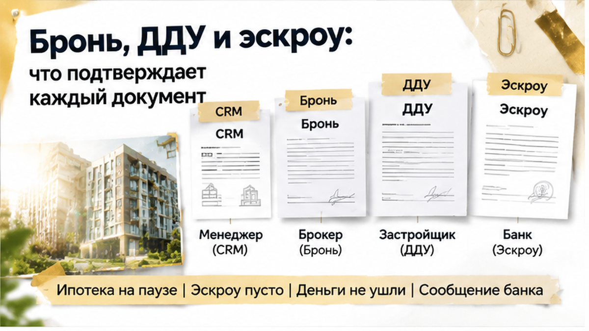

ROLE: Sol — сжать HTML-статью до **1400–1600 слов** (сейчас ~1900). НЕ переписывать с нуля, НЕ добавлять факты.

Убрать spine-once повторы: CRM/«свободна», одобрение vs эскроу, хронология дат — не дублировать в соседних H2. Склеить лишние однострочные абзацы.

СОХРАНИТЬ:
- все 6 H2 дословно
- ровно 7 inline figures после H2 (добавь недостающие inline_01, inline_02, inline_05, inline_06, inline_07):
<figure class="inline-quad" data-slot="inline_NN"></figure>
- excalibur-cta-early, excalibur-cta-mid, excalibur-cta-end целиком
- comment magnet и interlink href
- таблицу целиком
- лид 4–6 предложений, agency ending

HTML: <b> не <strong>, <i> не <em>. Выход: только HTML без fences.

Текущий article.html:

В Тюмени семья с детьми пришла в офис продаж за конкретной квартирой в новостройке на севере города — и услышала, что номер снова свободен. До этого покупатели оплатили бронь, получили скриншот «забронирована» и дождались предварительного одобрения ипотеки. Но к моменту визита другая семья уже подписала ДДУ на тот же объект и отправила его на государственную регистрацию. Сделка второй семьи остановилась до внесения денег на эскроу, а вопрос оказался не в ставке и не в сроке кредита: кто и на каком основании мог продавать эту квартиру.

Я Святослав Шакин, The Риэлтор, Тюмень. В <a href="https://t.me/Tyumen_Rieltor">Telegram</a> и <a href="https://max.ru/id561413315447_biz">MAX</a> разбираю такие ситуации до того, как покупатель подпишет следующий документ или внесёт деньги.

<h2>Два «свободно» в CRM — и две семьи на одну квартиру</h2>

Для второй семьи всё выглядело вполне обычно. Они выбрали конкретный номер, этаж и площадь в новостройке на севере Тюмени, оформили бронь и внесли предусмотренный платёж.

Менеджер показал скриншот из CRM — внутренней программы отдела продаж. В карточке квартиры сначала стоял статус «свободна», затем он изменился на «забронирована». Покупатели увидели знакомую последовательность: номер выбрали, бронь оплатили, квартиру за ними закрепили. Можно заниматься ипотекой и готовить договор.

Вот только <b>карточка в CRM и государственная регистрация ДДУ — не одно и то же</b>. Первая показывает, что в конкретный момент видит отдел продаж. Вторая фиксирует договор на объект в государственном реестре.

Поэтому повторное «свободна» в день подписания — не мелкая техническая неприятность. Причина сбоя здесь не установлена. Данные могли разойтись между каналами продаж, в системе мог появиться дубль или не обновиться статус. Называть случившееся мошенничеством только по двум скриншотам нельзя. Но объяснение «CRM зависла» само по себе тоже не отвечает на главный вопрос: почему покупателю снова предложили номер, который уже оказался в другой сделке.

Бронь — это отдельное соглашение. В нём нужно проверить срок удержания квартиры, порядок возврата платежа и ответственность сторон. Такой документ подтверждает, что застройщик обещал покупателю и какие деньги получил. Но <b>бронь сама по себе не создаёт зарегистрированного права на квартиру</b>.

<h2>Первая подписала ДДУ, вторая уже с одобренной ипотекой</h2>

Через несколько недель у второй семьи было предварительное одобрение ипотеки под эскроу и проект договора долевого участия. В проекте стоял тот же номер квартиры, который покупатели выбрали при бронировании. Для них это выглядело логичным продолжением процесса: квартиру закрепили, банк предварительно согласовал кредит, документы подготовили.

Параллельно первая семья уже подписала свой ДДУ и направила его на регистрацию. Здесь важно не смешивать два этапа. Подписанный договор — это ещё не зарегистрированный договор. По статье 4 закона № 214-ФЗ ДДУ подлежит государственной регистрации.

В такой ситуации проверяют не только название планировки. Сверяют номер квартиры, этаж и площадь. Даже небольшая разница в одном параметре может означать другой объект, а одинаковые параметры — наоборот, показать, что документы сошлись на одном номере.

Предварительное одобрение ипотеки конфликт не разрешало. Банк подтвердил возможность кредитования семьи, но не подтвердил, что спорная квартира свободна и доступна именно этим покупателям.

Разницу между одобрением и открытием эскроу я разбирал в истории, где <a href="/blog/ipoteka/semejnuyu-ipoteku-na-novostrojku-odobrili-eskrou-ne-otkryli/">ипотеку на новостройку одобрили, а эскроу не открыли</a>. Здесь требовалось отдельно установить статус самого объекта: две цепочки документов уже двигались к одной квартире, а одной карточки в программе продаж для ответа было недостаточно.

<h2>Первый договор ушёл в реестр — второй ДДУ остановили</h2>
<figure class="inline-quad" data-slot="inline_03"></figure>

Через несколько дней выяснилось: первый ДДУ уже зарегистрирован в Росреестре. В нём стоял тот же номер квартиры, который был указан в документах второй семьи. Здесь нельзя сверить только планировку и сказать: «Ну, похожая». Важны конкретные параметры — номер, этаж и площадь.

Второй договор на регистрацию не приняли. И в этот момент обещание менеджера «сейчас разберёмся» перестало быть решением.

Есть граница между фразой «мы договорились с продавцом» и зарегистрированным договором. По статье 4 закона № 214-ФЗ ДДУ подлежит государственной регистрации. Подписанные в офисе бумаги сами по себе не создают два равных права на одну квартиру.

<b>Два комплекта документов не превращаются в два объекта.</b> Один из договоров уже прошёл государственную регистрацию, а второй остановился на входе в реестр.

Скриншот со статусом «забронирована», соглашение и чек всё равно нужно сохранить. Они подтверждают, что именно обещали покупателю и за какой платёж. Но заменить зарегистрированный ДДУ эти документы не могут.

Теперь важна не громкость спора, а хронология: когда оформили бронь, когда внесли деньги, когда подготовили и подписали первый ДДУ, когда его подали на регистрацию и когда появилась запись в реестре.

Почему квартира продолжала отображаться свободной, точно не установлено. Данные могли разойтись между каналами продаж, в CRM мог появиться дубль или статус обновился с задержкой. Автоматически называть это мошенничеством нельзя. Но объяснение «программа тормозит» тоже не отменяет последствий для покупателя.

В письменной претензии полезнее разложить события по датам и приложить документы, чем спорить о том, что кто-то «наверняка хотел» сделать. Намерения ещё предстоит устанавливать, а зафиксированные действия уже можно проверять.

<h2>Банк заморозил сделку: «лот уже занят»</h2>
<figure class="inline-quad" data-slot="inline_04"></figure>

На следующий день после визита в офис продаж банк сообщил о приостановке сделки до выяснения юридического статуса объекта. Предварительное одобрение ипотеки у семьи было, но это не означало: банк готов профинансировать любую квартиру, которую покупатели выбрали в отделе продаж.

К этому моменту номер был выбран, бронь оплачена, проект ДДУ подготовлен. Но деньги на эскроу ещё не внесли.

Это важная деталь. <b>Банк остановил сделку до перечисления стоимости, а не заморозил уже внесённые на эскроу средства.</b> Эскроу защищает деньги после их внесения на специальный счёт. Само по себе одобрение кредита квартиру за покупателем не закрепляет.

Покупатель иногда слышит от банка «ипотека одобрена» и воспринимает это как финальный зелёный свет. На самом деле банк мог согласовать семью как заёмщика и условия кредитования, но ещё не подтвердить юридическую чистоту конкретного лота.

В этой истории препятствием стал именно статус квартиры. Две цепочки документов сошлись на одном номере, а карточки в системе продаж уже было недостаточно, чтобы понять, кому объект принадлежит в юридическом смысле.

Разницу между одобрением кредита и готовностью всей сделки я разбирал в истории, где <a href="/blog/ipoteka/semejnuyu-ipoteku-na-novostrojku-odobrili-eskrou-ne-otkryli/">семейную ипотеку одобрили, а эскроу не открыли</a>. Согласие банка кредитовать покупателя не заменяет проверку самого объекта и документов на него.

Тем более платёж за бронь проходил по отдельному соглашению и не оказался под защитой эскроу задним числом. Если деньги на покупку ещё не перечислены, это не значит, что у семьи нет расходов: остаются платёж за бронь, время и затраты на подготовку ипотечной сделки.

Сообщение банка вместе с предварительным одобрением стоит сохранить. Оно фиксирует, когда сделка остановилась и по какой причине. Для разговора с застройщиком это гораздо полезнее, чем пересказ по телефону: «Нам сказали, что лот занят».

<h2>Застройщик предложил другой этаж — семья потребовала свой номер</h2>

После остановки второй сделки застройщик предложил семье другой этаж. Но вместе с новым вариантом появилась доплата. Для отдела продаж это могло выглядеть как способ быстро закрыть вопрос: объект похожий, дом тот же, можно продолжать оформление.

Для семьи это был уже не тот договор. Выбирали конкретный номер, этаж и площадь. За квартиру внесли платёж по бронированию, получили подтверждение в системе продаж и несколько недель занимались ипотекой. Поэтому вопрос звучал не так: «Есть ли рядом свободный вариант?» А так: <i>почему исправление ошибки должно оплачиваться покупателями?</i>

Первая семья к этому моменту уже зарегистрировала ДДУ на спорный номер. Второй договор на регистрацию не приняли, а деньги на эскроу ещё не вносились. Требовать повторно оформить тот же объект, игнорируя зарегистрированный договор, нельзя. Но и соглашаться на другую квартиру с доплатой только потому, что так удобнее продавцу, семья не стала.

Покупатели направили претензию. В ней потребовали вернуть платёж за бронирование и компенсировать расходы, связанные с одобрением ипотеки. К претензии имеет смысл прикладывать не эмоциональное описание разговора в офисе, а документы: соглашение о бронировании, чек, скриншот статуса квартиры, переписку, проект ДДУ, ипотечные документы и сообщение банка о приостановке сделки.

<b>Подтверждённого возврата денег в этой истории пока нет.</b> Это важная граница для читателя: претензия фиксирует требования, но сама по себе не означает, что заявленную сумму вернут полностью. Дальше значение имеют условия брони, даты, содержание переписки и то, какие расходы подтверждены документами.

Семья остановилась до внесения денег на эскроу. Потеря времени, неопределённость с бронью и расходы на подготовку сделки остались, но стоимость квартиры не ушла на специальный счёт. В такой точке решение лучше принимать не под обещание «сейчас подберём этаж выше», а после проверки всех бумаг.

Если застройщик предлагает после двойной продажи другую квартиру этажом выше и просит доплату, соглашаться или требовать именно объект из брони и ДДУ?

<h2>Бронь, ДДУ и реестр: что сильнее — таблица</h2>

В этой истории у семьи были документы, которые подтверждали движение сделки. Но они имели разный вес. Бронь показывала договорённость и платёж, CRM — статус, который видели сотрудники отдела продаж, проект ДДУ — подготовленный договор. Зарегистрированный ДДУ первой семьи оказался документом другого уровня.

<table>
<tr><th>Документ или отметка</th><th>Что подтверждает</th><th>Чего не гарантирует</th></tr>
<tr><td>Карточка квартиры в CRM</td><td>Какой статус показывала система продаж в момент снимка</td><td>Что на этот номер не подан и не зарегистрирован чужой ДДУ</td></tr>
<tr><td>Соглашение о бронировании и чек</td><td>Условия удержания квартиры и внесение платежа</td><td>Зарегистрированного договора на квартиру; возврат оценивают по условиям соглашения</td></tr>
<tr><td>Подписанный ДДУ до регистрации</td><td>Договорённость сторон о конкретном объекте</td><td>Отсутствия конфликта с другим договором до государственной регистрации</td></tr>
<tr><td>Зарегистрированный ДДУ</td><td>Государственную регистрацию договора на указанный объект</td><td>Что покупателю больше не нужно проверять остальные условия сделки</td></tr>
<tr><td>Счёт эскроу</td><td>Специальный порядок хранения внесённых денег до предусмотренного законом основания</td><td>Что спорная квартира закреплена за владельцем счёта одной лишь его открытием</td></tr>
</table>

Смысл таблицы не в том, чтобы объявить бронь бесполезной. Она нужна как доказательство того, что покупателю обещали конкретный объект и получили ли за это деньги. Но <b>бронь не равна праву на квартиру</b>. Скриншот тоже не заменяет государственную регистрацию ДДУ.

В претензии стоит выстроить хронологию: когда выбрали номер, когда внесли платёж, когда получили подтверждение брони, когда подготовили проект договора, когда стало известно о первом ДДУ и почему банк остановил сделку. Отдельно сохраняют предложение другой квартиры и условие о доплате.

Расходы подтверждают отдельными документами. Предварительное одобрение ипотеки показывает, что банк рассматривал возможность кредита, но не доказывает безопасность выбранного объекта. Сообщение о приостановке фиксирует, на каком этапе сделка остановилась. Это разные документы и разные обстоятельства.

В похожей ситуации важно не путать согласие банка кредитовать семью с готовностью открыть эскроу: <a href="/blog/ipoteka/semejnuyu-ipoteku-na-novostrojku-odobrili-eskrou-ne-otkryli/">семейную ипотеку могли одобрить, а эскроу не открыть</a>. И отдельно нужно помнить: даже защита денег на эскроу не выбирает за покупателя правильный номер квартиры. О переносе сроков и заморозке средств на эскроу в новостройке я рассказывал в разборе <a href="/blog/vtorichka-i-riski/klyuchi-ot-novostrojki-v-tyumeni-perenesli-na-god-dengi-na-eskrou-zamorozili/">переноса ключей в Тюмени</a>.

Я Святослав Шакин, The Риэлтор, Тюмень. В <a href="https://t.me/Tyumen_Rieltor">Telegram</a> и <a href="https://max.ru/id561413315447_biz">MAX</a> разбираю сделки до момента, когда покупатель уже внёс деньги и обнаружил проблему. Можно прислать вопрос по брони, проекту ДДУ или статусу квартиры — сначала проверяем документы, потом принимаем решение.

До брони и ДДУ обычный покупатель смотрит на цену, планировку и обещанный срок. Профи добавляет к этому номер квартиры, этаж, площадь, срок удержания брони, порядок возврата платежа и подтверждение того, кто вправе подписывать договор со стороны застройщика.

Нужно запросить письменное подтверждение статуса объекта и сопоставить его с проектом ДДУ. Если в документах расходятся номер, этаж или площадь, вопрос задают до подписания, а не после. При уже возникшем конфликте второй ДДУ не подписывают, пока не понятен статус первого договора.

Причина повторного статуса «свободна» в CRM здесь не установлена. Это мог быть дубль, несогласованная работа каналов продаж или необновившаяся карточка. Но покупателю не требуется угадывать намерения застройщика, чтобы остановить сделку: достаточно увидеть, что документы на один объект разошлись.

Эта семья остановилась до пополнения эскроу. Теперь вопрос можно решать по бумагам: требовать возврат платежа и подтверждённых расходов либо рассматривать другой объект на понятных условиях. Не обязательно принимать первое предложение с доплатой и не нужно продолжать оформление только потому, что ипотека уже предварительно одобрена.

Я Святослав Шакин, The Риэлтор, Тюмень. Если выбираете новостройку, обращайтесь за разбором брони и проекта ДДУ <b>до оплаты и регистрации</b>: <a href="https://t.me/Tyumen_Rieltor">написать в Telegram</a>, <a href="https://max.ru/id561413315447_biz">написать в MAX</a> или позвонить <a href="tel:+79220016505">+7 922 001 65 05</a>. Другие разборы публикую в <a href="https://dzen.ru/holyslav">Дзене</a> и <a href="https://vk.ru/tymenrieltor">ВКонтакте</a>; на сайте есть <a href="{{SITE_BASE}}/gajdy/">гайды для покупателей</a> и информация о <a href="{{SITE_BASE}}/rieltor-tyumen/">сопровождении покупки в Тюмени</a>.

