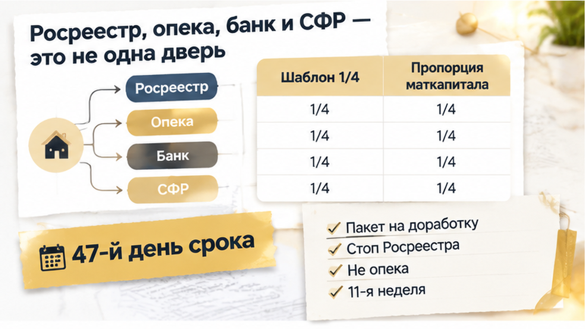
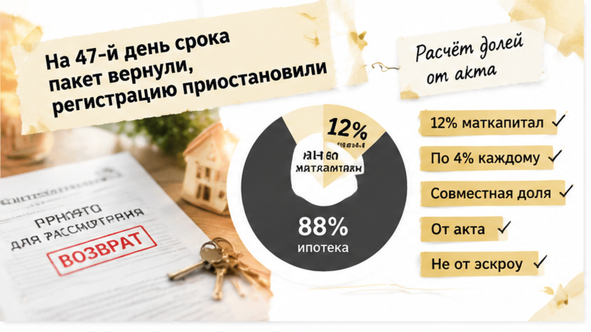
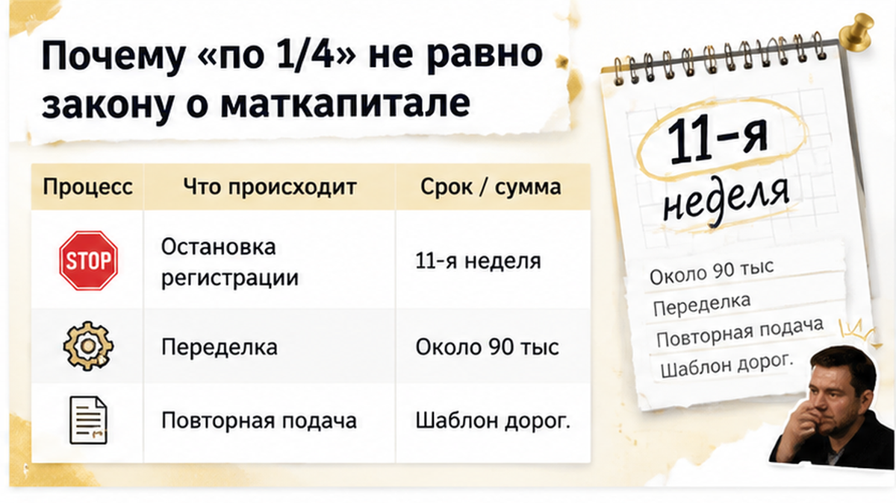
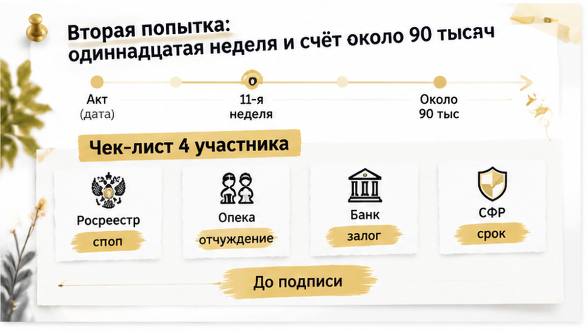

## drafts/writer.html

На 47-й день после передаточного акта семья из четырёх человек получила не зарегистрированные детские доли, а возвращённый пакет документов: соглашение «по 1/4 каждому» пришлось переделывать, а регистрацию Росреестр приостановил. Родители уже забрали ключи от новостройки на севере Тюмени, оформили своё право собственности и считали, что осталось выполнить формальность. В итоге со второй попытки регистрация состоялась только на 11-й неделе, а дополнительные расходы семья оценила примерно в 90 тысяч рублей.

  
Я — Святослав Шакин, The Риэлтор, Тюмень. В <a href="https://t.me/Tyumen_Rieltor">Telegram</a> и <a href="https://max.ru/id561413315447_biz">MAX</a> разбираю такие ситуации без канцелярита: что происходит с новостройкой после ключей и где готовый документ может остановить регистрацию.

<h2>Ключи на руках — и соглашение «по четверти каждому»</h2>

Квартиру купили по ДДУ с семейной ипотекой, а маткапитал использовали в первоначальном взносе на эскроу. После передачи квартиры родители получили ключи, подписали передаточный акт и зарегистрировали своё право собственности. Следующим шагом стало соглашение о распределении долей между отцом, матерью и двумя детьми — каждому по 1/4.

Такая схема кажется очевидной: если в семье четыре человека, квартиру можно разделить на четыре равные части. Но детские доли зависят не только от количества членов семьи. Нужно учитывать, какая часть стоимости оплачена материнским капиталом, какая — собственными деньгами и ипотекой, а также как супруги оформляют свою часть имущества.

По статье 10 части 4 закона № 256-ФЗ жильё, купленное с маткапиталом, должно перейти в общую собственность владельца сертификата, его супруга и всех детей. Доли определяются соглашением. При этом позиция Верховного суда связывает равенство с частью квартиры, оплаченной маткапиталом, а не автоматически со всей площадью и стоимостью объекта.

Например, если маткапитал составил 12% стоимости квартиры, то при семье из трёх человек ориентиром для «маткапитальной» части будут доли по 4% каждому. Остальная часть может распределяться иначе. Родительская доля может находиться в совместной собственности супругов, а не механически делиться на две отдельные четверти.

Соглашение «по 1/4» не всегда незаконно: оно может соответствовать воле семьи и пройти регистрацию, если правильно оформлено и подходит обстоятельствам сделки. Риск появляется, когда готовый шаблон используют без проверки размера маткапитала, ипотеки и режима собственности родителей.

После июля 2025 года для выделения детских долей в ипотечной квартире согласие банка-залогодержателя не требуется. Ипотека при этом сохраняется до полного погашения. Но обязанность выделить доли, шестимесячный срок и проверка соглашения регистратором остаются.

О том, почему маткапитал и семейная ипотека могут столкнуться ещё до начала строительства, я писал в разборе <a href="/blog/ipoteka/semejnuyu-ipoteku-na-novostrojku-odobrili-eskrou-ne-otkryli/">про одобренную семейную ипотеку, по которой эскроу так и не открыли</a>. Здесь кредит уже оформлен, дом передан, а ошибка возникла на следующем шаге.

<h2>На 47-й день срока пакет вернули, регистрацию приостановили</h2>

Документы подали, ожидая обычного завершения регистрации. Ориентир для регистрации соглашения — около трёх рабочих дней, если пакет полный и к его содержанию нет вопросов. Но на 47-й день после передаточного акта пакет вернули на доработку, а затем Росреестр приостановил регистрацию.

Семья стала звонить в банк, выяснять роль опеки и заново проверять бумаги. Важно было разделить эти события: приостановка произошла со стороны Росреестра, где регистратор увидел вопросы к соглашению и схеме собственности. Это не означало отказ органа опеки в первичном выделении долей.

Возврат пакета и приостановка также не являются одним и тем же. Возвращённые документы нужно доработать или подать заново в зависимости от причины, а приостановка означает официальную остановку регистрационного действия до устранения препятствия. Если назвать оба события «отказом опеки», можно потерять время на поиски несуществующей причины.

В исправленной версии заново проверили пропорцию маткапитала и режим собственности родителей. Срок шести месяцев считали от передаточного акта, а не от даты перечисления маткапитала на эскроу и не от момента, когда семья увидела уведомление в телефоне. Со второй попытки регистрация состоялась на 11-й неделе.

Расходы составили около 90 тысяч рублей. Это не официальный тариф и не фиксированная цена такой процедуры: в сумму вошли работа юриста, возможные нотариальные расходы и повторная регистрация. Банк также предупредил о рисках по договору, но такое письмо само по себе не означает автоматической отмены семейной ставки 6%.

Похожая логика действует и в других регистрационных сбоях: одобрение ипотеки ещё не гарантирует, что вся цепочка документов дойдёт до записи в ЕГРН. Ситуацию, когда ипотеку одобрили, но регистрацию отменили из-за строки в ЕГРН, я разбирал <a href="/blog/ipoteka/ipoteku-odobrili-a-registraciyu-otmenili-stroka-v-egrn/">в отдельном материале о том, почему банк и Росреестр проверяют разные вещи</a>.

<h2>Росреестр, опека, банк и СФР — это не одна дверь</h2>

Когда пакет вернули на доработку, семья пыталась понять, кто именно не согласовал детские доли. Но у участников разные задачи: <b>Росреестр</b> проверяет документы для регистрации, опека защищает права детей в отдельных сделках, банк контролирует кредитные условия, а СФР связан с использованием маткапитала. Они не принимают одно общее решение.

В этой истории остановка шла через <b>Росреестр</b>. Регистратор мог увидеть ошибку в расчёте долей, неправильный режим собственности или технический недочёт. Это не означает, что опека отказала семье в первичном выделении долей: приостановка регистрации и решение опеки — разные события.

При первичном выделении долей детям после использования маткапитала предварительное разрешение опеки обычно не требуется. Она становится отдельным участником, когда семья продаёт, меняет или дарит уже принадлежащую ребёнку долю, уменьшает её либо продаёт жильё, где дети были собственниками.

<b>Банк</b> также не регистрирует детские доли. С июля 2025 года согласие банка-залогодержателя на их выделение в ипотечной квартире не требуется: ипотека сохраняется до полного погашения. Но обязанность оформить доли и шестимесячный срок остаются. Банк при этом может контролировать исполнение кредитного договора и запросить объяснения по задержке.

Ставка по семейной ипотеке до 6% не превращается автоматически в обычную из-за просрочки выделения долей: подтверждённой федеральной нормы об автоматической отмене в такой ситуации нет. Однако спор с банком и дополнительные запросы семье всё равно не нужны.

<b>СФР</b> связан с направлением маткапитала на жильё. Поэтому соглашение должно показывать, какая часть квартиры оплачена сертификатом и как она отражается в правах владельца сертификата, супруга и детей. Если взять шаблон с одинаковыми дробями для всех, регистратор может остановить регистрацию, даже когда родители добросовестно хотели выделить детям доли.

Та же ошибка возникает, когда одобрение ипотеки принимают за гарантию всей дальнейшей цепочки документов. На практике кредит и регистрация проходят разные этапы — это видно и в разборе о том, как <a href="/blog/ipoteka/ipoteku-odobrili-a-registraciyu-otmenili-stroka-v-egrn/">одобрение кредита не спасло регистрацию в ЕГРН</a>.

<h2>Почему «по 1/4» не равно закону о маткапитале</h2>

Четыре человека в семье и четыре равные доли выглядят логично. Но закон о маткапитале требует выделить доли в общей собственности владельца сертификата, его супруга и всех детей, а равенство относится прежде всего к части стоимости жилья, оплаченной маткапиталом.

Остальная цена могла быть закрыта собственными деньгами и ипотекой. Поэтому сначала определяют долю маткапитала в общей стоимости, затем учитывают оставшуюся часть и выбранный родителями режим собственности. Если сертификат покрыл 12% цены, а в семье трое, ориентир по маткапитальной части составит по 4% каждому. Это не значит, что всю квартиру нужно разделить на три одинаковые доли.

В семье из четырёх человек схема «по 1/4 каждому» тоже может не совпасть с реальным вкладом маткапитала и договорённостью родителей. Родительская часть может быть оформлена в совместную собственность супругов, а детские доли — отдельно. Если соглашение одновременно делит имущество супругов и определяет доли детей, могут появиться дополнительные требования к форме документа, включая нотариальное удостоверение.

Поэтому равные доли нельзя считать ни автоматически правильными, ни автоматически ошибочными. Нужно сверить цену квартиры, сумму маткапитала, собственные средства, ипотеку и режим собственности родителей. Опасность готового шаблона в том, что его арифметика может не совпасть с конкретной семьёй.

Срок считают не от даты, которую покупатели обычно запоминают. Для квартиры по ДДУ ориентиром обычно служит передаточный акт: после его подписания начинается шестимесячный период для оформления долей. Перечисление маткапитала на эскроу и последующая регистрация права собственности эту дату не заменяют. В обычной ипотеке без ДДУ порядок может отличаться.

Проверять расчёт нужно сразу после получения ключей, а не в последний месяц. В новостройке документ о долях появляется уже после передаточного акта — в отличие от ситуации, когда проблема с маткапиталом возникла ещё до открытия эскроу и заключения ДДУ, как в разборе <a href="/blog/ipoteka/semejnuyu-ipoteku-na-novostrojku-odobrili-eskrou-ne-otkryli/">о семейной ипотеке и неоткрытом эскроу</a>.

<h2>Вторая попытка: одиннадцатая неделя и счёт около 90 тысяч</h2>

После приостановки Росреестра семья заново разобрала соглашение и схему собственности. Четыре равные доли выглядели понятно, но документ не показывал, какая часть квартиры оплачена маткапиталом, а какая — собственными деньгами и ипотекой. В исправленном варианте учли эту пропорцию, отдельно прописали режим собственности родителей и повторно подали пакет.

<b>Регистрация состоялась на одиннадцатой неделе второй попытки.</b> Вместо первоначального ориентира в несколько рабочих дней пришлось ждать разъяснений, переделывать соглашение и проходить процедуру заново. Дополнительные расходы оценили примерно в 90 тысяч рублей: работа юриста, возможные нотариальные действия и повторная регистрация. Это не официальный тариф и не фиксированная цена подобной ошибки.

Банк также направил предупреждение о рисках по договору. Само письмо не означает автоматическую отмену семейной ставки 6%: федеральной нормы, которая сразу превращает льготную ипотеку в обычную из-за просрочки выделения долей, нет. Вопросы банка возможны, но гарантированного повышения ставки из этого не следует.

Кто должен оплачивать исправление соглашения о детских долях, если семья доверилась готовому шаблону: сами покупатели или тот, кто предложил этот документ?

<h2>Что сверить до подписания соглашения — таблица</h2>

У каждого участника своя часть работы. Ответ банка не подтверждает правильность соглашения, а приостановка Росреестра не означает отказ опеки. До подписания важно понять, чей именно вопрос остаётся открытым.

<table>
  <tr>
    <th>Участник</th>
    <th>Что проверяет или делает</th>
    <th>Что важно семье</th>
  </tr>
  <tr>
    <td>Росреестр</td>
    <td>Регистрирует права по соглашению; может приостановить процедуру из-за расчёта долей, текста или выбранной схемы собственности.</td>
    <td>Нужно устранить причины приостановки: исправить или дополнить документы.</td>
  </tr>
  <tr>
    <td>Орган опеки</td>
    <td>Обычно подключается при продаже, обмене, дарении или уменьшении существующей детской доли.</td>
    <td>При первичном выделении долей по маткапиталу предварительное разрешение обычно не требуется.</td>
  </tr>
  <tr>
    <td>Банк</td>
    <td>Контролирует условия ипотечного договора и залог.</td>
    <td>С июля 2025 года согласие банка-залогодержателя на выделение долей детям не требуется. Ипотека сохраняется до полного погашения.</td>
  </tr>
  <tr>
    <td>Социальный фонд России</td>
    <td>Связан с использованием маткапитала и обязательством оформить жильё в общую собственность семьи.</td>
    <td>Для ДДУ шестимесячный срок обычно считают от передаточного акта или другого документа о передаче, а не от перечисления денег на эскроу.</td>
  </tr>
</table>

Расчёт начинается с суммы маткапитала и цены квартиры. Если маткапитал составил 12% стоимости, для семьи из трёх человек ориентир в «маткапитальной части» — по 4% каждому. Остальную часть распределяют соглашением с учётом режима собственности родителей. Вариант «по четверти каждому» сам по себе не запрещён, но число членов семьи ещё не делает готовый шаблон подходящим.

Отдельно нужно решить, останется ли родительская часть общей совместной собственностью супругов или у каждого будет своя доля. Если соглашение одновременно разделяет имущество супругов, может потребоваться нотариальное удостоверение. При выделении только детских долей в квартире супругов нотариус часто не обязателен, но форму документа стоит проверить до подписания.

Содержание документов способно остановить сделку, даже когда квартира и расчёты готовы, — это видно в истории о <a href="/blog/vtorichka-i-riski/v-tyumeni-kupili-kvartiru-s-otkrytoj-kuhnej-rosreestr-otkazal-v-registracii/">приостановке регистрации квартиры с открытой кухней</a>. А отдельный вопрос сроков передачи разобран в материале о <a href="/blog/vtorichka-i-riski/klyuchi-ot-novostrojki-v-tyumeni-perenesli-na-god-dengi-na-eskrou-zamorozili/">переносе ключей в тюменской новостройке</a>.

  
Покупаете новостройку в Тюмени с маткапиталом? Разбирайте документы до подписи, а не после приостановки. Подписывайтесь на Telegram <a href="https://t.me/Tyumen_Rieltor">The Риэлтор</a> и MAX <a href="https://max.ru/id561413315447_biz">Святослава Шакина</a> — там практические разборы сделок без лишней паники.

Детские доли не стоит оставлять на формальность после получения ключей. Пока соглашение не подписано, семья может проверить расчёт и исправить текст без повторной подачи. Если Росреестр уже приостановил регистрацию, точка опоры — указанная в уведомлении причина: разбирать нужно её, а не считать, что вся покупка новостройки развалилась.

  
Больше разборов новостроек Тюмени — в <a href="https://t.me/Tyumen_Rieltor">Telegram</a> и <a href="https://max.ru/id561413315447_biz">MAX</a>. Если нужна личная консультация Святослава Шакина, The Риэлтор: <a href="tel:+79220016505">+7 922 001 65 05</a>.

  
Читайте также <a href="https://dzen.ru/holyslav">Дзен</a>, подписывайтесь на <a href="https://vk.ru/tymenrieltor">VK</a>, смотрите <a href="{{SITE_BASE}}/gajdy/">гайды</a> и информацию о работе <a href="{{SITE_BASE}}/rieltor-tyumen/">риэлтора в Тюмени</a>.

## article.html (repair base)

На 47-й день после передаточного акта семья из четырёх человек получила не зарегистрированные детские доли, а возвращённый пакет документов: соглашение «по 1/4 каждому» пришлось переделывать, а Росреестр приостановил регистрацию. Ключи от новостройки на севере Тюмени уже лежали дома, право собственности родителей было зарегистрировано, и казалось, что осталась обычная формальность. Но со второй попытки запись в ЕГРН появилась только на 11-й неделе, а дополнительные расходы семья оценила примерно в 90 тысяч рублей. В телефоне было уведомление о приостановке, на кухне — документы, которые ещё недавно считались готовыми.

  
В <a href="https://t.me/Tyumen_Rieltor">Telegram</a> и <a href="https://max.ru/id561413315447_biz">MAX</a> разбираю такие истории без канцелярита: что происходит с новостройкой после ключей и почему готовый документ иногда останавливает регистрацию.

<h2>Ключи на руках — и соглашение «по четверти каждому»</h2>

<figure class="inline-quad" data-slot="inline_01"></figure>

Квартиру купили по ДДУ с семейной ипотекой. Маткапитал направили в первоначальный взнос на эскроу.

После передачи квартиры родители получили ключи, подписали передаточный акт и зарегистрировали своё право собственности. Следующим шагом стало соглашение о распределении долей между отцом, матерью и двумя детьми — каждому по 1/4.

На бытовом уровне всё выглядело безупречно. Четыре человека — четыре равные части. Что тут проверять?

Но маткапитал считает не членов семьи, а деньги. Важно, какая часть стоимости оплачена сертификатом, какая закрыта собственными средствами и какая приходится на ипотеку. Отдельно нужно понимать, как супруги оформляют свою часть имущества.

По статье 10 части 4 закона № 256-ФЗ жильё, купленное с маткапиталом, должно перейти в общую собственность владельца сертификата, его супруга и всех детей. Доли определяют соглашением.

Равенство относится прежде всего к той части квартиры, которую оплатил маткапитал, а не автоматически ко всей площади и стоимости жилья.

Представим: сертификат составил 12% цены квартиры, а в семье три человека. Тогда ориентир по «маткапитальной» части — по 4% каждому. Остальное семья может распределить иначе. Родительская доля, например, может остаться в общей совместной собственности супругов, а не превращаться механически ещё в две отдельные четверти.

Поэтому соглашение «по 1/4» не запрещено само по себе. Оно может соответствовать воле семьи и пройти регистрацию, если подходит конкретной сделке и правильно оформлено.

Проблема начинается с готового шаблона, который подписывают, не сверяя сумму маткапитала, ипотеку и режим собственности родителей. На экране телефона такая бумага выглядит простой. Для регистратора это схема, где каждая доля должна складываться с остальными.

С июля 2025 года для выделения детских долей в ипотечной квартире согласие банка-залогодержателя не требуется. Ипотека сохраняется до полного погашения. Но обязанность оформить доли, шестимесячный срок и проверка соглашения Росреестром остаются.

О том, как семейная ипотека и маткапитал могут столкнуться ещё до начала строительства, я писал в разборе <a href="/blog/ipoteka/semejnuyu-ipoteku-na-novostrojku-odobrili-eskrou-ne-otkryli/">про одобренную семейную ипотеку, по которой эскроу так и не открыли</a>. Здесь кредит уже оформили, дом передали, ключи получили — а спорным оказался следующий документ.

<h2>На 47-й день срока пакет вернули, регистрацию приостановили</h2>

<figure class="inline-quad" data-slot="inline_02"></figure>

Документы подали с ожиданием обычного финала: несколько рабочих дней — и детские доли появятся в реестре.

Но на 47-й день после передаточного акта пакет вернули на доработку, а затем Росреестр приостановил регистрацию. В семье начали звонить в банк, выяснять, нужна ли опека, и заново просматривать соглашение.

Здесь важно не смешать разные двери. Приостановку вынес Росреестр: регистратор увидел вопросы к соглашению или схеме собственности. Это не было решением опеки, которая якобы «не приняла» детские доли.

Возврат пакета и приостановка тоже не одно и то же. Возвращённые документы могут потребовать доработки или новой подачи. Приостановка означает официальную остановку регистрационного действия, пока препятствие не устранят.

В исправленной версии заново проверили пропорцию маткапитала и режим собственности родителей. Шестимесячный срок считали от передаточного акта, а не от перечисления денег на эскроу или уведомления в телефоне.

Со второй попытки регистрация состоялась только на 11-й неделе. Дополнительные расходы семья оценила примерно в 90 тысяч рублей. Это не официальный тариф: в сумму вошли работа юриста, возможные нотариальные расходы и повторная регистрация.

Банк также предупредил о рисках по договору. Но такое предупреждение само по себе не означает автоматическую отмену семейной ставки 6%.

Похожая путаница возникает и в других регистрационных историях: одобрение ипотеки ещё не гарантирует, что вся цепочка документов дойдёт до записи в ЕГРН. О ситуации, когда кредит одобрили, но регистрацию остановила проблема со строкой в ЕГРН, я рассказывал <a href="/blog/ipoteka/ipoteku-odobrili-a-registraciyu-otmenili-stroka-v-egrn/">в отдельном разборе о разных проверках банка и Росреестра</a>.

<h2>Росреестр, опека, банк и СФР — это не одна дверь</h2>

<figure class="inline-quad" data-slot="inline_03"></figure>

Когда пакет вернули на доработку, семья стала выяснять, кто именно не согласовал детские доли: банк, опека или СФР. Но это разные двери. <b>Росреестр</b> проверяет документы для регистрации права и может приостановить регистрацию, если в соглашении не сходится расчёт долей или неясно оформлена собственность родителей.

Именно это произошло в данной истории: регистрацию приостановил Росреестр. Это не означало, что опека отказала семье. Возврат документов и приостановка тоже не одно и то же: при возврате пакет дорабатывают или подают заново, а приостановка означает официальную остановку регистрационного действия до устранения указанной причины.

При первичном выделении долей детям после использования маткапитала предварительное разрешение опеки обычно не требуется. Опека становится отдельным участником, когда семья продаёт, меняет, дарит или уменьшает уже принадлежащую ребёнку долю.

<b>Банк</b> не регистрирует детские доли. С июля 2025 года его согласие на выделение долей в ипотечной квартире не требуется, хотя сама квартира остаётся в залоге до полного погашения кредита. Банк может контролировать кредитный договор, но предупреждение о рисках не означает автоматическую отмену семейной ставки 6%: подтверждённой федеральной нормы о таком переходе из-за просрочки выделения долей нет.

<b>Социальный фонд России</b> связан с использованием маткапитала. В соглашении должно быть понятно, какая часть жилья оплачена сертификатом и как она переходит в общую собственность владельца сертификата, супруга и детей. СФР не заменяет Росреестр, банк не определяет размер детских долей, а опека не подменяет регистратора при первичном выделении.

Проблема готового шаблона была в том, что он казался понятным, но не показывал связь между маткапиталом, ипотекой и режимом собственности родителей.

<h2>Почему «по 1/4» не равно закону о маткапитале</h2>

<figure class="inline-quad" data-slot="inline_04"></figure>

Четыре человека — четыре одинаковые доли. На кухне это звучит логично. Но маткапитал считает не только людей, а ещё и ту часть квартиры, которая оплачена сертификатом.

По статье 10 части 4 закона № 256-ФЗ жильё, купленное с маткапиталом, должно перейти в общую собственность владельца сертификата, его супруга и всех детей. Доли определяют соглашением. Равенство относится прежде всего к маткапитальной части стоимости, а не автоматически ко всей квартире.

Если сертификат покрыл 12% стоимости жилья, а в семье три человека, ориентир для этой части — по 4% каждому. Остальные 88%, оплаченные собственными деньгами и ипотекой, семья распределяет с учётом договорённости и режима собственности супругов.

Поэтому схема «по 1/4 каждому» не является автоматически ни правильной, ни неправильной. Она может соответствовать воле семьи и пройти регистрацию, если совпадает с обстоятельствами сделки и корректно оформлена. Но одного числа членов семьи для такого шаблона недостаточно.

Родительская часть может оставаться общей совместной собственностью супругов — это не то же самое, что выдать каждому родителю отдельную четверть. Если соглашение одновременно определяет детские доли и делит имущество супругов, нужно заранее проверить требования к форме, включая возможное нотариальное удостоверение.

Срок тоже считают не от той даты. Для квартиры по ДДУ шестимесячный период обычно отсчитывают от передаточного акта, а не от перечисления маткапитала на эскроу или регистрации права родителей. Ключи получили, акт подписали — срок пошёл. Значит, соглашение стоит проверить сразу после передачи квартиры, пока его можно исправить без повторной подачи.

<h2>Вторая попытка: одиннадцатая неделя и счёт около 90 тысяч</h2>

<figure class="inline-quad" data-slot="inline_05"></figure>

<figure class="inline-quad" data-slot="inline_06"></figure>

После приостановки пришлось проверить не только текст соглашения, но и всю схему собственности. Четыре одинаковые доли выглядели понятно, однако документ не показывал, какая часть квартиры оплачена маткапиталом, а какая — ипотекой и собственными деньгами.

В новую версию внесли правильную пропорцию маткапитала и отдельно указали режим собственности родителей. Пакет подали повторно.

<b>Регистрация состоялась на одиннадцатой неделе второй попытки.</b> Вместо нескольких рабочих дней семья получила ожидание, переделку соглашения и новую подачу документов.

Дополнительные расходы оценили примерно в 90 тысяч рублей. В них вошли работа юриста, возможные нотариальные действия и повторная регистрация. Это не официальный тариф: итог зависит от того, что именно пришлось исправлять.

Банк также предупредил о рисках по договору. Но само предупреждение не означает автоматическую отмену семейной ставки 6%: федеральной нормы, по которой просрочка выделения долей сразу превращает льготную ипотеку в обычную, нет.

Семья не потеряла квартиру — регистрацию довели до конца. Но цена готового шаблона оказалась настоящей: временем, повторной работой и деньгами.

Кто должен оплачивать исправление соглашения о детских долях, если семья доверилась готовому шаблону: сами покупатели или тот, кто предложил этот документ?

<h2>Что сверить до подписания соглашения — таблица</h2>

<figure class="inline-quad" data-slot="inline_07"></figure>

До подписания соглашения важно не только спросить, одобрил ли его банк. У каждого участника сделки своя зона ответственности.

<table>
  <tr>
    <th>Участник</th>
    <th>Что проверяет или делает</th>
    <th>Что важно семье</th>
  </tr>
  <tr>
    <td>Росреестр</td>
    <td>Регистрирует права по соглашению и может приостановить процедуру из-за расчёта долей, текста документа или схемы собственности.</td>
    <td>Нужно устранить именно причину, указанную в уведомлении о приостановке.</td>
  </tr>
  <tr>
    <td>Орган опеки</td>
    <td>Обычно подключается при продаже, обмене, дарении или уменьшении уже принадлежащей ребёнку доли.</td>
    <td>При первичном выделении долей после использования маткапитала предварительное разрешение обычно не требуется.</td>
  </tr>
  <tr>
    <td>Банк</td>
    <td>Контролирует условия ипотечного договора и залог.</td>
    <td>С июля 2025 года согласие банка-залогодержателя на выделение детских долей не требуется. Ипотека сохраняется до полного погашения.</td>
  </tr>
  <tr>
    <td>Социальный фонд России</td>
    <td>Связан с использованием маткапитала и обязательством оформить жильё в общую собственность семьи.</td>
    <td>При покупке по ДДУ шестимесячный срок обычно считают от передаточного акта, а не от перечисления денег на эскроу.</td>
  </tr>
</table>

Содержание документов способно остановить регистрацию, даже когда квартира уже передана, — это видно в истории о <a href="/blog/vtorichka-i-riski/v-tyumeni-kupili-kvartiru-s-otkrytoj-kuhnej-rosreestr-otkazal-v-registracii/">приостановке регистрации из-за несоответствия в пакете</a>. Отдельный вопрос сроков передачи разобран в материале о <a href="/blog/vtorichka-i-riski/klyuchi-ot-novostrojki-v-tyumeni-perenesli-na-god-dengi-na-eskrou-zamorozili/">переносе ключей в тюменской новостройке</a>.

Детские доли — не формальность «на потом». Срок от передаточного акта, пропорцию маткапитала и форму соглашения лучше проверить заранее, пока ошибку можно исправить без повторной подачи и новых расходов.

  
Покупаете новостройку в Тюмени с маткапиталом? Документы лучше разобрать до подписи, пока ошибку можно исправить без повторной подачи. Подписывайтесь на <a href="https://t.me/Tyumen_Rieltor">Telegram</a> и <a href="https://max.ru/id561413315447_biz">MAX</a> — там разбираю сделки простым языком, без лишней паники.

  
Больше разборов новостроек Тюмени — в <a href="https://t.me/Tyumen_Rieltor">Telegram</a> и <a href="https://max.ru/id561413315447_biz">MAX</a>. Если нужно разобрать документы до подписи, можно связаться со мной: <a href="tel:+79220016505">+7 922 001 65 05</a>.

  
Читайте <a href="https://dzen.ru/holyslav">Дзен</a>, подписывайтесь на <a href="https://vk.ru/tymenrieltor">VK</a>, смотрите <a href="{{SITE_BASE}}/gajdy/">гайды</a> и информацию о работе <a href="{{SITE_BASE}}/rieltor-tyumen/">риэлтора в Тюмени</a>.

