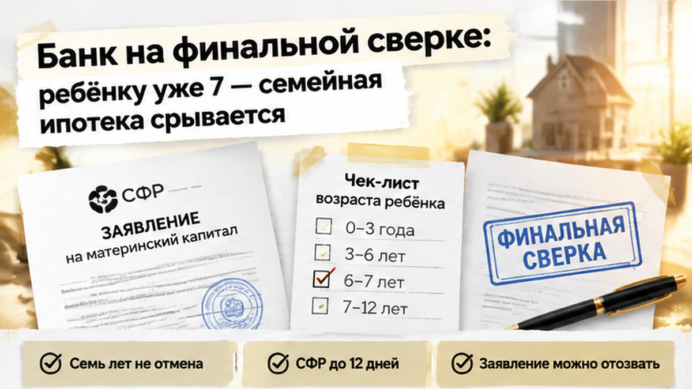
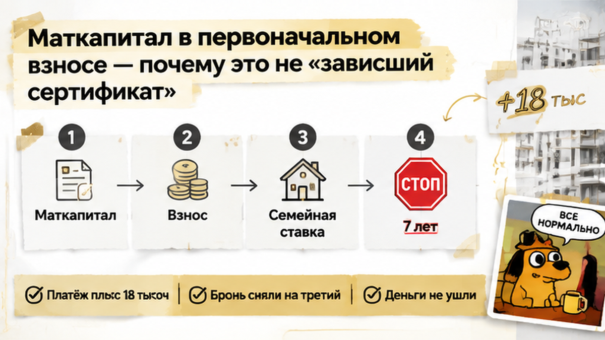
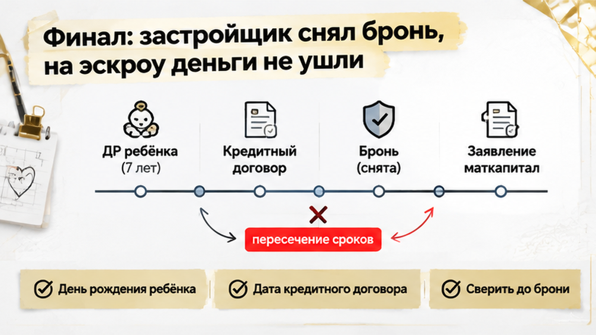
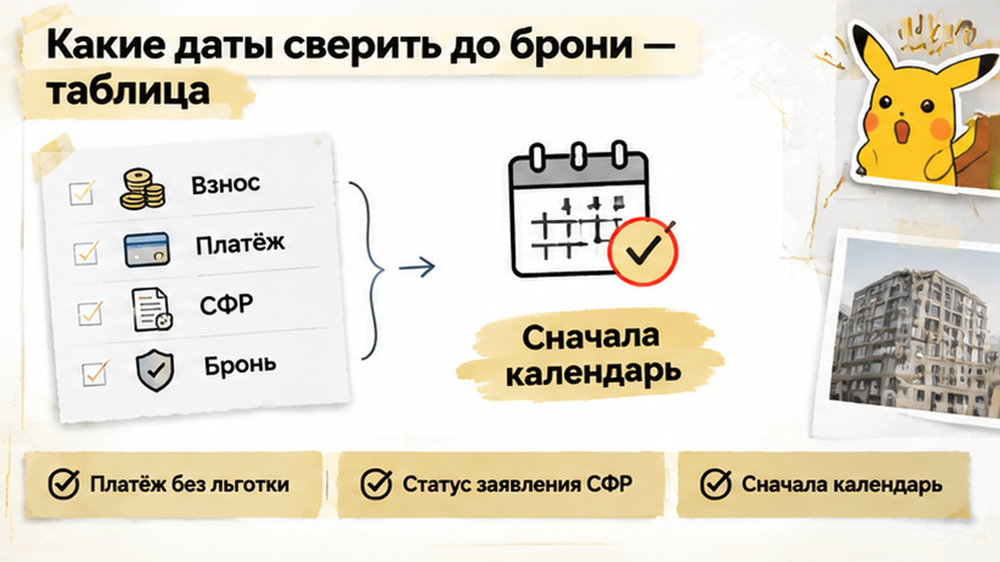

# Quality score repair — один проход

Исправь article.html ниже по FAIL:
1. finale-third-retell: убрать из финала повтор «без маткапитала в первоначальном взносе» — оставить только исход финала (5 дней, +18k платёж, бронь снята, эскроу не открыли, agency).
2. length-over: сжать с 1719 до 1400–1600 слов — убрать spine-once повторы между H2, склеить лишние однострочные абзацы. Не ниже 1400.

Сохрани: interlinks, CTAs, comment magnet, все figure inline_01..07.

## Current article.html

Ребёнку исполнилось 7 лет за девять дней до сделки — и семейная ипотека под 6% превратилась для семьи в платёж на 18 тысяч рублей больше. Двушка в тюменской новостройке уже была забронирована, рядом с календарём на кухне лежали расчёты собственных денег и маткапитала, а банк прислал предварительное одобрение. Родители считали, что осталось только подписать документы и открыть эскроу. Но день рождения оказался между банковским «одобрено» и кредитным договором — и именно эта дата решила судьбу льготной ставки.

Я разбираю такие покупки изнутри — по датам, условиям и деньгам, а не по красивой надписи «ипотека одобрена». Новые разборы публикую в <a href="https://t.me/Tyumen_Rieltor">Telegram</a> и <a href="https://max.ru/id561413315447_biz">MAX</a>.

<h2>«Ипотеку одобрили» — и семья забронировала двушку в новостройке</h2>

<figure class="inline-quad" data-slot="inline_01"></figure>

Сначала всё выглядело как обычная удачная сделка. Семья с одним ребёнком выбрала двушку в новостройке Тюмени и рассчитывала на семейную ипотеку под 6%. В первоначальный взнос собирались вложить собственные накопления и маткапитал, ежемесячный платёж уже был посчитан.

Банк выдал предварительное одобрение. После этого семья забронировала квартиру, а заявление на использование маткапитала передала через банк — тот должен был обменяться документами с Социальным фондом.

<b>Предварительное одобрение не фиксирует все условия сделки навсегда.</b> Перед кредитным договором банк ещё раз проверяет документы и обстоятельства, от которых зависит право на программу. Бронь тоже не превращается в гарантию льготной ставки: она лишь удерживает выбранную квартиру на условиях договора с застройщиком.

Маткапитал в этой цепочке — отдельная история. Поданное заявление не означает, что деньги уже перечислены на первоначальный взнос. Пока Социальный фонд рассматривает заявление, семья всё ещё должна понимать, из каких средств складывается сделка и что произойдёт, если выбранная ипотечная программа не сработает.

Для семейной ипотеки в Тюмени в этих условиях важны и другие цифры: кредит до 6 миллионов рублей, первоначальный взнос от 20%. Но сначала нужно подтвердить право на саму льготную программу, а уже потом считать, хватает ли собственных денег на вход в сделку.

Если убрать маткапитал из расчёта, накоплений может не хватить. Поэтому путь от одобрения до эскроу нельзя считать пройденным после первого положительного ответа банка. В похожих историях семья доходит до офиса застройщика, а затем выясняет, что <a href="/blog/ipoteka/semejnuyu-ipoteku-na-novostrojku-odobrili-eskrou-ne-otkryli/">одобрение не означает открытие эскроу</a>.

<h2>День рождения ребёнка попал между одобрением и кредитным договором</h2>

<figure class="inline-quad" data-slot="inline_02"></figure>

На кухонном календаре у семьи стояли две даты. Сначала — седьмой день рождения ребёнка, через девять дней — планируемое подписание ДДУ и открытие эскроу.

Когда банк прислал предварительное одобрение, ребёнку ещё не исполнилось семь. Семья поэтому и рассчитывала на семейную ипотеку. Но кредитный договор должен был появиться уже после дня рождения.

Условие «до 6 лет включительно» действует, пока ребёнку не исполнилось семь. Для этой программы возраст смотрят <b>на дату заключения кредитного договора</b>. Не на день подачи заявки, не на дату предварительного одобрения и не на момент бронирования квартиры.

ДДУ, кредитный договор и открытие эскроу могут подписываться почти одновременно, но это разные действия. Для возраста ребёнка решающей остаётся одна дата — день, когда семья заключает кредитный договор с банком.

Поэтому календарь нужно сверять не с датой, когда менеджер сказал «всё предварительно согласовано», а с датой финальной подписи. Если к этому дню ребёнку уже исполнилось семь, прежнее одобрение не сохраняет основание для семейной ипотеки.

Здесь важно не спутать причину с другой неприятной развилкой — когда <a href="/blog/ipoteka/v-tyumeni-nakanune-ddu-bank-podnyal-stavku-ipoteki-platezh-vyros-sdelku-ostanovi/">между одобрением и ДДУ меняются условия кредита</a>. В нашем разборе проблема не в том, что банк просто решил предложить ставку повыше: исчезает возрастное основание для семейной ипотеки. У семьи один ребёнок без инвалидности, другого основания для льготного кредита в этих исходных данных нет. Поэтому перед поездкой в офис застройщика нужно получить от банка ответ не о сроке действия одобрения, а о возможности заключить льготный кредитный договор в назначенный день.

<h2>Банк на финальной сверке: ребёнку уже 7 — семейная ипотека срывается</h2>

<figure class="inline-quad" data-slot="inline_03"></figure>

На финальной сверке банк смотрит не только на доходы родителей и документы на квартиру. Ему нужно ещё раз проверить, есть ли у семьи право именно на ту программу, по которой собираются подписывать кредитный договор.

И вот здесь обнаруживается главное: ребёнку уже исполнилось семь лет. Предварительное одобрение семья получила раньше, когда ему ещё было шесть, но этот ответ банка не «заморозил» возраст на удобной для покупателей дате.

<b>Для семейной ипотеки важно, сколько ребёнку на день заключения кредитного договора.</b> Не на дату заявки, не на день предварительного одобрения и не на момент бронирования двушки.

Для родителей такая разница кажется почти технической. Квартира выбрана, документы собраны, менеджер застройщика ждёт в офисе. В голове уже стоит галочка: «ипотеку одобрили».

Но банк видит другую последовательность. Сначала была предварительная оценка заявки, затем наступил день рождения ребёнка, а кредитный договор ещё не подписан. Значит, возрастное условие нужно проверять заново.

Это не та ситуация, когда банк просто пересмотрел ставку и предложил платить немного больше. Здесь исчезло основание для семейной ипотеки по ставке 6%: в семье один ребёнок без инвалидности, и ему уже семь.

Вариант для семей с двумя несовершеннолетними детьми тоже не подходит. В этой семье ребёнок один. А основание для покупки новостройки по такому сценарию в Тюмени дополнительно связано с перечнем из 35 регионов, куда Тюменская область не входит.

Поэтому просьба «оставьте нам прежнее одобрение, мы уже всё забронировали» не решает вопрос. Одобрение не заменяет кредитный договор и не обязывает банк открыть кредит и эскроу на условиях, которым семья больше не соответствует.

На финальном этапе банк приостанавливает выдачу кредита и открытие эскроу по семейной программе. Дальше остаётся считать запасной вариант: другую ипотеку, другой первоначальный взнос и другой ежемесячный платёж.

<h2>Маткапитал в первоначальном взносе — почему это не «зависший сертификат»</h2>

<figure class="inline-quad" data-slot="inline_04"></figure>

В первоначальном взносе у семьи были собственные деньги и маткапитал. Заявление на распоряжение сертификатом уже подали через банк, поэтому остановка ипотеки выглядела ещё тревожнее: если сделка не состоится, что будет с этими деньгами?

Здесь важно разделить две истории. Возраст ребёнка оказался критичным для семейной ипотеки, но <b>седьмой день рождения сам по себе не отменяет право на маткапитал</b>.

Маткапитал можно направить на первоначальный взнос по ипотеке сразу после рождения ребёнка. Ограничение «до 6 лет включительно» относится к основанию для льготного кредита, а не к самому сертификату и не к возможности использовать его для покупки жилья.

В этой сделке проблема возникла в другом: льготный кредит на прежних условиях не заключается. Поэтому заявление, поданное под конкретную ипотечную покупку, может быть отозвано или остаться неисполненным. Это не означает, что сертификат исчез или деньги сгорели.

У заявления есть собственный календарь. Социальный фонд рассматривает его до пяти рабочих дней, а если потребуются межведомственные запросы — до двенадцати. После решения на перечисление средств отводится ещё пять рабочих дней.

Подача заявления через банк не превращает этот процесс в мгновенный перевод. Поэтому нужно отдельно узнать, на каком этапе находится заявление: документы отправлены, решение принято или деньги уже перечислены. Сам факт подачи ещё ничего из этого не подтверждает.

Если пересчитать покупку без маткапитала в первоначальном взносе, меняется не только размер будущего платежа. Собственных накоплений может не хватить для входа в сделку: по семейной программе первоначальный взнос начинается от 20%, а требования к запасному кредиту нужно уточнять отдельно.

И здесь легко сделать неверный вывод: раз одна сделка остановилась, значит, маткапитал больше нельзя использовать после семилетия ребёнка. Нет. Нужно разбирать два вопроса отдельно: что произойдёт с уже поданным заявлением и из каких денег теперь складывается первоначальный взнос.

<h2>Финал: застройщик снял бронь, на эскроу деньги не ушли</h2>

Застройщик дал семье пять дней на смену кредитной программы. Это был срок именно по этой сделке, а не обещание держать квартиру сколько угодно. За это время покупатели пересчитали рыночную ипотеку без маткапитала в первоначальном взносе.

<figure class="inline-quad" data-slot="inline_05"></figure>

Новая арифметика оказалась жёсткой: ежемесячный платёж вырос на 18 тысяч рублей. Двушка, которую планировали взять под семейные 6%, уже не помещалась в привычный бюджет.

Подписывать ДДУ на таких условиях семья не стала. Через три дня бронь сняли, а деньги на эскроу так и не ушли.

Квартиру удержать не получилось. Зато покупатели не подписали договор в надежде, что кредит как-нибудь сложится уже после сделки. Если семейная ипотека сорвалась, сам факт прежнего одобрения не превращает неподъёмный платёж в посильный.

С деньгами за бронь вопрос отдельный: их возврат зависит от текста договора бронирования. Бронь и деньги на покупку квартиры — это разные платежи с разными условиями. Похожий разрыв на финише бывает, когда <a href="/blog/ipoteka/ipoteku-odobrili-a-registraciyu-otmenili-stroka-v-egrn/">одобрение не закрыло сделку</a>: там другая причина, но граница та же — до перечисления денег нужна финальная проверка.

Кто должен следить за возрастным порогом между одобрением и кредитным договором — семья или банк, который уже одобрил ипотеку?

<h2>Какие даты сверить до брони — таблица</h2>

В такой покупке я бы начинал не с выбора свободной двушки, а с календаря. В нём должны стоять день рождения ребёнка, предполагаемая дата кредитного договора и последний день брони.

<figure class="inline-quad" data-slot="inline_06"></figure>

Если ребёнку исполнится семь лет до подписания кредитного договора, фраза «ипотеку уже одобрили» не отвечает на главный вопрос. Важно понять, сохранится ли основание для семейной программы именно в день заключения договора.

<table>
<tr><th>Дата или срок</th><th>Что подтверждает</th><th>Чего не гарантирует</th></tr>
<tr><td>Предварительное одобрение банка</td><td>Банк предварительно согласовал заявку.</td><td>Возраст ребёнка не фиксируется навсегда на этот день. Перед сделкой будет финальная сверка.</td></tr>
<tr><td>Заключение кредитного договора</td><td>Именно на эту дату определяется возраст ребёнка для основания «до 6 лет включительно».</td><td>Если ребёнку уже семь, прежнее одобрение не сохраняет право на семейные 6% по этому основанию.</td></tr>
<tr><td>Окончание брони</td><td>До какого срока действуют договорённости о бронировании квартиры.</td><td>Бронь не закрепляет льготную ставку и не обязывает банк выдать кредит.</td></tr>
<tr><td>Подача заявления на маткапитал</td><td>Начало отдельного рассмотрения распоряжения средствами.</td><td>Заявление не заменяет кредитный договор и не означает, что деньги уже перечислены.</td></tr>
</table>

У маткапитала свой календарь. Заявление рассматривают до пяти рабочих дней, а при межведомственных запросах — до двенадцати. После решения на перечисление средств отводится ещё пять рабочих дней.

<figure class="inline-quad" data-slot="inline_07"></figure>

Поэтому перед продлением брони нужно отдельно узнать через банк статус уже поданного заявления. В разборе <a href="/blog/pokupka-kvartiry/v-tyumeni-zastrojschik-smenil-yurlico-dolschikam-prislali-novyj-ddu-eskrou-ne-ot/">цепочки ДДУ и эскроу на новостройке</a> важна та же граница: согласованная заявка ещё не означает, что все деньги готовы к сделке.

Запасной расчёт стоит сделать до бронирования. Сколько собственных средств останется на первоначальный взнос? Какой будет платёж без семейной программы? Если убрать маткапитал из расчёта, денег может не хватить даже на первоначальный взнос от 20%.

Больше разборов покупки новостроек Тюмени — в моих <a href="https://t.me/Tyumen_Rieltor">Telegram</a> и <a href="https://max.ru/id561413315447_biz">MAX</a>. Разбираю, где между одобрением и подписанием ещё нужно остановиться и проверить условия.

Управлять такой покупкой — не значит просить банк закрыть глаза на дату рождения. Это значит до денег сопоставить возраст ребёнка именно с датой кредитного договора, проверить срок брони и статус заявления на маткапитал.

А затем честно посчитать запасной вариант. В этой истории семья остановила ДДУ до эскроу: квартиру потеряла из выбора, но не взяла на себя неподъёмный платёж ради сохранения брони.

Я Святослав Шакин, The Риэлтор, Тюмень. Веду сделку от звонка до регистрации — подключусь до брони, разберём сроки и бюджет покупки. Напишите в <a href="https://t.me/Tyumen_Rieltor">Telegram</a> или <a href="https://max.ru/id561413315447_biz">MAX</a>, либо позвоните: <a href="tel:+79220016505">+7 922 001 65 05</a>. Другие разборы — в <a href="https://dzen.ru/holyslav">Дзене</a> и <a href="https://vk.ru/tymenrieltor">ВКонтакте</a>; на сайте доступны <a href="{{SITE_BASE}}/gajdy/">гайды для покупателей</a> и <a href="{{SITE_BASE}}/rieltor-tyumen/">информация о работе со мной</a>.

