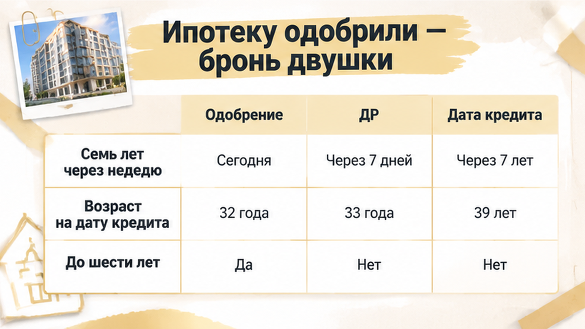

ROLE: Sol TRIM pass — сжать финальный article.html на ~80–150 слов. НЕ переписывать с нуля.

Задача: убрать spine-once повторы (одни тезисы в соседних H2), склеить лишние однострочные абзацы, сократить пересказы.
ЦЕЛЬ: итог ~2000–2150 слов при сохранении casus arc, agency ending, comment magnet.

СОХРАНИТЬ БЕЗ ИЗМЕНЕНИЙ URL/структуры:
- все H2 дословно (заголовки в этом чанке)
- все <figure class="inline-quad" data-slot="inline_N"> с alt и src
- excalibur-cta-early, excalibur-cta-mid, excalibur-cta-end целиком
- comment magnet и interlink href
- таблицы и casus spine (лид, финал, agency ending)

ЗАПРЕЩЕНО: новые факты, composite disclaimer, TL;DR, удаление H2/inline/CTA.
HTML: <b> не <strong>, <i> не <em>. Выход: только HTML фрагмент без fences.

Assembled Sol TRIM — B27 — 2026-09-14

ЦЕЛЬ: **1400–1600 слов** (hard max 1750). Сейчас ~1820 — убрать ~150–250 слов повторов spine-once, не трогая факты.

СОХРАНИТЬ: 6 H2, 7 inline figures, 4 interlink URL, comment magnet, все CTA blocks, таблицу, agency ending.

=== SOL TRIM CHUNK 1/3 ===
Сожми ТОЛЬКО этот HTML-фрагмент. Не дублируй секции из других чанков.
HTML whitelist: <b> не <strong>, <i> не <em>.

Текущий фрагмент:

Ребёнку исполнилось 7 лет за девять дней до сделки — и семейная ипотека под 6% превратилась для семьи в платёж на 18 тысяч рублей больше. Двушка в тюменской новостройке уже была забронирована, рядом с календарём на кухне лежали расчёты собственных денег и маткапитала, а банк прислал предварительное одобрение. Родители считали, что осталось только подписать документы и открыть эскроу. Но день рождения оказался между банковским «одобрено» и кредитным договором — и именно эта дата решила судьбу льготной ставки.

Я разбираю такие покупки изнутри — по датам, условиям и деньгам, а не по красивой надписи «ипотека одобрена». Новые разборы публикую в <a href="https://t.me/Tyumen_Rieltor">Telegram</a> и <a href="https://max.ru/id561413315447_biz">MAX</a>.

<h2>«Ипотеку одобрили» — и семья забронировала двушку в новостройке</h2>

<figure class="inline-quad" data-slot="inline_01"></figure>

Сначала всё выглядело как обычная удачная сделка. Семья с одним ребёнком выбрала двушку в новостройке Тюмени и рассчитывала на семейную ипотеку под 6%. В первоначальный взнос собирались вложить собственные накопления и маткапитал, ежемесячный платёж уже был посчитан.

Банк выдал предварительное одобрение. После этого семья забронировала квартиру, а заявление на использование маткапитала передала через банк — тот должен был обменяться документами с Социальным фондом.

На этом месте многие мысленно ставят галочку: деньги согласованы, квартира закреплена, осталось приехать на подписание. Но банковское «одобрено» — это ещё не выданный кредит.

<b>Предварительное одобрение не фиксирует все условия сделки навсегда.</b> Перед кредитным договором банк ещё раз проверяет документы и обстоятельства, от которых зависит право на программу. Бронь тоже не превращается в гарантию льготной ставки: она лишь удерживает выбранную квартиру на условиях договора с застройщиком.

Маткапитал в этой цепочке — отдельная история. Поданное заявление не означает, что деньги уже перечислены на первоначальный взнос. Пока Социальный фонд рассматривает заявление, семья всё ещё должна понимать, из каких средств складывается сделка и что произойдёт, если выбранная ипотечная программа не сработает.

Для семейной ипотеки в Тюмени в этих условиях важны и другие цифры: кредит до 6 миллионов рублей, первоначальный взнос от 20%. Но сначала нужно подтвердить право на саму льготную программу, а уже потом считать, хватает ли собственных денег на вход в сделку.

Если убрать маткапитал из расчёта, накоплений может не хватить. Поэтому путь от одобрения до эскроу нельзя считать пройденным после первого положительного ответа банка. В похожих историях семья доходит до офиса застройщика, а затем выясняет, что <a href="/blog/ipoteka/semejnuyu-ipoteku-na-novostrojku-odobrili-eskrou-ne-otkryli/">одобрение не означает открытие эскроу</a>.

<h2>День рождения ребёнка попал между одобрением и кредитным договором</h2>

<figure class="inline-quad" data-slot="inline_02"></figure>

На кухонном календаре у семьи стояли две даты. Сначала — седьмой день рождения ребёнка, через девять дней — планируемое подписание ДДУ и открытие эскроу.

Когда банк прислал предварительное одобрение, ребёнку ещё не исполнилось семь. Семья поэтому и рассчитывала на семейную ипотеку. Но кредитный договор должен был появиться уже после дня рождения.

Вот здесь привычная фраза «нам же уже одобрили» перестала помогать.

Условие «до 6 лет включительно» действует, пока ребёнку не исполнилось семь. Для этой программы возраст смотрят <b>на дату заключения кредитного договора</b>. Не на день подачи заявки, не на дату предварительного одобрения и не на момент бронирования квартиры.

ДДУ, кредитный договор и открытие эскроу могут подписываться почти одновременно, но это разные действия. Для возраста ребёнка решающей остаётся одна дата — день, когда семья заключает кредитный договор с банком.

Поэтому календарь нужно сверять не с датой, когда менеджер сказал «всё предварительно согласовано», а с датой финальной подписи. Если к этому дню ребёнку уже исполнилось семь, прежнее одобрение не сохраняет основание для семейной ипотеки.

Здесь важно не спутать причину с другой неприятной развилкой — когда <a href="/blog/ipoteka/v-tyumeni-nakanune-ddu-bank-podnyal-stavku-ipoteki-platezh-vyros-sdelku-ostanovi/">между одобрением и ДДУ меняются условия кредита</a>. В нашем разборе проблема не в том, что банк просто решил предложить ставку повыше: исчезает возрастное основание для семейной ипотеки. У семьи один ребёнок без инвалидности, другого основания для льготного кредита в этих исходных данных нет. Поэтому перед поездкой в офис застройщика нужно получить от банка ответ не о сроке действия одобрения, а о возможности заключить льготный кредитный договор в назначенный день.

