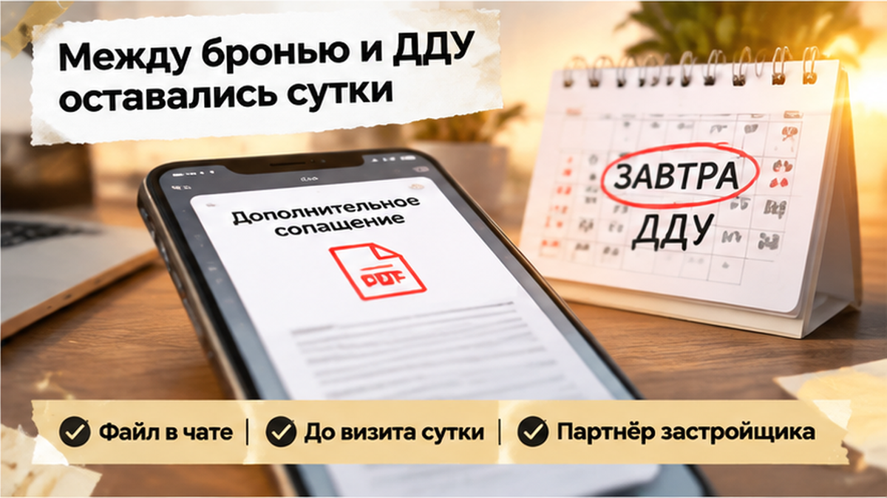
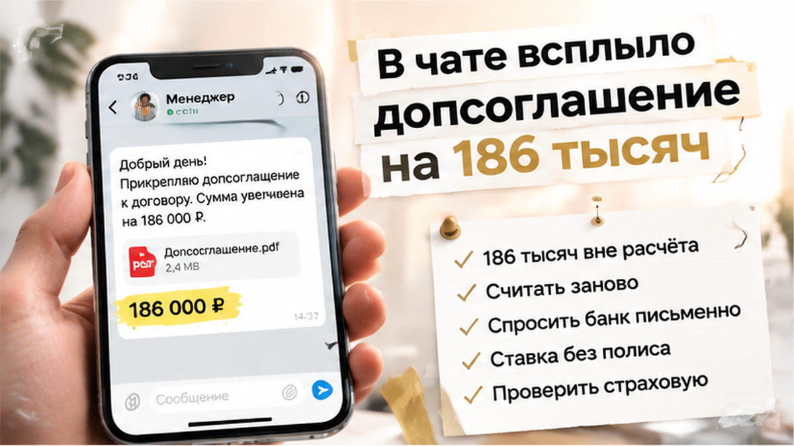

ROLE: Sol TRIM pass — сжать финальный article.html на ~80–150 слов. НЕ переписывать с нуля.

Задача: убрать spine-once повторы (одни тезисы в соседних H2), склеить лишние однострочные абзацы, сократить пересказы.
ЦЕЛЬ: итог ~2000–2150 слов при сохранении casus arc, agency ending, comment magnet.

СОХРАНИТЬ БЕЗ ИЗМЕНЕНИЙ URL/структуры:
- все H2 дословно (заголовки в этом чанке)
- все <figure class="inline-quad" data-slot="inline_N"> с alt и src
- excalibur-cta-early, excalibur-cta-mid, excalibur-cta-end целиком
- comment magnet и interlink href
- таблицы и casus spine (лид, финал, agency ending)

ЗАПРЕЩЕНО: новые факты, composite disclaimer, TL;DR, удаление H2/inline/CTA.
HTML: <b> не <strong>, <i> не <em>. Выход: только HTML фрагмент без fences.

Assembled Sol TRIM — B27 — 2026-09-16

ROLE: Sol TRIM pass — сжать финальный article.html. НЕ переписывать с нуля.

Задача: убрать spine-once повторы (вечером допсоглашение / 186 тысяч / кухня с калькулятором / «обязательный пакет» / 102-ФЗ / Т-Банк / Finuslugi — не дублировать в соседних H2), склеить лишние однострочные абзацы.
ЦЕЛЬ: итоговая статья **1400–1600 слов** (сейчас ~2090). **Агрессивно** режь повторы: различие банк vs офис продаж — один раз; пять вопросов банку — один раз (список можно сократить до 3 пунктов); 30 дней охлаждения — один раз.

СОХРАНИТЬ БЕЗ ИЗМЕНЕНИЙ URL/структуры:
- все 6 H2 дословно
- все 7 <figure class="inline-quad" data-slot="inline_N"> с src cover/inline-0N.png
- excalibur-cta-early, excalibur-cta-mid, excalibur-cta-end целиком (телефон 1×)
- comment magnet: «Страховку на 186 тысяч вынесли в допсоглашение накануне ДДУ — вы бы доплатили ради квартиры или развернулись, даже если бронь сгорит?»
- все 4 interlink href
- таблицу целиком
- casus spine: лид, финал брони, agency ending

ЗАПРЕЩЕНО: новые факты, composite disclaimer, TL;DR, удаление H2/inline/CTA.
HTML: <b> не <strong>, <i> не <em>. Выход: только HTML фрагмент без fences.

=== SOL TRIM CHUNK 2/3 ===
Сожми ТОЛЬКО этот HTML-фрагмент. Не дублируй секции из других чанков.
HTML whitelist: <b> не <strong>, <i> не <em>.

Текущий фрагмент:
<h2>В чате всплыло допсоглашение на 186 тысяч</h2>

<figure class="inline-quad" data-slot="inline_03"></figure>

Сообщение пришло вечером. До визита в офис продаж оставались сутки, а у семьи уже были бронь, одобрение ипотеки и расчёт первоначального взноса, ежемесячного платежа и суммы для эскроу.

В переписке появился новый файл — допсоглашение с пакетом страхования жизни и имущества на <b>186&nbsp;000 рублей</b>. Оформить его предлагали у партнёра застройщика.

Для обычного покупателя такая формулировка звучит почти как команда: «Без этого дальше нельзя». Но файл от офиса продаж ещё не доказывает, что именно этот пакет потребовал банк.

Семья открыла документ на кухне перед поездкой в банк. Посчитали заново входной платёж и увидели: решение о квартире принималось при другой сумме. Новый расход появился не в начале переговоров, а за сутки до ДДУ.

Здесь важно не смешивать документы. Бронь удерживает выбранную квартиру на определённый срок. ДДУ регулирует покупку и расчёты через эскроу. Страховой пакет — отдельная часть предложенной схемы, и его обязательность нужно подтверждать отдельно.

В новой бумаге следовало проверить срок страхования, страховую сумму, состав рисков, порядок оплаты и последствия отказа. Если этих данных нет, цена выглядит полной только на первой странице.

Похожая проверка нужна и тогда, когда застройщик меняет юридические детали сделки. В <a href="/blog/pokupka-kvartiry/v-tyumeni-zastrojschik-smenil-yurlico-dolschikam-prislali-novyj-ddu-eskrou-ne-ot/">разборе смены юрлица застройщика</a> вопрос возник не из-за одной строки в чате, а из-за документов, от которых зависело открытие эскроу.

<h2>Страховой пакет не был в ипотечном расчёте</h2>

<figure class="inline-quad" data-slot="inline_04"></figure>

Одобрение ипотеки подтверждает кредитную конструкцию в тех данных, которые банк видел на момент решения. Оно не превращает любой последующий платёж партнёру застройщика в обязательную часть кредита.

В этой истории 186 тысяч не входили в первоначальный расчёт. Поэтому накануне ДДУ пришлось заново считать всю сделку, а не просто добавить к ней ещё одну строку.

Страхование жизни и здоровья заёмщика само по себе не является обязательным по закону. Но кредитный договор может предусматривать изменение ставки при отказе от полиса. Это нужно увидеть именно в условиях своего кредита, а не угадывать по словам менеджера.

С имущественным страхованием другая логика. При покупке квартиры по ДДУ обязанность обычно связана с возникновением права собственности и конкретными условиями банка, а не автоматически с днём подписания договора. Точную схему определяют документы кредитора.

Поэтому банку стоит задать вопросы письменно:

<ul>
<li>обязателен ли именно этот пакет для выдачи кредита;</li>
<li>как изменится ставка без личного страхования;</li>
<li>можно ли выбрать другую страховую компанию;</li>
<li>какие риски, срок и страховая сумма должны быть указаны в полисе;</li>
<li>вносится ли платёж своими средствами или включается в кредит.</li>
</ul>

Сумма 186&nbsp;000 рублей сама по себе ничего не объясняет. Нужно понять, за какой период её требуют, какие услуги входят в пакет и сколько стоит каждая из них. Без срока, страховой суммы и состава рисков сравнивать предложение с обычной годовой страховкой нельзя.

Условия разных банков могут отличаться. Например, справочные материалы Т-Банка разделяют страхование недвижимости и личное страхование: первое связывают с получением права собственности, второе не считают обязательным, но допускают изменение ставки при отказе. При выполнении требований банка может быть доступен другой страховщик.

Это ориентир для проверки своего договора, а не готовый ответ для любой сделки. Важен документ конкретного банка: его требования к полису, страховщику, сроку и страховой сумме.

Также не стоит подписывать непонятный пакет с мыслью, что деньги потом обязательно вернутся. Для добровольного ипотечного страхования может действовать период охлаждения, но результат зависит от вида продукта, текста договора, страхового случая и уже оказанных услуг.

Рабочий порядок простой: сначала получить позицию банка письменно, затем сравнить варианты страхования и только после этого обновить расчёт. Если банк говорит о возможном повышении ставки без личного полиса, а офис продаж настаивает на конкретном партнёре, это два разных требования.

На финише нужно проверять не только страховку. В истории об <a href="/blog/ipoteka/v-tyumeni-nakanune-ddu-bank-podnyal-stavku-ipoteki-platezh-vyros-sdelku-ostanovi/">изменении ипотечной ставки перед ДДУ</a> менялась стоимость самого кредита. А в отдельном разборе <a href="/blog/ipoteka/ipoteku-odobrili-a-registraciyu-otmenili-stroka-v-egrn/">отменённой регистрации после одобрения ипотеки</a> проблема возникла уже на этапе оформления. Одобрение — это не финальная проверка всей цепочки.

