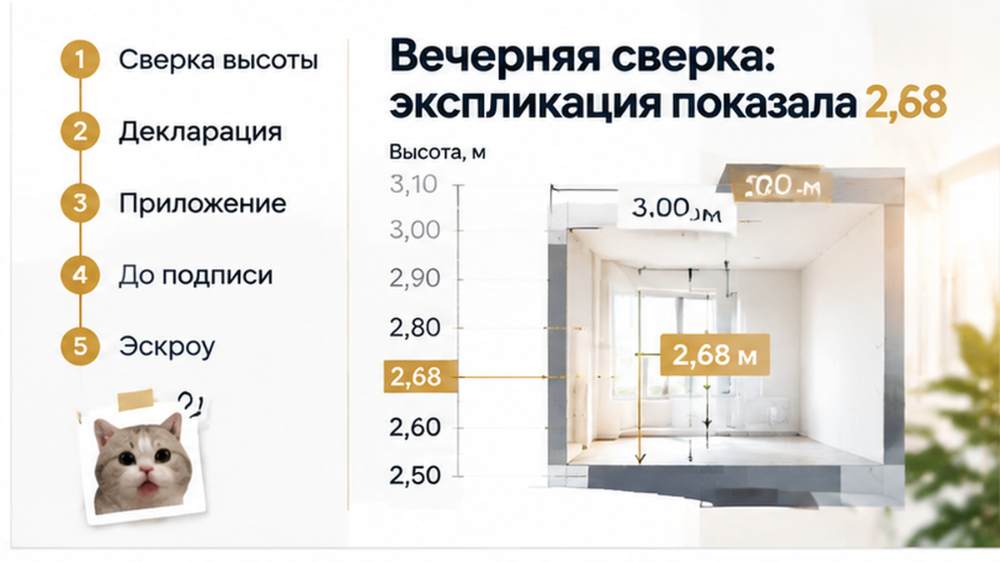

STYLO REPAIR — один проход Sol. Перепиши article.html целиком: только ритм и голос по stylo-notes.md. Факты, цифры, H2, interlink, CTA, comment magnet — не менять по смыслу.

# Stylo notes (для Sol, один проход)

Delta: **2.91** (порог 2.85); pass: **False**

Правь только ритм/голос. Факты, сюжет и newbuild-фокус не трогать.

- перекрытие лид ↔ финал (spine-once): выше gold (сейчас 0.102, эталон 0.032, z=+9.06)
- средняя длина абзаца: ниже gold (сейчас 43.6, эталон 1.94e+03, z=-6.79)
- тире на 1000 слов: ниже gold (сейчас 10.4, эталон 29.1, z=-5.46)
- частота служебного «к»: выше gold (сейчас 7.98, эталон 2.34, z=+4.63)
- частота служебного «но»: выше gold (сейчас 6.75, эталон 2.42, z=+4.04)
- доля «я» среди я/мы/вы: ниже gold (сейчас 0, эталон 0.581, z=-3.84)
- средняя длина предложения (слова): выше gold (сейчас 17.5, эталон 12.1, z=+3.16)
- длина лида (слова): выше gold (сейчас 58, эталон 29.5, z=+3.12)

CURRENT article.html:

В шоу-руме новостройки Тюмени семье обещали потолки три метра, а за четыре дня до подписания ДДУ в экспликации квартиры появилась другая цифра — 2,68 м, поэтому сделку остановили до открытия эскроу. Родители уже представляли высокий шкаф и детскую кровать в будущих комнатах, и разница в 32 сантиметра внезапно стала не мелочью на плане, а вопросом всей планировки. Дома они ещё раз проверили документы и увидели: рекламное «3 м» не совпадает с характеристикой конкретного лота. ДДУ не подписали, деньги на эскроу не переводили, а застройщика попросили либо перенести бронь на другой вариант, либо вернуть внесённую сумму.

Разбираю такие расхождения в Telegram и MAX: <a href="{{TG_URL}}">подписывайтесь, чтобы не пропустить новые разборы</a>.

<h2>В шоу-руме три метра звучали как обещание</h2>

Семья пришла в шоу-рум с вполне бытовым запросом: нужна была квартира, где не придётся подгонять мебель под каждый сантиметр и где ребёнку будет удобно в отдельной комнате. Менеджер показывал демонстрационное помещение, обращал внимание на высокий верх окон и несколько раз говорил о потолках в три метра.

Для покупателя такая цифра звучит не как часть красивой презентации, а как характеристика будущей квартиры. На визуализации пространство и правда выглядело выше обычного: светлая отделка, высокие двери, свободная комната, мебель без ощущения тесноты. Семья стала считать бюджет и планировку уже с учётом этой высоты — где поставить шкаф, какой сделать верхний ярус, сколько места оставить над детской кроватью.

Но шоу-рум показывает идею проекта, а ДДУ и приложения к нему относятся к конкретной квартире. Разница между этими вещами обычно становится заметной не во время презентации, а вечером дома, когда покупатель открывает документы и начинает сверять услышанное с тем, что ему действительно предлагают подписать.

Именно экспликация — план с характеристиками помещений — стала первым местом, где три метра пришлось проверять не на глаз, а по записи. С похожими расхождениями сталкиваются и в вопросах отделки, окон или комплектации: на встрече звучит одно, а в договоре появляется более узкое описание. В другой тюменской истории обещанная чистовая отделка не совпала с тем, что застройщик должен был передать по ДДУ, — <a href="{{SITE_BASE}}/blog/proverka-pered-pokupkoj/v-tyumeni-v-ddu-obeschali-chistovuyu-na-priemke-golye-steny-akt-ne-podpisali/">покупатели обнаружили голые стены и не подписали акт</a>.

<h2>Бронь и ипотека сжимали срок до ДДУ</h2>

К моменту проверки у семьи уже был ограниченный срок. Подходящий лот забронировали, под него начали оформлять ипотеку, а менеджер напоминал: с подписанием ДДУ лучше не затягивать. Если выйти на сделку позже, квартиру могли отдать другому покупателю или изменить условия бронирования.

В такой ситуации легко решить, что выбор простой: быстро подписать договор или потерять нужную квартиру. Бронь начинает работать как таймер, а вопросы к документам воспринимаются почти как помеха сделке. Хотя несколько дней до ДДУ — это как раз время, когда рекламные обещания, планировку и приложения к договору нужно сопоставить между собой.

Ипотека усиливала давление. Семья уже мысленно привязала будущий платёж к выбранной квартире, а сроки банка и застройщика наложились друг на друга. Но ДДУ — не формальность перед открытием эскроу. В нём фиксируются характеристики объекта, на которые потом можно опираться при передаче квартиры и в споре с застройщиком.

Поэтому семья остановилась не из-за страха перед новостройками вообще. Нужно было понять, что именно покупается: квартира с высотой, о которой говорили в шоу-руме, или объект с параметрами, указанными в документах. Пока этот вопрос не закрыли письменно, подписывать ДДУ и переводить деньги на эскроу не стали.

<h2>Вечерняя сверка: экспликация показала 2,68</h2>

Вечером семья ещё раз открыла документы по выбранной квартире. Не презентацию, не фотографию интерьера, а именно экспликацию — план с характеристиками помещения. Там вместо обещанных в шоу-руме трёх метров стояло другое число: 2,68.

<figure class="figure-inline figure-inline-quad" data-slot="inline_4">
  
</figure>

Разница в 32 сантиметра кажется небольшой, пока смотришь на неё в таблице. Но семья выбирала квартиру с конкретным расчётом: высокий шкаф, место над детской кроватью, возможность сделать хранение почти до потолка. При высоте 2,68 м мебель уже нельзя было планировать так же, как при трёх метрах.

Тут и выяснилось главное. Шоу-рум показывал идею проекта: высокие двери, светлую отделку, свободную комнату и ощущение воздуха. Экспликация относилась к конкретному лоту. Это не два способа описать одну и ту же вещь, а разные источники информации, которые нужно было сопоставить до подписания ДДУ.

Фраза «потолки три метра» могла относиться к демонстрационному помещению или быть рекламным описанием. Но запись 2,68 м уже была привязана к выбранной квартире. Поэтому семье нужно было выяснить, что именно измерено: расстояние от плиты до плиты, высота после отделки или другой проектный показатель.

Такие расхождения бывают не только с потолками. В рекламе и на встрече могут говорить об отделке, окнах, комплектации или сроках, а в документах эти условия оказываются сформулированы уже. Для покупателя важен не самый красивый вариант обещания, а тот, который можно предъявить застройщику по ДДУ.

<h2>Ответ застройщика: маркетинг и норма 2,7</h2>

Когда семья задала вопрос о разнице, ей объяснили: «три метра» в шоу-руме не означают гарантированную высоту в каждой квартире. В разговоре также появилась цифра около 2,7 м — нормативное значение для жилых помещений в соответствующей части Тюмени.

Но нормативный минимум и рекламное обещание — не одно и то же. Если помещение соответствует нижней границе требований, это ещё не подтверждает слова менеджера о потолках в три метра. Покупатель пришёл за одной характеристикой, а в документах увидел другую.

<figure class="figure-inline figure-inline-quad" data-slot="inline_5">
  
</figure>

В такой ситуации решает порядок документов. Реклама и устный рассказ помогают выбрать квартиру, но при споре смотрят прежде всего на ДДУ, его приложения и проектную документацию. Если покупатель подписал договор с другим значением, доказать потом, что рекламная цифра должна была стать обязательством, значительно сложнее.

Семья не стала подписывать ДДУ на прежних условиях. Эскроу тоже не открывали: сначала нужно было понять, какую именно квартиру они покупают и какая высота в ней гарантируется. Бронь могли перенести на другой лот либо вернуть внесённую сумму — конкретный вариант зависел от условий бронирования, но деньги дальше в сделку не пошли автоматически.

Это не значит, что любое различие между презентацией и документом сразу доказывает обман. Иногда цифры относятся к разным точкам измерения, отделке или техническим параметрам. Но оставлять вопрос на уровне «менеджер сказал, что всё нормально» нельзя. Его нужно закрыть письменно до подписания ДДУ и перечисления денег на эскроу.

<h2>Что сверить по высоте до подписания и эскроу</h2>

В этой истории семья остановила сделку не потому, что квартира внезапно стала непригодной для жизни. Стоп случился раньше: обещанные в шоу-руме три метра не совпали с цифрой в документах на конкретный лот.

До подписания ДДУ покупатели запросили письменное подтверждение высоты именно в чистом виде — после устройства пола, потолка и предусмотренной проектом отделки. Формулировка «от плиты до плиты» или «высота этажа» может звучать внушительно, но это не обязательно то расстояние, которое останется в готовой комнате.

Затем эту цифру нужно сопоставить с экспликацией квартиры и проектной документацией. Если в презентации стоят «потолки 3 м», а в документах указано 2,68 м или «не менее 2,7 м», перед покупателем уже не одна и та же характеристика. Нужно выяснить, что именно измерено и какая высота попадёт в ДДУ.

Для семьи это был не спор о красивой цифре. От высоты зависели шкафы, антресоли, карнизы и планировка детской. При 2,68 м часть мебели пришлось бы заказывать иначе, а расчёт пространства над кроватью и системой хранения — пересматривать.

Та же логика работает с отделкой и другими обещаниями из офиса продаж. В одном из тюменских разборов покупателям обещали чистовую квартиру, но в ДДУ и на приёмке обнаружились голые стены — <a href="{{SITE_BASE}}/blog/proverka-pered-pokupkoj/v-tyumeni-v-ddu-obeschali-chistovuyu-na-priemke-golye-steny-akt-ne-podpisali/">обещание из офиса не совпало с тем, что застройщик должен был передать</a>. Важна не только презентация, а то, что можно предъявить по договору.

<h2>Таблица: шоу-рум, экспликация, декларация</h2>

<table>
  <thead>
    <tr>
      <th>Где указано</th>
      <th>Что может быть написано</th>
      <th>Что это значит для покупателя</th>
    </tr>
  </thead>
  <tbody>
    <tr>
      <td>Шоу-рум и презентация</td>
      <td>«Потолки 3 м»</td>
      <td>Рекламный ориентир, если цифра не закреплена в договоре.</td>
    </tr>
    <tr>
      <td>Экспликация квартиры</td>
      <td>2,68 м или «не менее 2,7 м»</td>
      <td>Нужно уточнить, откуда и до чего произведено измерение.</td>
    </tr>
    <tr>
      <td>Проектная документация</td>
      <td>Расчётные параметры помещения</td>
      <td>Проверить, совпадают ли они с экспликацией и ДДУ.</td>
    </tr>
    <tr>
      <td>ДДУ</td>
      <td>Характеристики объекта и порядок передачи</td>
      <td>Главный документ сделки: по нему определяются обязательства застройщика.</td>
    </tr>
  </tbody>
</table>

Нормативный минимум и рекламные три метра — разные вещи. В материалах проверки для соответствующей части Тюмени использовался минимум 2,7 м по СП 54.13330.2022. Если в экспликации указано 2,68 м, важно понять, к какой высоте относится эта цифра и почему она отличается от презентации.

При этом соответствие минимальному требованию не превращает слова менеджера о трёх метрах в договорное обязательство. Если обещание не попало в ДДУ или приложение к нему, после подписания будет трудно требовать именно заявленную в шоу-руме характеристику.

Поэтому спорить о том, много ли 32 сантиметра, не главный вопрос. Для одного покупателя это почти незаметная разница, для другого — шкаф, который не встанет по проекту, или детская, которую придётся планировать заново. Важно заранее понять, какую квартиру передадут и какая цифра будет иметь силу в сделке.

До брони и открытия эскроу стоит также сверить отделку, сроки передачи, видовые характеристики, реквизиты и условия возврата денег. В другом тюменском кейсе проверка до эскроу остановила перевод после того, как в реквизитах обнаружилось чужое юридическое лицо: <a href="{{SITE_BASE}}/blog/ipoteka/za-2-dnya-do-eskrou-v-rekvizitah-scheta-okazalos-chuzhoe-yurlico-bank-ostanovil/">банк остановил сделку до перечисления денег</a>.

Бронь не должна становиться причиной подписать неподходящий ДДУ. Если срок заканчивается сегодня, а экспликацию предлагают посмотреть только после внесения денег, разумнее запросить документы и перенести решение. Давление дедлайна уже становилось отдельной проблемой для покупателей: <a href="{{SITE_BASE}}/blog/ipoteka/v-tyumeni-nakanune-ddu-bank-podnyal-stavku-ipoteki-platezh-vyros-sdelku-ostanovi/">изменение условий ипотеки накануне ДДУ увеличило платёж</a>.

В этой истории семья ДДУ не подписала, деньги на эскроу не переводила и попросила либо перенести бронь на другой лот, либо вернуть внесённую сумму. Так у неё осталось право выбирать, а не доказывать после сделки, что рекламные три метра должны были стать частью договора.

<b>Если в шоу-руме говорят «потолки 3 метра», а в ДДУ указано 2,68, вы бы подписали договор, чтобы не потерять бронь, или ушли бы сразу?</b>

Покупка новостройки не требует заранее отвергать каждое обещание застройщика. Но до эскроу важно отделить красивую подачу от условия договора: запросить высоту в чистом виде, сверить экспликацию и понять, что именно будет передано по ДДУ.

Подписывайтесь на Telegram и MAX «Экскалибур»: там разбираем сделки в новостройках Тюмени без рекламной витрины — что проверить в документах и в какой момент ещё можно остановиться.

Если документы уже на руках, их можно разобрать до брони, ДДУ или эскроу. Подключусь к проверке характеристик квартиры, условий бронирования и формулировок договора: <b><a href="tel:+79220016505">+7 922 001 65 05</a></b>.

