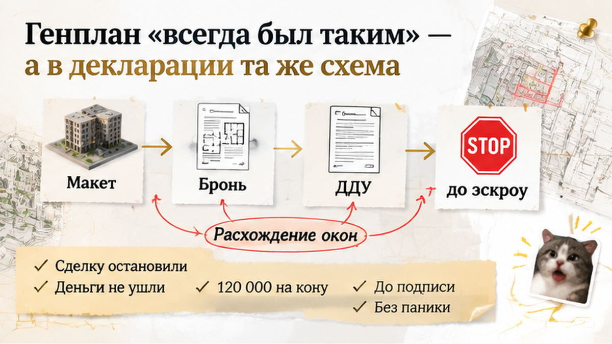
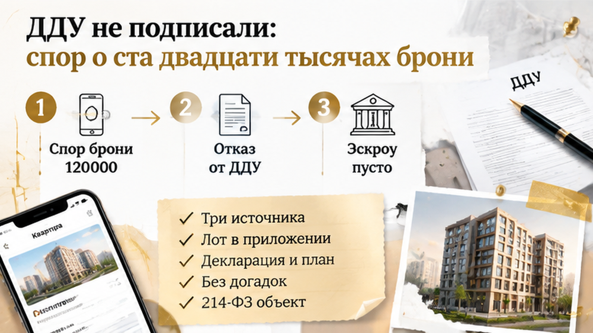

Assembled Sol inputs — B33 quality repair — 2026-09-22

ROLE: Sol — один repair pass по quality-score-notes. Факты writer не менять.

# Quality score notes (для Sol, один проход)

H1: Окна обещали во двор — за 5 дней до ДДУ семья остановила сделку: вместо двора магистраль

Исправь **только** структуру/тон по FAIL ниже. Факты из drafts/writer.html не менять.
Без self-score loop. Без padding до 1800+. Target 1400–1600 слов.

## LEAD FAIL
- lead-hit: first 1-2 sentences missing consequence beat

## FINALE FAIL
- finale-third-retell: middle scene repeated in closing: «обещали двор вокруг конкретного»

## LENGTH FAIL
- length-over: 1671 words above target 1400-1600

HARD:
- Lead: в первых 1–2 предложениях casus + число + последствие (em-dash или глагол: остановил/потеря/под вопросом)
- Finale: убрать третий пересказ сцены «двор/магистраль» — сжать closing абзацы перед таблицей
- 1400–1600 слов
- Ровно 7: <figure class="inline-quad" data-slot="inline_N"></figure> после H2 1-6 и после таблицы (inline_7)
- Убрать class figure-inline-quad

CURRENT article.html:

За пять дней до подписания ДДУ семья узнала, что окна из выбранной квартиры могут смотреть не во двор, а на оживлённую улицу или магистраль. За бронь уже внесли <b>120 000 ₽</b>, ипотеку одобрили, дату сделки назначили. В офисе продаж секция на макете выглядела обращённой внутрь двора, а менеджер говорил, что родители и кухня будут смотреть на спокойную территорию без потока машин. Но вечером родители открыли приложение к проекту договора и увидели другую ориентацию фасада. До эскроу деньги ещё не дошли — у семьи оставалось пять дней, чтобы остановиться и понять, какую квартиру ей на самом деле продавали.

Я разбираю такие истории без рекламного тумана: что показывают в офисе, а что в итоге закрепляют в документах. Полезные разборы новостроек — в <a href="https://t.me/Tyumen_Rieltor">Telegram</a> и <a href="https://max.ru/id561413315447_biz">MAX</a>.

<h2>«Тихий двор» — так показали макет и менеджер в офисе продаж</h2>

Семья выбирала квартиру не только по цене и площади. Родителям было важно, чтобы детская и кухня выходили во внутренний двор, а не на дорогу, где с утра до вечера идут машины. На макете нужная секция выглядела обращённой внутрь территории. Менеджер подтвердил: окна будут смотреть именно туда.

После этого покупатели внесли <b>120 000 ₽</b> по соглашению о бронировании. Банк одобрил ипотеку, дату подписания договора долевого участия заранее наметили. Оставалось получить документы и перечислить деньги на эскроу — тот же этап, на котором в новостройках Тюмени иногда всплывают сроки и условия, как в истории, когда <a href="/blog/vtorichka-i-riski/klyuchi-ot-novostrojki-v-tyumeni-perenesli-na-god-dengi-na-eskrou-zamorozili/">сдачу перенесли, а деньги на эскроу уже заморозили</a>.

Но макет и разговор в офисе сами по себе не определяют квартиру, которую покупатель получит по ДДУ. Для этого нужно сопоставить конкретный лот: номер квартиры, секцию, этаж, поэтажный план, фасад и другие признаки. Если в приложении к договору указан лот с другой стороны здания, повторный просмотр красивого рендера спор не решит. Нужно смотреть документы.

Такой разрыв между словами менеджера и бумагами важен и при <a href="/blog/proverka-pered-pokupkoj/v-tyumeni-v-proektnoj-deklaracii-zemlya-pod-zhk-v-arende-v-broni-obeschali-sobst/">проверке проектной декларации</a>. Покупателю важно отделить обещание в офисе от сведений, которые застройщик раскрыл до подписания.

<h2>За пять дней до ДДУ: в проекте договора окна смотрят не туда</h2>

Проект договора семья открыла вечером, когда до сделки оставалось пять дней. В приложении к нему и актуальной проектной документации родители увидели другую ориентацию секции и фасада. Выбранная квартира уже не выглядела квартирой «во двор»: по схеме окна выходили на оживлённую улицу или магистраль.

Покупатели попросили менеджера объяснить расхождение. Ответ был коротким: генплан «всегда был таким», а макет — всего лишь маркетинговый материал. Но главный вопрос остался: какую именно квартиру семья собиралась купить и что ей показывали до внесения денег за бронь?

По части 1 статьи 4 214-ФЗ объект долевого строительства определяется в ДДУ в соответствии с проектной документацией. Проще говоря, из договора должно быть понятно, какую конкретно квартиру получает покупатель. Поэтому направление окон проверяют по номеру квартиры, секции, поэтажному плану и фасаду. Если проект менялся, смотрят ещё и даты редакций — и то, как эти изменения отразили в проектной декларации.

Семья проверила схему в проектной декларации на ЕИСЖС. Там она совпадала с документами, а не с впечатлением от макета и разговора в офисе. Это ещё не означало автоматически, что застройщик нарушил закон: сначала нужно было понять, менялась ли проектная документация и когда.

Изменения проектной документации должны отражаться в декларации ежемесячно, не позднее 10-го числа, по правилам части 4 статьи 19 214-ФЗ. Поэтому важна история редакций: какая схема действовала раньше, какая появилась позже и что именно покупатель мог увидеть в момент бронирования.

<h2>Генплан «всегда был таким» — а в декларации та же схема</h2>

В офисе семье ответили коротко: «Генплан всегда был таким. На макете просто показали идею двора». Но на актуальной схеме секция стояла иначе: окна выбранной квартиры выходили на оживлённую улицу или магистраль. Хотя вид во двор до этого называли одним из преимуществ.

В ЕИСЖС покупатели увидели ту же схему, что и в приложении к проекту договора. Здесь и проходит граница между красивой картинкой и документом: <b>проектная документация показывает, какую квартиру человек получает по ДДУ, а макет и слова менеджера — как эту квартиру продавали</b>. Иногда эти вещи совпадают. В этой истории — нет.

Но одного скриншота декларации мало. Нужно было понять, менялась ли проектная документация и когда именно: сравнить прежнюю и актуальную редакции, посмотреть даты и проверить, отражены ли изменения в декларации. По части 4 статьи 19 214-ФЗ такие изменения должны вноситься ежемесячно, не позднее 10-го числа.

Если документы не менялись, а на макете и в разговоре с менеджером с самого начала показывали другое, спор уже не о решении застройщика. Он о том, что именно обещали покупателю и чем это можно подтвердить: перепиской, рекламой, презентацией, материалами офиса или условиями бронирования.

С отделкой бывает так же. Обещание чистовой квартиры не заменяет характеристику в ДДУ. В одном из тюменских случаев это выяснилось только на приёмке: вместо обещанной чистовой покупатели увидели голые стены.

Поэтому семье стоило сохранить фотографию макета, лист с номером квартиры, переписку, презентацию, условия бронирования, скриншоты страницы проекта и редакцию декларации на дату проверки. Тогда разговор шёл бы не вокруг фразы «нам обещали двор», а вокруг конкретного расхождения по конкретному лоту.

<figure class="figure-inline-quad">
  
</figure>

<h2>ДДУ не подписали: спор о ста двадцати тысячах брони</h2>

К подписанию ДДУ семья не пришла. Деньги на эскроу не перечислили: выбранная квартира могла оказаться совсем не той, которую родители собирались покупать. Ипотеку банк одобрил, но это не обязывало оформлять сделку на непроверенный объект — как и в другой тюменской истории, когда <a href="/blog/ipoteka/v-tyumeni-nakanune-ddu-bank-podnyal-stavku-ipoteki-platezh-vyros-sdelku-ostanovi/">сделку остановили прямо перед ДДУ</a>.

Главным стал вопрос о <b>120 000 ₽</b>, внесённых по соглашению о бронировании. Покупатели считали, что не должны терять эту сумму после обнаружения расхождения. Офис ссылался на условия брони и на то, что ДДУ так и не подписали.

Автоматически обещать возврат здесь нельзя. Бронь — отдельное соглашение, а до заключения ДДУ покупатель ещё не стал участником долевого строительства. Сначала нужно посмотреть сам документ: кому и когда направлять заявление, в каких случаях деньги возвращают или удерживают, что считается отказом покупателя, а что — невозможностью заключить договор на согласованных условиях.

Важно и то, указан ли в брони конкретный лот с его характеристиками. Если там есть только общая формулировка, а номер квартиры и её параметры не закреплены, доказать расхождение будет сложнее.

Нормы 214-ФЗ о расторжении ДДУ напрямую этот спор не решают: договора ещё нет. Даже после подписания один только вид из окна не даёт автоматического результата. Сначала нужно установить, какие отношения возникли по соглашению о бронировании, что обещали семье до внесения денег и что было зафиксировано.

В итоге всё упёрлось в документы: что показывали до оплаты, что написано в соглашении, какая схема была доступна в декларации и совпадала ли она с проектом договора. Семья поставила сделку на паузу и начала обсуждать возврат брони. Деньги на эскроу она не переводила и ДДУ не подписывала в надежде, что вопрос с видом как-нибудь решится позже.

<figure class="figure-inline-quad">
  
</figure>

<h2>Сделку остановили до эскроу — вопрос остался за бронью</h2>

<figure class="inline-quad" data-slot="inline_05"></figure>

Вечером семья не стала подписывать ДДУ. Деньги на эскроу не перечислили, ипотечную сделку поставили на паузу: одобрение банка ещё не означало, что покупатели обязаны брать квартиру с видом на улицу или магистраль, если выбирали её как квартиру во двор.

Оставались <b>120 000 ₽</b>, внесённые по соглашению о бронировании. Автоматически обещать семье возврат нельзя. ДДУ ещё не подписали, поэтому спор зависел от текста брони, причины отказа и того, что именно было показано и зафиксировано до оплаты.

Нужно было выяснить и другое: проектную документацию меняли или магистраль была указана там с самого начала. Для этого сравнивают редакции, даты и материалы, которые покупатель видел в офисе. Одна запись в декларации сама по себе ещё не отвечает на вопрос, почему квартиру продавали как вариант с тихим двором.

Семья сохранила переписку, презентацию, фотографию макета, условия бронирования и доступные редакции проектной документации. Теперь разговор шёл не вокруг фразы «нам обещали двор», а вокруг конкретного лота и конкретного расхождения.

Кто должен отвечать за такой разрыв — менеджер, застройщик или сам покупатель, который не проверил документы до внесения брони?

<h2>До подписи — один лот, три источника и никаких догадок</h2>

<figure class="inline-quad" data-slot="inline_06"></figure>

Проверять нужно не весь жилой комплекс сразу, а выбранную квартиру: номер, секцию, этаж и фасад. Тогда становится видно, где заканчивается картинка из офиса и начинается объект, который закрепят в ДДУ.

<table>
<tr>
<th>Что сверить</th>
<th>В офисе продаж</th>
<th>В ДДУ и проектной документации</th>
</tr>
<tr>
<td>Номер квартиры и секция</td>
<td>Квартира выбрана на плане продаж или в презентации.</td>
<td>Номер должен совпадать в приложении к ДДУ, на поэтажном плане и в документах по корпусу.</td>
</tr>
<tr>
<td>Направление окон</td>
<td>На рендере могут быть двор, зелень или детская площадка.</td>
<td>Проверяются фасад, сторона света и направление окон по плану и проектной документации.</td>
</tr>
<tr>
<td>Что находится перед фасадом</td>
<td>Макет может показывать только благоустройство внутри участка.</td>
<td>Смотрят генплан, дороги, проезды и соседние объекты, если эти сведения доступны.</td>
</tr>
<tr>
<td>Изменения проекта</td>
<td>Дата макета часто не указана, а менеджер называет его актуальным.</td>
<td>Сравниваются редакции декларации, даты изменений и доступная проектная документация.</td>
</tr>
<tr>
<td>Условия бронирования</td>
<td>Фиксируются сумма <b>120 000 ₽</b> и выбранная квартира.</td>
<td>В соглашении ищут основания возврата или удержания денег, сроки и порядок прекращения брони.</td>
</tr>
</table>

Проектную декларацию можно открыть через ЕИСЖС. Но читать её отдельно от приложения к ДДУ мало: сведения по дому нужно сопоставить с документами именно по выбранной квартире. Если в приложении указан один фасад, а на плане продаж показан другой, вопрос лучше остановить до подписи.

Так же разбирают ситуации, когда обещание из офиса расходится с договором: <a href="/blog/proverka-pered-pokupkoj/v-tyumeni-v-ddu-obeschali-chistovuyu-na-priemke-golye-steny-akt-ne-podpisali/">обещание чистовой отделки не заменяет условие ДДУ</a>. А историю проектной декларации полезно сопоставлять с тем, что раскрыто по объекту в документах: такой разрыв уже разбирался в <a href="/blog/proverka-pered-pokupkoj/v-tyumeni-v-proektnoj-deklaracii-zemlya-pod-zhk-v-arende-v-broni-obeschali-sobst/">истории с землёй под жилой комплекс</a>.

Схема могла появиться в ЕИСЖС раньше, чем покупатель получил проект ДДУ. Но могло быть и иначе: документы не менялись, а рекламный макет с самого начала не соответствовал фасаду. Без сравнения редакций и материалов по конкретному лоту причину расхождения не установить.

Если картинка из офиса не совпала с проектом, это стоит разобрать до подписи и перечисления денег на эскроу. Написать можно в <a href="https://t.me/Tyumen_Rieltor">Telegram</a> или <a href="https://max.ru/id561413315447_biz">MAX</a> — по документам конкретной ситуации.

Семья остановила сделку не потому, что любой вид на улицу неприемлем. Она просто не стала считать макет и проект одним и тем же документом. Пять дней до ДДУ оставляли возможность проверить бумаги, обсудить бронь и не переводить деньги на эскроу вслепую.

Макет помогает представить будущий дом. Решение принимают по приложению к ДДУ, поэтажному плану и проектной декларации. Такая проверка не гарантирует, что спор исчезнет, зато сохраняет возможность остановиться до подписи, а не выяснять всё после передачи квартиры.

<a href="https://t.me/Tyumen_Rieltor">Telegram</a> и <a href="https://max.ru/id561413315447_biz">MAX</a> — для вопросов по новостройкам и документам.

Телефон: <a href="tel:+79220016505">+7 922 001 65 05</a>. Ещё материалы — <a href="https://dzen.ru/holyslav">Дзен</a>, <a href="https://vk.ru/tymenrieltor">ВКонтакте</a>, <a href="{{SITE_BASE}}/gajdy/">гайды</a> и <a href="{{SITE_BASE}}/rieltor-tyumen/">помощь риэлтора в Тюмени</a>.

