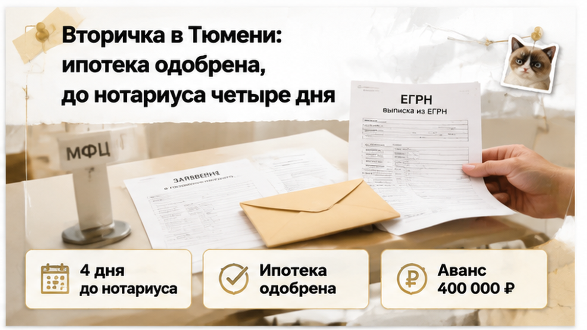
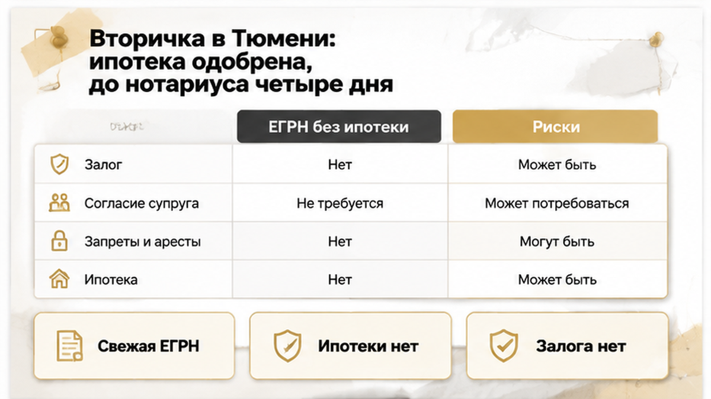
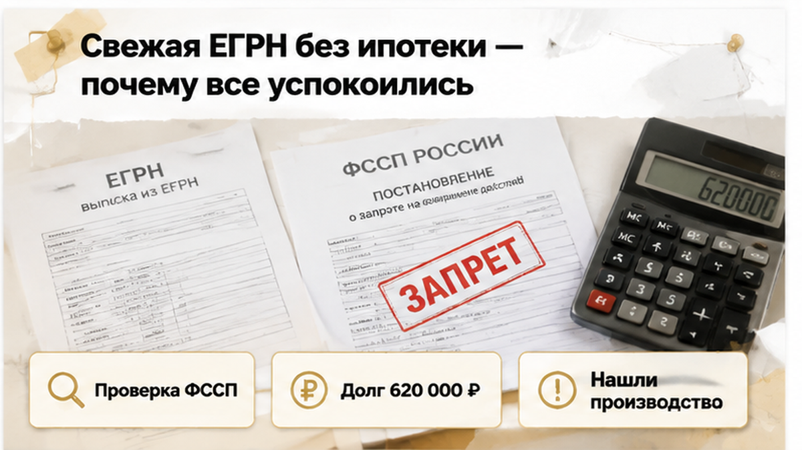

Assembled schema inputs — B34

Derouter schema utility. Output schema.jsonld BlogPosting only (FAQ skip per theme_blocks).

H1: Во вторичке Тюмени — запрет пристава сорвал аванс за 4 дня
topic B34 slug v-tyumeni-za-4-dnya-do-avansa-pristav-zapretil-registraciyu-vtorichki
datePublished 2026-09-30 author_id svyatoslav-shakin
description: «Снимут за два дня», — уверял продавец. Но постановление пристава показать не смог: при долге около 620 тысяч аванс за тюменскую вторичку решили придержать.
theme_blocks faq skip — no FAQPage
site_base placeholder {{SITE_BASE}} canonical {{SITE_BASE}}/v-tyumeni-za-4-dnya-do-avansa-pristav-zapretil-registraciyu-vtorichki/ (no /blog/)

article.html (first 6000 chars):

<b>За 4 дня до нотариуса покупатели вторички в Тюмени столкнулись с запретом пристава — и остановили перевод аванса около 400 тысяч рублей.</b> Переоформить квартиру продавца сейчас было нельзя: в ЕГРН висело ограничение ФССП на регистрацию. До этого всё выглядело гладко: банк предварительно одобрил ипотеку, свежая выписка без залога, согласие супруга на месте. Расширенная проверка нашла исполнительные производства примерно на 620 тысяч. Продавец спокойно сказал: «Снимут за два дня, нотариуса не переносим». Покупатели на слово верить не стали, и деньги так и не ушли.

Проверяем квартиры на вторичке в Тюмени до аванса: ЕГРН, база ФССП, исполнительные производства. Напишите: <a href="https://t.me/Tyumen_Rieltor">Telegram</a> или <a href="https://max.ru/id561413315447_biz">MAX</a>.

<h2>Вторичка в Тюмени: ипотека одобрена, до нотариуса четыре дня</h2>
<figure class="inline-quad" data-slot="inline_01"></figure>

Покупатели шли по обычному порядку. Сначала решение банка, потом цена и дата с продавцом. Дальше аванс на защищённый счёт, а через четыре дня договор у нотариуса.

После одобрения ипотеки у людей почти всегда одна мысль: «Банк дал добро, значит, дальше формальности». Я слышу это постоянно. И понимаю, откуда оно: самое нервное вроде бы позади.

Только одобрение говорит об одном. Банк готов дать деньги этим людям под эту квартиру. Пропустит ли переход права регистратор, банк не отвечает. Этот разрыв хорошо видно в истории, где <a href="/blog/ipoteka/ipoteku-odobrili-a-registraciyu-otmenili-stroka-v-egrn/">ипотеку одобрили, а регистрацию отменили</a> из-за одной строки в ЕГРН. Если на квартире запрет пристава, одобренный кредит сделку не спасёт.

А тут ещё календарь подгонял. Четыре дня на аванс, банковские бумаги и подписание — это впритык. В таком темпе проверку обычно режут до минимума: выписка есть, согласие супруга есть, платим.

Обычный покупатель в эти дни думает, как всё успеть. Профи думает, какой вопрос ещё не задан. Четырёх дней на него хватает, если задать его до перевода денег, а не после.

<h2>Свежая ЕГРН без ипотеки — почему все успокоились</h2>
<figure class="inline-quad" data-slot="inline_02"></figure>

Выписку ЕГРН читали с одним вопросом: нет ли на квартире ипотеки продавца. Её не оказалось. Все заметно выдохнули. Согласие супруга тоже проверили, а на вторичке оно часто всплывает в последний момент.

И вот тут появляется опасное ощущение, что проверка закончена. «Ипотеки нет» тихо превращается в «можно покупать». Разница в одно слово, а цена ошибки — весь аванс.

Выписка отвечает только на то, что в неё уже попало. Долги продавца перед банками, налоговой или по решениям суда там не расписаны. Исполнительные производства живут в базе ФССП, а не в ЕГРН. Бумага и реальность вообще любят расходиться: вспомните случай, где <a href="/blog/vtorichka-i-riski/v-tyumeni-prodavec-pokazal-spravku-o-zakrytii-ipoteki-bank-vse-esche-derzhal-zal/">продавец показал справку о закрытии ипотеки, а банк всё ещё держал залог</a>.

Логику покупателей понять можно. Квартира не в залоге, супруг согласен, банк одобрил. Три подтверждения подряд выглядят как гарантия.

Но посмотрите, что именно проверили. Ипотеку, семью и деньги банка. Самого продавца как должника не проверил никто. Эту дыру и закрыла расширенная проверка, которую заказали за несколько дней до аванса.

<h2>Расширенная проверка: исполнительное производство и запрет на регистрацию</h2>
<figure class="inline-quad" data-slot="inline_03"></figure>

За четыре дня до нотариуса покупатели заказали расширенную проверку продавца. Обычный покупатель рассуждает так: выписка свежая, что ещё проверять. Профи знает, что ЕГРН показывает только то, что уже дошло до реестра на дату запроса. Долги, суды и приставы живут в других базах, и там их иногда видно раньше, чем в Росреестре.

В банке данных исполнительных производств на сайте ФССП (fssp.gov.ru/iss/ip) на продавца нашлось производство. Долг около <b>620 000 ₽</b>. К нему прилагался <b>запрет регистрационных действий</b> на имущество должника. Это не долг за коммуналку и не самозапрет, который человек ставит себе сам. Это решение пристава.

Первым делом покупатели спросили: «А долг теперь на нас перейдёт?» Нет. По договору купли-продажи чужой долг не наследуют, и 620 тысяч вместе с ключами к новым владельцам не переедут. Опасность в другом. Пока запрет стоит, Росреестр не зарегистрирует переход права. Договор подписан, деньги ушли, а квартира по документам всё ещё принадлежит продавцу. Если аванс отдан без защиты, вернуть его можно только через переговоры или суд.

<h2>Обещание «снимут за два дня» — аванс около 400 тысяч так и не ушёл</h2>
<figure class="inline-quad" data-slot="inline_04"></figure>

Продавец отреагировал спокойно, даже с лёгким раздражением. «Долг старый, я всё оплачу. Запрет снимут за два дня, нотариуса переносить не надо». И предложил внести аванс по плану, около <b>400 000 ₽</b> на защищённый счёт, чтобы «не потерять квартиру».

На этом месте покупатели остановились. Они не стали гадать, верить продавцу или нет. Они спросили, по какой бумаге узнают, что запрет снят. Сама по себе оплата долга запрет не снимает. Сначала пристав выносит постановление об отмене мер, потом оно доходит до Росреестра, и только после этого строка о запрете исчезает из ЕГРН. База ФССП после оплаты может обновляться 3–7 дней, и даже чистая строка там ещё не значит, что реестр тоже чист.

Покупатели попросили показать само постановление пристава: что именно наложено и по какому производству. Показать его продавец не смог. Одобренная ипотека в этой ситуации не помогала. Банк готов дать деньги, но при действующем запрете регистратор 

---
OUTPUT CONTRACT (mandatory):
You are the Derouter schema utility inside excalibur_blog_derouter_opus_chat.py.
The Python script will write your reply to schema.jsonld.
Reply with ONLY valid JSON-LD (single JSON object with @context and @graph).
No markdown fences. No prose. No shell commands. No refusals.
Start with { and end with }.
Include Organization, Person (author svyatoslav-shakin), BlogPosting.
Use {{SITE_BASE}} for all site URLs. Canonical: {{SITE_BASE}}/v-tyumeni-za-4-dnya-do-avansa-pristav-zapretil-registraciyu-vtorichki/
datePublished: 2026-09-30
headline: Во вторичке Тюмени — запрет пристава сорвал аванс за 4 дня
description from description-brief above.
No FAQPage (faq skip).
Exclude any sameAs URL containing [REDACTED].
