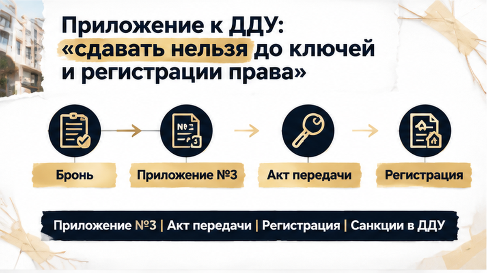
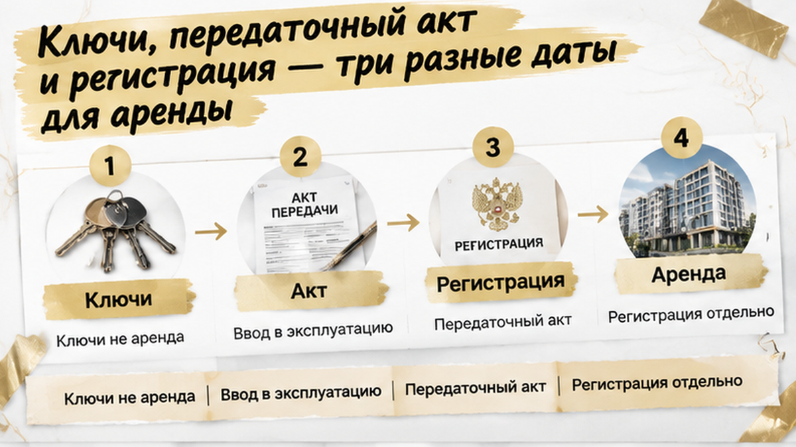

Assembled Sol TRIM — B35 — 2026-09-11

ROLE: Sol TRIM pass — сжать финальный article.html. НЕ переписывать с нуля.
Ты выполняешься **внутри excalibur_blog_derouter_opus_chat.py / sol_trim_chunk**. **Пиши HTML сейчас.** Не выводи BLOCKER.

Задача: убрать spine-once повторы (ключи/акт/регистрация, бронь/возврат, «рекламный срок» — не объяснять одно и то же в соседних H2), склеить лишние однострочные абзацы.
ЦЕЛЬ: итог **1400–1600 слов** (сейчас ~2135; hard max 1750).

СОХРАНИТЬ БЕЗ ИЗМЕНЕНИЙ URL/структуры:
- все 6 H2 дословно
- все 7 <figure class="inline-quad" data-slot="inline_N"> с src cover/inline-0N.png
- excalibur-cta-early: добавь «Я Святослав Шакин, The Риэлтор, Тюмень» если нет; TG+MAX only
- excalibur-cta-mid, excalibur-cta-end целиком (все ссылки, телефон 1×)
- comment magnet дословно: «Если в ДДУ есть запрет на аренду до ключей и регистрации права, вы бы подписали договор, рассчитывая договориться неофициально, или отказались бы от квартиры?»
- все 3 interlink href (/blog/vtorichka-i-riski/klyuchi..., /blog/ipoteka/v-tyumeni-nakanune..., /blog/pokupka-kvartiry/v-tyumeni-zastrojschik...)
- обе таблицы целиком
- casus spine: лид, финал, agency ending

ЗАПРЕЩЕНО: новые факты, composite disclaimer, TL;DR, удаление H2/inline/CTA.
HTML: <b> не <strong>, <i> не <em>. Выход: только HTML фрагмент без fences.

Текущий article.html (word_count=2135):

В тюменской новостройке инвестор нашёл двух будущих жильцов, а потом увидел в приложении к ДДУ запрет на аренду до передачи квартиры по акту и регистрации права собственности. До конца брони оставалось две недели, и в его расчётах уже стоял въезд «к ключам». Но подтвердить такую дату жильцам он больше не мог: ключи, акт и регистрация оказались разными этапами. Договор подписывать не стал, деньги по ДДУ и на эскроу не внёс — зато бронь закончилась, квартира вернулась в продажу, а арендаторы ушли в соседний проект.

Разбираю условия ДДУ, приложений и брони без рекламных обещаний. Новости и разборы новостроек — в <a href="https://t.me/Tyumen_Rieltor">Telegram</a> и <a href="https://max.ru/id561413315447_biz">MAX</a>.

<h2>Два жильца на срок — и бронь на две недели в тюменской новостройке</h2>

<figure class="inline-quad" data-slot="inline_01"></figure>

Инвестор выбирал однокомнатную квартиру под сдачу. Модель выглядела привычно: получить ключи, подготовить жильё и быстро запустить аренду. В рекламе срок сдачи звучал как удобная точка старта. Поэтому за две недели до конца брони он заранее поговорил с двумя будущими жильцами и устно согласовал предполагаемый въезд «к ключам».

Договор аренды ещё не подписывали. Но дата уже попала в расчёты: от неё зависели первые платежи, доходность и смысл самой покупки. Для обычного покупателя это могло выглядеть как предварительный разговор. Для инвестора — как часть финансовой модели, где каждый месяц простоя уменьшает ожидаемый доход.

Перед подписанием ДДУ менеджер отправил полный пакет документов на электронную почту. Инвестор открыл основной договор, затем начал смотреть приложения. Именно там обнаружилось условие, которое меняло всю картину: квартиру нельзя было сдавать до подписания передаточного акта и государственной регистрации права собственности.

В этот момент обещание жильцам «заедете к ключам» перестало быть безопасным. Получение ключей само по себе не означало, что аренда уже разрешена. Сначала нужно было дождаться передачи квартиры по акту, а затем — регистрации права, если именно это требование закреплено в приложении.

Рекламный срок сдачи дома тоже не давал нужной гарантии. Он не заменяет срок передачи, не отменяет оформление документов и не превращает предполагаемую дату выдачи ключей в день начала аренды. В отдельном разборе <a href="/blog/vtorichka-i-riski/klyuchi-ot-novostrojki-v-tyumeni-perenesli-na-god-dengi-na-eskrou-zamorozili/">я показывал, почему ключи и срок сдачи новостройки нельзя смешивать</a>. Здесь проблема проявилась ещё раньше — до подписания ДДУ и внесения денег.

<h2>Приложение к ДДУ: «сдавать нельзя до ключей и регистрации права»</h2>

<figure class="inline-quad" data-slot="inline_02"></figure>

Приложение к договору — не листок, который можно прочитать потом, когда появятся ключи. Если ДДУ на него ссылается, документ становится частью общего договорного пакета. Именно в приложении могут находиться правила пользования квартирой, ограничения для собственника и последствия нарушения.

В этом случае разрешение на аренду зависело сразу от двух событий: передачи квартиры по передаточному акту и регистрации права собственности. Даже если бы ключи выдали раньше, инвестор не мог автоматически считать условие выполненным. Для будущих жильцов это означало простую вещь: дату заселения нельзя было честно назвать заранее.

Там же упоминались расторжение ДДУ и санкции за нарушение запрета. Но одна такая формулировка не даёт готового ответа на все вопросы. Нельзя заранее объявить пункт бесспорно действительным или автоматически недействительным: значение имеют точный текст, связь приложения с ДДУ, порядок передачи объекта и обстоятельства конкретной ситуации.

Закон о долевом строительстве регулирует регистрацию договора и передачу объекта, но договорный запрет на использование квартиры нужно смотреть в полном контексте. Важна не только строка «сдавать нельзя», а то, когда именно наступает разрешённый момент, кто и каким документом его подтверждает.

<figure class="inline-quad" data-slot="inline_03"></figure>

До передачи по акту инвестор ещё не получает квартиру во владение. Поэтому даже без специального ограничения обещать жильцу въезд в рекламную дату рискованно. Ввод дома в эксплуатацию, передача квартиры, выдача ключей и регистрация права могут идти не одним днём.

Правильный вопрос застройщику звучит не так: «Когда можно будет заехать?» Лучше спросить письменно: разрешена ли аренда после подписания акта, но до регистрации права, и на каком пункте договора основан ответ. Устное «обычно все так делают» не заменяет условие ДДУ.

Проверить нужно и бронь. В коротком промежутке между бронированием и договором могут измениться не только документы, но и решение самого покупателя. Платёж за бронь — отдельная история: его название, основания удержания и порядок возврата определяются отдельным договором. Поэтому заранее считать возврат гарантированным нельзя.

Похожая логика работает и в других ситуациях, когда решение приходится принимать до внесения денег. В истории, где сделку остановили из-за изменения условий ипотеки, <a href="/blog/ipoteka/v-tyumeni-nakanune-ddu-bank-podnyal-stavku-ipoteki-platezh-vyros-sdelku-ostanovi/">проверка до подписания помогла не зайти в сделку</a>. А при обновлении договорного пакета важно сверять не только первую страницу ДДУ, но и все приложения, как в разборе <a href="/blog/pokupka-kvartiry/v-tyumeni-zastrojschik-smenil-yurlico-dolschikam-prislali-novyj-ddu-eskrou-ne-ot/">замены документов застройщика</a>.

В этой тюменской истории решающим оказался не красивый расчёт аренды и не обещание менеджера, а один документ, открытый до сделки. Пока деньги не внесены, такой пункт ещё можно спокойно сопоставить с планами на квартиру. После подписания ДДУ спорить с уже принятым условием обычно гораздо сложнее.

<h2>Финал: отказ от договора, бронь сгорела, арендаторы ушли</h2>

<figure class="inline-quad" data-slot="inline_04"></figure>

Решение пришлось принимать не у стойки с ключами, а в коротком окне бронирования. Инвестор ещё мог остановиться: ДДУ не подписан, деньги на эскроу не внесены. Но обещание двум будущим жильцам уже упиралось в документ. Назвать им точную дату въезда «к ключам» он не мог.

Подписывать договор с расчётом на неофициальную договорённость инвестор не стал. Если в приложении написано, что аренда запрещена до передаточного акта и регистрации права, слова менеджера «обычно всё решается» не превращают запрет в разрешение.

Сделка остановилась до денег. Это важно: спор не дошёл до стадии, когда пришлось бы разбираться с внесёнными средствами, эскроу и последствиями уже подписанного ДДУ.

Но совсем без потерь не обошлось. Две недели закончились, срок брони истёк, квартира вернулась в продажу. Плата за бронь не обязана возвращаться автоматически: всё зависело от отдельного договора и от того, как в нём был назван платёж.

Двое будущих жильцов ждать не стали. Они выбрали квартиру в соседнем проекте. Инвестор потерял и бронь, и арендаторов, зато не вошёл в сделку, где обещанный доход начинался раньше, чем это позволяли документы.

Сам запрет нельзя объявить автоматически недействительным только потому, что он оказался неудобным. Но и одна фраза в приложении не означает, что застройщик при любых обстоятельствах бесспорно расторгнет договор или применит санкции. Значение имеют точная формулировка, весь договорный пакет и порядок передачи квартиры.

Просчёт был не в самой идее купить однокомнатную квартиру под аренду. Ошибка случилась раньше: дату заселения жильцам назвали до того, как проверили, когда инвестор получит квартиру и когда сможет законно ею распоряжаться.

Если в ДДУ есть запрет на аренду до ключей и регистрации права, вы бы подписали договор, рассчитывая договориться неофициально, или отказались бы от квартиры?

<h2>Что сверять в пакете до подписи — таблица</h2>

<figure class="inline-quad" data-slot="inline_05"></figure>

В такой ситуации проверяют не только цену, площадь и рекламный срок. ДДУ редко существует один: к нему могут прилагаться правила пользования, документы по брони и другие бумаги, на которые договор прямо ссылается. Если приложение входит в перечень, откладывать его «на потом» уже нельзя.

<table>
<tr><th>Что проверить</th><th>Где искать</th><th>Какой вопрос задать</th><th>Почему важно</th></tr>
<tr><td>ДДУ и приложения</td><td>Договор, перечень приложений, письмо, личный кабинет</td><td>Все документы перечислены и версии совпадают?</td><td>Ссылка в ДДУ может включить приложение в общий договорный пакет.</td></tr>
<tr><td>Платёж за бронь</td><td>Договор бронирования, квитанция</td><td>Это аванс, обеспечительный платёж или услуга? Каков порядок возврата?</td><td>При отказе от ДДУ возврат не возникает автоматически.</td></tr>
<tr><td>Использование до передачи</td><td>Права участника, правила пользования</td><td>Что разрешено до передаточного акта?</td><td>До подписания акта квартира ещё не передана инвестору.</td></tr>
<tr><td>Аренда до регистрации права</td><td>Приложение №3 или аналогичный документ</td><td>Разрешена ли аренда после акта, но до регистрации?</td><td>Передача квартиры и регистрация собственности — разные этапы.</td></tr>
<tr><td>Запреты и последствия</td><td>Разделы о нарушениях, расторжении, санкциях и убытках</td><td>Что считается нарушением и каков порядок действий?</td><td>Фраза о расторжении сама по себе не отвечает на все вопросы.</td></tr>
<tr><td>Дата передачи</td><td>ДДУ, проектная декларация, реклама</td><td>Какая дата закреплена договором, а какая указана в рекламе?</td><td>Рекламный срок не заменяет договорную дату передачи.</td></tr>
<tr><td>Правила проекта</td><td>Документы о доступе, проживании, управляющей организации</td><td>Есть ли ограничения для собственника и арендатора?</td><td>Такие условия могут находиться в документах, на которые ссылается ДДУ.</td></tr>
<tr><td>Письменный ответ</td><td>Почта или официальный канал застройщика</td><td>Можно ли арендовать после акта до регистрации права и на каком пункте основан ответ?</td><td>Письмо помогает увидеть расхождение между устным обещанием и договором.</td></tr>
</table>

Таблица нужна не для того, чтобы пройтись по бумагам механически. Она помогает сопоставить три вещи: что обещали на встрече, что написано в ДДУ и приложениях, и от какой даты инвестор уже заложил доход в расчёт.

Особенно внимательно смотрите на бронь. Её срок может закончиться раньше, чем вы успеете получить ответы и проверить обновлённый пакет. Поэтому ещё до оплаты нужно понимать, что именно вы вносите, в каких случаях сумму удержат и что произойдёт, если условия ДДУ не подойдут.

Если квартира покупается под аренду, один вопрос стоит задать письменно: можно ли заселить жильца после передаточного акта, но до регистрации права собственности. Ответ должен опираться на конкретный пункт договора, а не на фразу «так все делают».

<h2>Ключи, передаточный акт и регистрация — три разные даты для аренды</h2>

<figure class="inline-quad" data-slot="inline_06"></figure>

Для будущего жильца слово «ключи» звучит как точка старта: зашёл, занёс вещи, начал платить. В договоре такой точки может не быть. Рекламный срок сдачи дома — ориентир, а в ДДУ важнее срок передачи квартиры участнику и порядок подписания передаточного акта.

Пока акт не подписан, квартира ещё не передана инвестору. Поэтому обещание «заедете сразу к ключам» может оказаться преждевременным даже тогда, когда дом уже вводят в эксплуатацию.

Есть и следующий разрыв. Получение ключей не всегда означает, что зарегистрировано право собственности. Если приложение к ДДУ разрешает аренду только после передачи по акту и регистрации права, между этими событиями жильца заселять нельзя — по крайней мере, без риска нарушить договор.

Эти даты лучше выписать рядом, а не держать в голове:

<table>
<tr><th>Этап</th><th>Что он означает</th><th>Где возникает риск</th></tr>
<tr><td>Ввод дома</td><td>Дом разрешён к эксплуатации</td><td>Это ещё не передача конкретной квартиры</td></tr>
<tr><td>Передаточный акт</td><td>Квартира передана участнику</td><td>До акта заселение может быть невозможным</td></tr>
<tr><td>Получение ключей</td><td>Инвестор получает доступ к объекту в рамках передачи</td><td>Ключи не обязательно означают регистрацию права</td></tr>
<tr><td>Регистрация права</td><td>Собственность внесена в реестр</td><td>Именно она может быть последним условием для аренды</td></tr>
</table>

Если формулировка в приложении непонятна, вопрос нужно задать письменно: разрешена ли аренда после подписания акта, но до регистрации права, и на каком пункте договора основан ответ. Устное «все так делают» звучит успокаивающе, но договор от этого не меняется.

Это отдельная история от переноса срока передачи. При переносе проверяют дату по ДДУ и последствия задержки — например, как в разборе о <a href="/blog/vtorichka-i-riski/klyuchi-ot-novostrojki-v-tyumeni-perenesli-na-god-dengi-na-eskrou-zamorozili/">переносе ключей в тюменской новостройке</a>. Здесь проблема появилась ещё до оплаты: ограничение уже лежало в приложении к договору.

<h2>Бронь, ДДУ и доходность: где рвётся модель инвестора</h2>

<figure class="inline-quad" data-slot="inline_07"></figure>

Доходность обычно считают от предполагаемой даты заселения. Ставка аренды умножается на месяцы, из неё вычитают расходы — и получается красивая цифра. Но первая точка расчёта должна быть не в рекламном обещании и не в словах менеджера. Сначала нужно понять, когда квартиру действительно разрешено передать жильцу.

Запрет аренды до акта или регистрации способен отодвинуть начало дохода. И тогда меняется не мелкая деталь в таблице, а вся логика покупки под сдачу.

Особенно неприятно это при короткой брони. ДДУ ещё не подписан, деньги на эскроу не внесены, но инвестор уже мог договориться с жильцами, заложить будущие платежи в расчёты и отказаться от других вариантов. За две недели до окончания брони кажется, что времени достаточно. На проверку пакета и спокойное решение его иногда почти не остаётся.

Бронь — отдельный документ, а не гарантия того, что квартиру можно будет купить на прежних условиях в любой момент. Возврат платы зависит от того, как она названа и что написано в договоре: аванс, обеспечительный платёж или услуга. Поэтому сумму нельзя заранее считать ни гарантированно возвращаемой, ни автоматически невозвратной.

Нужно посмотреть срок бронирования, основания отказа, порядок возврата и право продавца удержать деньги. Если эти пункты неясны, вопрос лучше задать до перевода суммы, а не после того, как лот снова выставили в продажу.

Не стоит смешивать разные риски. Эскроу регулирует расчёты по сделке, но не превращает дату передачи квартиры в дату начала аренды. Ипотечный платёж тоже может измениться ещё до подписания, как в истории, где <a href="/blog/ipoteka/v-tyumeni-nakanune-ddu-bank-podnyal-stavku-ipoteki-platezh-vyros-sdelku-ostanovi/">рост ставки остановил сделку до внесения денег</a>.

Перед ДДУ нужно открыть весь пакет, включая приложения и обновлённые версии документов. Найти правила пользования квартирой, проверить дату передачи, отдельно посмотреть запрет на аренду и последствия нарушения. Затем сопоставить это с бронью и будущими договорённостями с жильцами. Если застройщик прислал новый комплект, сравнить его с прежним — такая замена сама по себе требует внимания, как в истории о <a href="/blog/pokupka-kvartiry/v-tyumeni-zastrojschik-smenil-yurlico-dolschikam-prislali-novyj-ddu-eskrou-ne-ot/">новом ДДУ и изменении договорного пакета</a>.

Если выбираете новостройку в Тюмени под жизнь или аренду, можно задать вопрос в <a href="https://t.me/Tyumen_Rieltor">Telegram</a> или написать в <a href="https://max.ru/id561413315447_biz">MAX</a>. Договор, приложение, бронь и сроки лучше разложить по отдельности до подписи, а не проверять уже после внесения денег.

В этой истории инвестор остановился до ДДУ и эскроу. Он потерял бронь и двух жильцов, но не вошёл в сделку с обещанием, которое не мог выполнить по документам. Это не приятный итог, но решение осталось за ним — пока деньги ещё не были внесены.

Перед бронированием или подписью ДДУ оставьте время на проверку. Доходность считайте не от даты «получили ключи — заселили», а от самой поздней даты, после которой аренда прямо разрешена договорным пакетом.

Обсудить новостройку, ДДУ и условия брони можно в <a href="https://t.me/Tyumen_Rieltor">Telegram</a>, <a href="https://max.ru/id561413315447_biz">MAX</a> или по телефону <a href="tel:+79220016505">+7 922 001 65 05</a>. Подключусь до брони или подписи, чтобы проверить документы и сроки до того, как решение станет дорогим.

Больше разборов: <a href="https://dzen.ru/holyslav">Дзен</a>, <a href="https://vk.ru/tymenrieltor">VK</a>, <a href="{{SITE_BASE}}/gajdy/">гайды</a> и <a href="{{SITE_BASE}}/rieltor-tyumen/">услуги риэлтора в Тюмени</a>.

