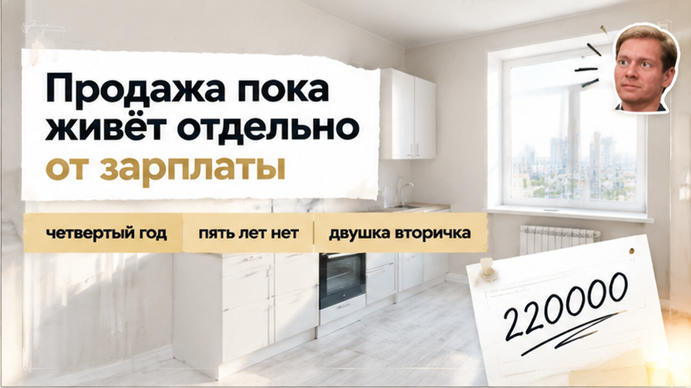
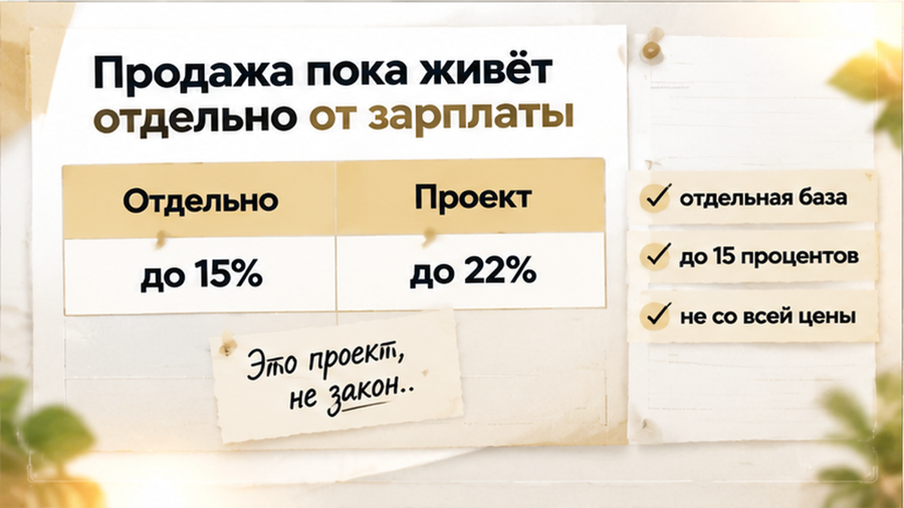
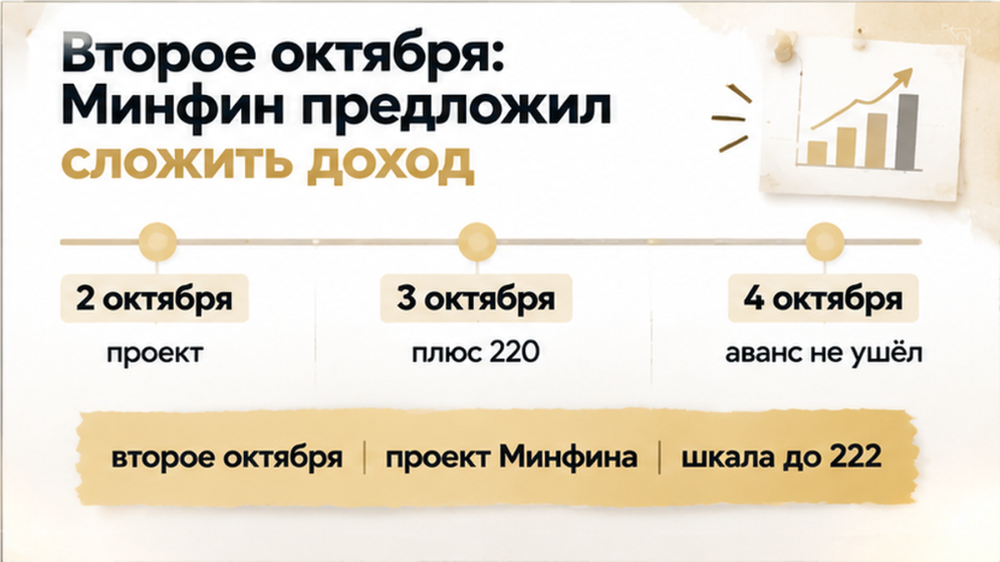
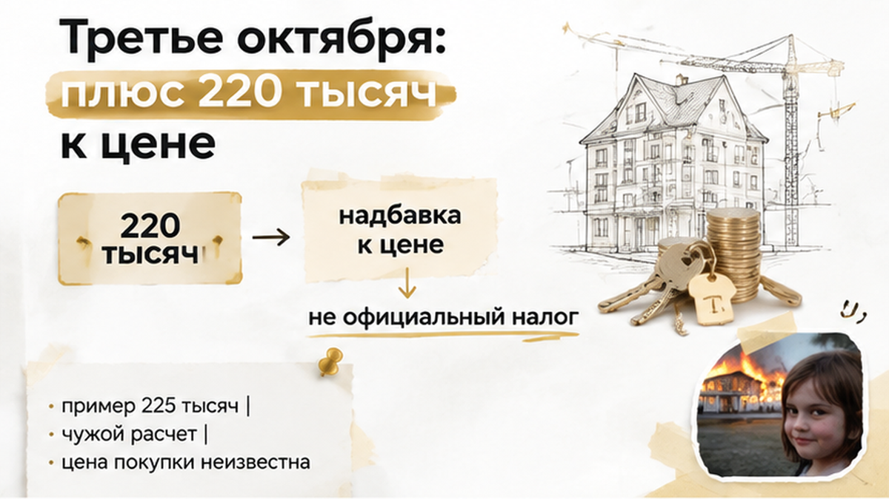
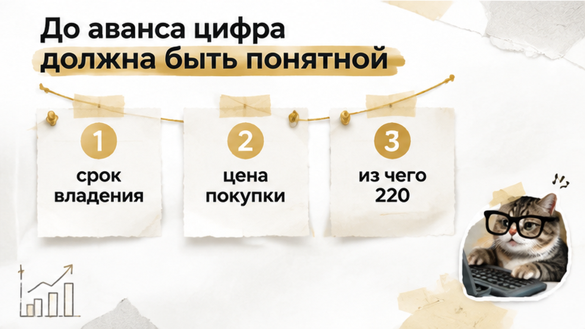

WRITER INPUTS B61:

H1 (не вставлять в HTML): Продавец в Тюмени добавил 220 тысяч из-за налога — покупатель не перевёл аванс

slot_rubric: vtorichka
comment_magnet_angle: Доплатить 220 тысяч продавцу до аванса или уйти из сделки?

ФАКТЫ:

3 октября 2026, Тюмень, вторичка, двушка. Продавец физлицо, покупатель физлицо. Владение вошло в четвёртый год, до пяти лет не дошли, продажа ещё может облагаться налогом. Сделку хотели закрыть в декабре 2026. Аванс назначили на 4 октября. 3 октября продавец добавил к уже согласованной цене 220 000 рублей, чтобы «закрыть налог». Покупатель деньги не перевёл. Аванса нет, договор не подписан.

2 октября 2026 Коммерсантъ и РБК написали: Минфин предложил с 1 января 2027 складывать доход от продажи недвижимости с зарплатой. Шкала проекта: до 2,4 млн — 13%, до 5 млн — 15%, до 20 млн — 18%, до 50 млн — 20%, свыше 50 млн — 22%. Это проект, не закон.

Сейчас по НК (ст. 224 п. 1.1 и ст. 210 п. 6) продажа имущества сидит в отдельной базе: 13% до 2,4 млн и дальше 15% с превышения. С зарплатой эта база не складывается. Потолок отдельной базы — 15%, не 22%. Ст. 217.1: после минимального срока владения налога нет; общий срок — пять лет. Для купленной квартиры налог считают с разницы покупки и продажи, если срок не вышел. Цену покупки этой двушки мы не знаем — не выдумывать.

Пример РБК (Five Stones, другая квартира за 10 млн и зарплата 1,5 млн в год) даёт плюс 225 тысяч к налогу при сложении баз. Это не тюменская двушка и не цифра 220. 220 тысяч назвал продавец в цене. Не приписывать ему зарплату 1,5 млн.

ГОЛОС ФАКТОВ:

Первое лицо: Святослав Шакин, The Риэлтор, Тюмень. Я смотрю такие сдвиги цены до аванса. Не паника «никогда не продавать». Последние абзацы: ручка до аванса — спросить, откуда цифра, и не переводить деньги, пока надбавка не разобрана.

CTA:

Сразу после лида, до первого H2:

Я Святослав Шакин, The Риэлтор в Тюмени. Как ловить такую надбавку до денег — в <a href="https://t.me/Tyumen_Rieltor">Telegram</a> и <a href="https://max.ru/id561413315447_biz">MAX</a>.

В раннем блоке только эти две ссылки.

Середина, после раздела про проект Минфина:

Если продавец уже двигает цену — напишите в <a href="https://t.me/Tyumen_Rieltor">Telegram</a> или <a href="https://max.ru/id561413315447_biz">MAX</a>, разберём до аванса.

Финал:

Напишите на консультацию или подключаюсь в сделку до аванса. Телефон <a href="tel:+79220016505">+7 922 001 65 05</a>.

<a href="https://t.me/Tyumen_Rieltor">Telegram</a>, <a href="https://max.ru/id561413315447_biz">MAX</a>, <a href="https://dzen.ru/holyslav">Дзен</a>, <a href="https://vk.ru/tymenrieltor">ВК</a>, <a href="/">сайт</a>, <a href="/gajdy/">гайды</a>.

Телефон только в этом конечном блоке, один раз.

ПЕРЕЛИНКОВКА, РОВНО ТРИ, ЯКОРЬ КОРОТКИЙ, БЕЗ ПЕРЕСКАЗА ЧУЖОГО СЮЖЕТА:

- <a href="/blog/vtorichka-i-riski/v-tyumeni-poddelnoe-soglasie-suprugi-ostanovilo-sdelku-pered-avansom/">согласие супруги до аванса</a>
- <a href="/blog/vtorichka-i-riski/za-3-dnya-do-avansa-v-tyumeni-vsplyl-dolg-za-svet-186-tysyach-semya-otkazalas-ot/">коммуналка до аванса</a>
- <a href="/blog/vtorichka-i-riski/v-tyumeni-rodstvenniki-ostanovili-prodazhu-pozhilogo-prodavca-veli-po-telefonu-v/">родственники остановили продажу</a>

КАРТИНКИ:

Семь figure. Под первым H2 картинок нет. Класс строго inline-quad. Alt — короткая человеческая фраза, без хука, без мемов, без точки с запятой.

<figure class="inline-quad" data-slot="inline_1"></figure>
<figure class="inline-quad" data-slot="inline_2"></figure>
<figure class="inline-quad" data-slot="inline_3"></figure>
<figure class="inline-quad" data-slot="inline_4"></figure>
<figure class="inline-quad" data-slot="inline_5"></figure>
<figure class="inline-quad" data-slot="inline_6"></figure>
<figure class="inline-quad" data-slot="inline_7"></figure>

Размещение: H2 «Четвёртый год» — без картинок. H2 «Отдельная база» — inline_1 и inline_2. H2 «Второе октября» — inline_3. H2 «Третье октября» — inline_4 и inline_5. H2 «Четвёртое октября» — inline_6. H2 «До аванса» — inline_7.

ВОПРОС ДЛЯ КОММЕНТАРИЕВ:

Сразу после финала (покупатель не перевёл), один вопрос:
Доплатить 220 тысяч продавцу до аванса или встать и уйти?

H2: Четвёртый год, декабрь ещё далеко
H2: Продажа пока живёт отдельно от зарплаты
H2: Второе октября: Минфин предложил сложить доход
H2: Третье октября: плюс 220 тысяч к цене
H2: Четвёртое октября: деньги не ушли
H2: До аванса цифра должна быть понятной

Не делай из последнего H2 чеклист шагов. Один короткий разбор: спросить срок владения, цену покупки и что именно продавец кладёт в 220 тысяч. Потом два абзаца agency и конечный CTA.
